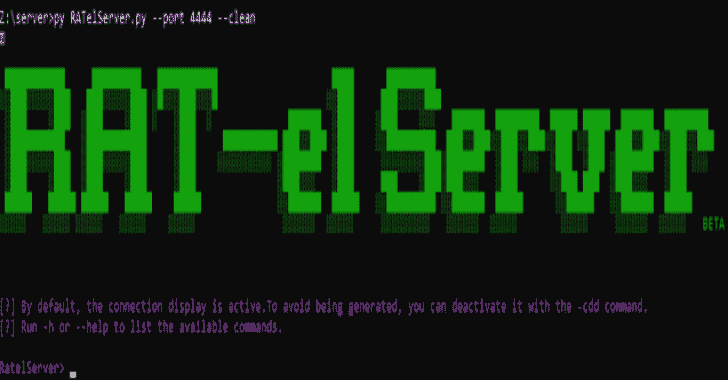
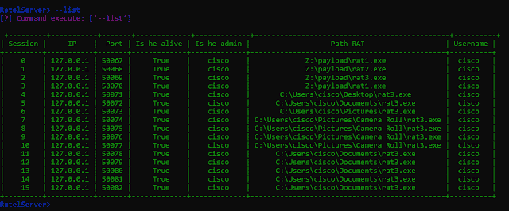

# RATel:一个开源渗透测试工具

> 原文：<https://kalilinuxtutorials.com/ratel/>

RAT-el 是一个开源渗透测试工具，允许你控制一台 windows 机器。它采用客户机-服务器模式，服务器发送命令，客户机执行命令并将结果发送回服务器。杀毒软件完全检测不到客户端。

**截图**

**新增功能**

*   版本的 Unicode 管理(20 . 02 . 21):**beta _ v 0.1**

**特性**

*   **RATelServer** :
    *   多重连接
    *   向所有客户端广播命令
    *   将客户信息存储在数据库中
    *   通过 XOR 加密网络上的数据
    *   用于识别客户端的令牌管理系统
    *   Unicode 管理
*   **客户端**:
    *   加密通过网络发送的数据
    *   启动持久性
    *   通过 CMD 远程执行命令
    *   通过 Powershell 远程执行命令
    *   通过 XOR 加密网络上的数据
    *   运行客户端时的自动持久性
    *   自动重新连接
    *   Unicode 管理
*   **RATelGenerator** :
    *   自动客户端编译

**未来特征**

*   版本的键盘记录器: **beta_v0.2**

**免责声明**

为了防止防病毒软件检测到 **RATel** ，请不要将有效载荷上传到 TOTAL VIRUS。每个月我都会测试自己是否被杀毒软件检测到。所以你每个月都会有一张照片来证明你的判断力。

[**Download**](https://github.com/FrenchCisco/RATel)