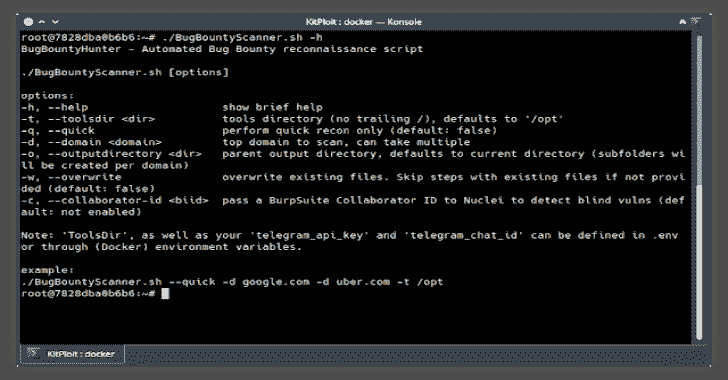

# BugBountyScanner:一个用于 Bug 赏金侦察的 Bash 脚本和 Docker 图像

> 原文：<https://kalilinuxtutorials.com/bugbountyscanner/>

[](https://1.bp.blogspot.com/-bPZzHhS7Dxo/YEYm3tzfN_I/AAAAAAAAIc8/hC3hpHLrvlktngBWUdXIo03lK4ytiZWUwCLcBGAsYHQ/s728/BugBountyScanner%25281%2529.png)

bugbountscanner 是一个用于 Bug Bounty 侦察的 Bash 脚本和 Docker 图像，旨在供 headless 使用。资源少，信息输出多。

**注意:**强烈建议通过 VPN 使用脚本。

建议从服务器(VPS 或家庭服务器)运行 BugBountyScanner，而不是从您的终端运行*。它被编程为资源不足，考虑到更大的范围可能需要多天的扫描。该脚本独立运行。*

你可以作为 docker 镜像运行这个脚本，也可以从你喜欢的 Debian/Ubuntu 系统运行(见下文)。所需要的就是开始写剧本，然后把它忘得一干二净！运行脚本需要几分钟的时间(对于非常小的范围< 10 subdomains) and several days (for very large scopes > 20000 个子域)。存在一个“快速模式”标志，它会放弃一些耗时的任务，如漏洞识别、端口扫描和 web 端点爬行。

**安装**

**码头工人**

码头枢纽链接:【https://hub.docker.com/r/chvancooten/bugbountyscanner】T2。为开发分支(`:dev`标记)和主分支(`:latest`标记)自动生成图像。

您可以从 Docker Hub 中提取 Docker 图像，如下所示。

**坞站拉 chvancouten/bugbountysbanner
坞站运行-it chvancouten/bugbountysbanner/bin/bash**

也可以使用 Docker-Compose。

```
version: "3"
services:
  bugbountybox:
    container_name: BugBountyBox
    stdin_open: true
    tty: true
    image: chvancooten/bugbountyscanner:latest
    environment:
    - telegram_api_key=X
    - telegram_chat_id=X
    volumes:
      - ${USERDIR}/docker/bugbountybox:/root/bugbounty
    # VPN recommended :)
    network_mode: service:your_vpn_container
    depends_on:
      - your_vpn_container 
```

或者，您可以从源代码构建映像。

**git 克隆 https://github . com/chv anccooten/bugbountysbanner . git**
**【CD bugbountysbanner**
**dock build。**

**手动**

如果您喜欢手动运行脚本，您可以这样做。

**注意:**这个脚本是在 Ubuntu 20.04 上构建并测试的。您的收获可能因其他发行版而异，但是它应该可以在大多数基于 Debian 的安装上工作(比如 Kali Linux)。

```
git clone https://github.com/chvancooten/BugBountyScanner.git
cd BugBountyScanner
cp .env.example .env # Edit accordingly
chmod +x BugBountyScanner.sh setup.sh
./setup.sh -t /custom/tools/dir # Setup is automatically triggered, but can be manually run
./BugBountyScanner.sh --help
./BugBountyScanner.sh -d target1.com -d target2.net -t /custom/tools/dir --quick 
```

**用途**

使用`--help`或`-h`查看简短的帮助菜单。

```
root@dockerhost:~# ./BugBountyScanner.sh -h
BugBountyHunter - Automated Bug Bounty reconnaissance script

./BugBountyScanner.sh [options]

options:
-h, --help                show brief help
-t, --toolsdir            tools directory (no trailing /), defaults to '/opt'
-q, --quick               perform quick recon only (default: false)
-d, --domain <domain>     top domain to scan, can take multiple
-o, --outputdirectory     parent output directory, defaults to current directory (subfolders will be created per domain)
-w, --overwrite           overwrite existing files. Skip steps with existing files if not provided (default: false)
-c, --collaborator-id     pass a BurpSuite Collaborator BIID to Nuclei to detect blind vulns (default: not enabled)

Note: 'ToolsDir', 'telegram_api_key' and 'telegram_chat_id' can be defined in .env or through Docker environment variables.

example:
./BugBountyScanner.sh --quick -d google.com -d uber.com -t /opt 
```

**使用 Burp Collaborator 的注意事项:**nucleus 需要您的 Burp Collaborator 的“BIID”。如果您使用 Burp 托管的 Collaborator 服务器，您可以通过为服务器设置“项目选项- >杂项- >通过未加密的 HTTP 轮询”来获取此 ID。然后从您的客户端轮询服务器一次，并使用第二个 Burp 客户端或 Wireshark 拦截来自 HTTP 请求的`?biid=`参数。这是你需要的 ID(确保 URL 解码)。

**特性**

*   资源高效，适合在低资源 VPS、家庭服务器或 Raspberry Pi 上长时间在后台运行
*   带有每个命令结果的电报状态通知
*   使用 Nuclei 进行广泛的 CVE 和错误配置检测(可选择通过 Burp Collaborator 检测隐蔽漏洞)
*   子域枚举和实时 web 服务器检测
*   网页截图和抓取，HTML 截图报告生成
*   从回溯机器中检索(希望是敏感的)端点
*   用 Gf 识别感兴趣的参数化 URL
*   使用 GoBuster 枚举常见的“临时”和被遗忘的文件
*   自动检测 URL 参数中的 LFI、SSTI 和开放重定向
*   子域接管检测
*   端口扫描(前 1000 个 TCP + SNMP)
*   opsec-safe (ish)基础设施侦察的“快速模式”

**工具**

*   `amass`
*   `dnsutils`
*   `Go`
*   `gau`
*   `Gf`(带`Gf-Patterns`)
*   `GoBuster`
*   `gospider`
*   `httpx`
*   `nmap`
*   `Nuclei`(带`Nuclei-Templates`)
*   `qsreplace`
*   `subjack`
*   `webscreenshot`

[**Download**](https://github.com/chvancooten/BugBountyScanner)