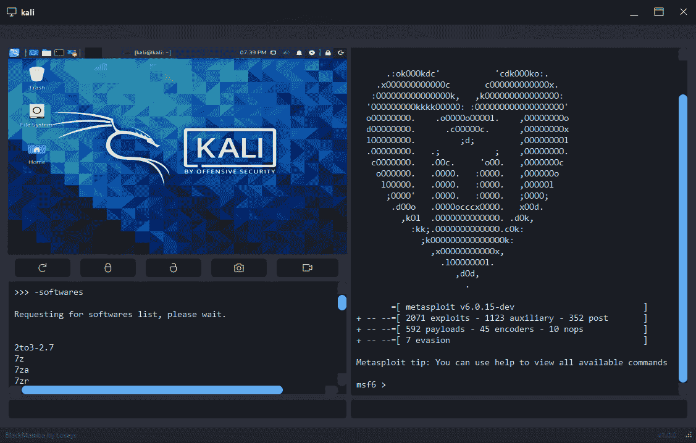
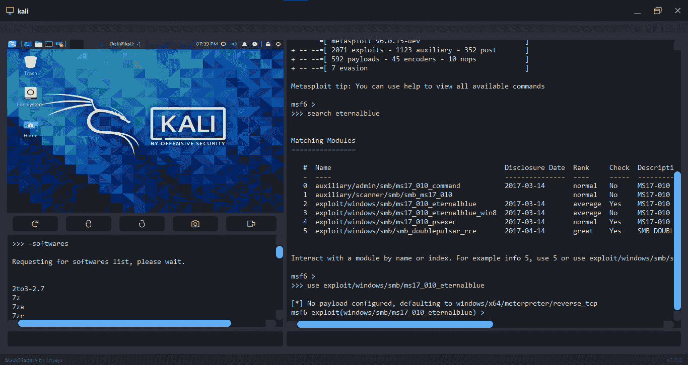
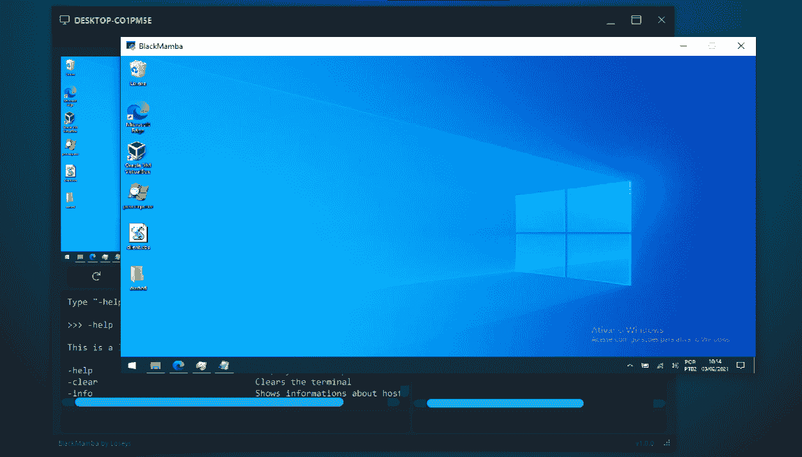
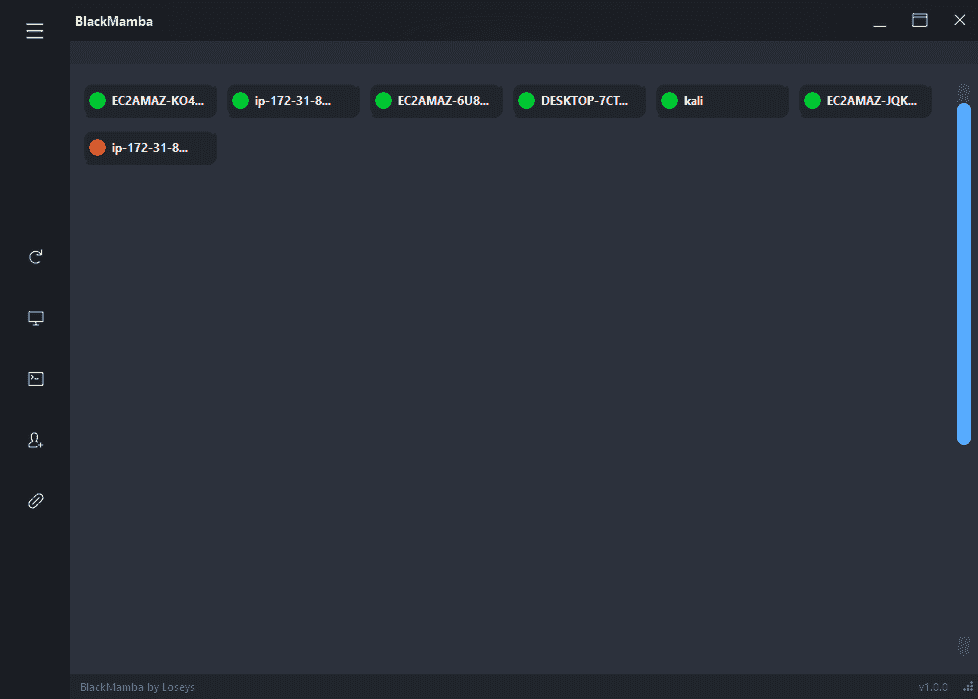
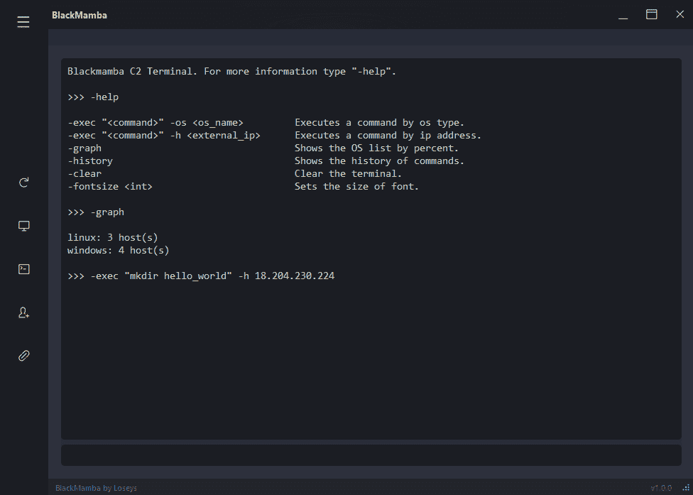
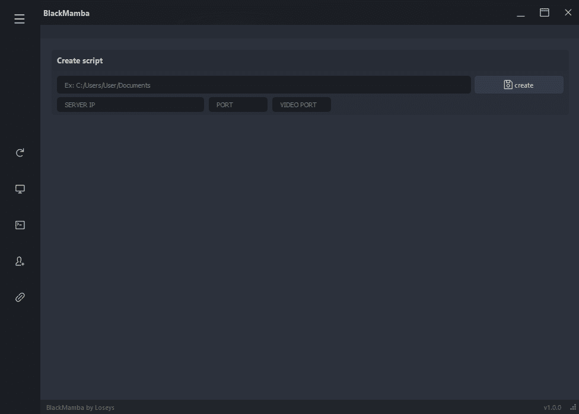

# 黑曼巴:C2/开采后框架

> 原文：<https://kalilinuxtutorials.com/blackmamba/>

BlackMamba 是一个多客户端 C2/后利用框架，具有一些间谍软件功能。它由 Python 3.8.6 和 QT 框架提供支持。

**特性**

*   **多客户端**–同时支持多个客户端连接。
*   **实时通信更新**–客户端和服务器之间的实时通信和更新。
*   **加密通信**–除了屏幕视频流，几乎所有的通信都是加密的。
*   **截图收集**–从客户端获取实时截图。
*   **视频流**–实时观看客户端屏幕。
*   **客户端锁定**–锁定和解锁客户端的机器。
*   **加密文件传输(上传/下载)**–从客户端下载文件或为客户端上传文件。
*   **键盘记录器**–记录客户按下的所有按键。
*   **Web Downloader**–通过原始页面从 URL 或内容下载文件。

**安装导轨**

**服务器安装**

*   下载黑曼巴；
*   安装 PIP 包；

**pip install-r requirements . txt**
pyqt 5
Pillow
PyAutoGUI
pytest-shutil
cryptography
pynput
pygame

*   在您的网关或路由器中打开端口 65000 和 65005(端口号可选)；
*   在防火墙中为 BlackMamba 创建一个例外或禁用它；
*   进入“black mamba/bin/profile/socket . txt”，输入打开的端口号；

**SERVER _ IP = 0.0.0.0**
PORT = 65000
PORT _ VIDEO = 65005

**重要提示:不要更改 0 . 0 . 0 . 0。**

*   (可选)–转到 BlackMamba 文件夹并打开“keygen.py”文件。复制生成的密钥，粘贴到“black mamba/bin/profile/crypt _ key . py”中；

黑曼巴使用默认的加密密钥。有趣的是你改变了它。

*   回到 BlackMamba 根文件夹，打开“main.py”文件；

**windows**
【python main . py】

**【GNU/Linux】**
【sudo chmod 777 main . py】
【sudo python 3.8 main . py】
**kali**

*   点击带有人物图标和加号信号的按钮；
*   输入将创建 Python 文件的路径，输入您的主机的端口号和 IP 地址(外部或本地)，然后单击“创建”按钮。

**客户端安装**

创建客户端脚本后，您需要在主机目标中打开脚本:

*   **窗户**

**python script.py**

*   **GNU/LINUX**

*   下载软件包:

scrot-y
python 3-pip-y
python 3-tk-y
python 3-dev-y

*   sudo python3.8 script.py

卡利 LINUX
(sudo python3 script.py)

**重要**:客户端的脚本不具备持久性。如果你想坚持，你需要自己去做。另一个要点是客户端脚本可能会延迟几秒或几分钟进行连接/重新连接。

**发布状态**

目前黑曼巴正处于测试阶段，这意味着所有的功能都已完成，但可能包含一些已知和未知的错误。需要强调的是，崩溃或缓冲区溢出等最关键的错误已经得到解决。

[**Download**](https://github.com/loseys/BlackMamba)