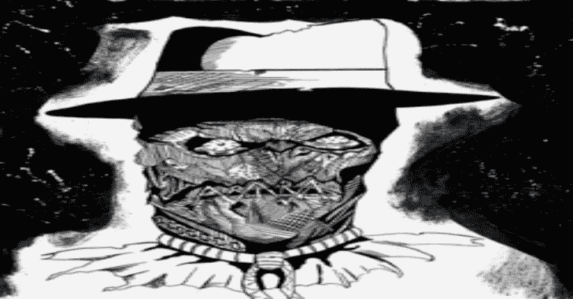
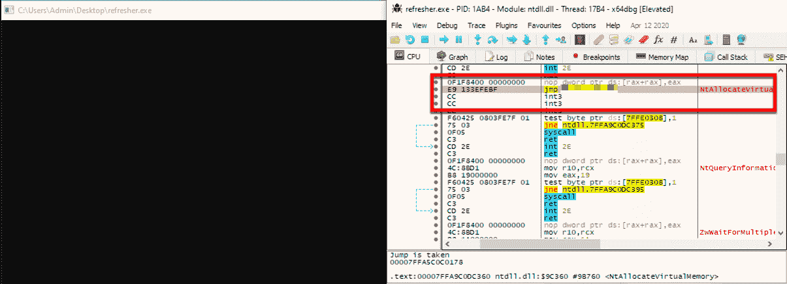
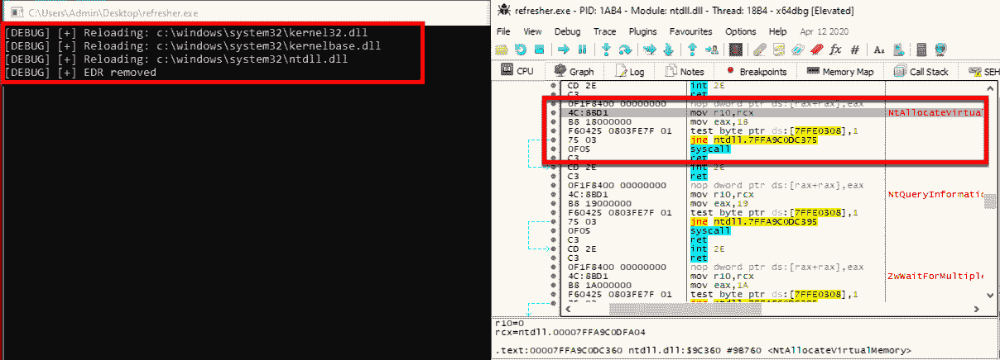
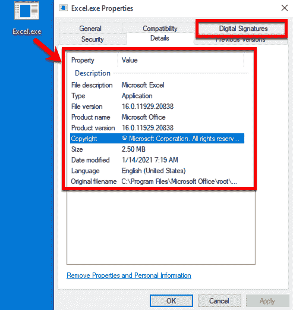

# 稻草人:围绕 EDR 旁路设计的有效载荷创建框架

> 原文：<https://kalilinuxtutorials.com/scarecrow/>

稻草人是一个有效负载创建框架，用于生成加载器，以供侧加载(而不是注入)到合法的 Windows 进程中(绕过应用程序白名单控制)。一旦 DLL 加载程序被加载到内存中，就利用一种技术来刷新 EDR 钩子，以清除在进程内存中运行的系统 DLL。这是可行的，因为我们知道 EDR 钩子是在进程产生时放置的。稻草人可以通过使用 API 函数 VirtualProtect 来定位这些 dll 并在内存中操纵它们，该函数将进程的一部分内存权限更改为不同的值，具体来说就是从执行-读取更改为读取-写入-执行。

执行时，稻草人会复制`**C:\Windows\System32\**`中存储在磁盘上的系统 dll 的字节。这些 dll 存储在 EDR 钩子的“干净”磁盘上，因为它们被系统用来在新进程产生时将未改变的副本加载到新进程中。由于 EDR 只是把这些过程钩在记忆里，它们保持不变。稻草人不复制整个 DLL 文件，而是只关注。dll 的文本部分。DLL 的这一部分包含可执行程序集，通过这样做，稻草人有助于降低被检测到的可能性，因为重新读取整个文件会导致 EDR 检测到对系统资源的修改。然后使用每个函数的偏移量将数据复制到内存的正确区域。每个函数都有一个偏移量，它表示从它们所在的基址开始的确切字节数，提供了函数在堆栈上的位置。为了做到这一点，稻草人改变了。使用 VirtualProtect 的内存文本区域。尽管这是一个系统 DLL，因为它已经被加载到我们的进程中(由我们控制)，我们可以改变内存权限而不需要提升特权。

一旦这些钩子被移除，稻草人就利用定制的系统调用来加载和运行内存中的外壳代码。稻草人甚至在 EDR 挂钩被移除后也这样做，以帮助避免被非用户的基于挂钩的遥测收集工具检测到，例如 Windows (ETW)的事件跟踪或其他事件记录机制。这些自定义系统调用也用于执行 VirtualProtect 调用，以移除由 EDRs 放置的挂钩，如上所述，以避免被任何 EDR 的防篡改控制检测到。这是通过调用自定义版本的 VirtualProtect 系统调用 NtProtectVirtualMemory 来实现的。稻草人利用 Golang 生成这些加载器，然后为这些定制的系统调用函数进行汇编。

稻草人将外壳代码加载到内存中，首先解密外壳代码，默认情况下使用 AES 加密和解密及初始化向量密钥对外壳代码进行加密。一旦解密并加载，外壳代码就会被执行。根据指定的加载器选项，稻草人将为 DLL 设置不同的导出函数。加载的 DLL 也不包含所有 DLL 通常需要操作的标准 DLLmain 函数。DLL 仍然会顺利执行，因为我们加载的进程会查找这些导出函数，而不会担心 DLLMain 的存在。

**二进制样本**

之后

**

在创建加载程序的过程中，稻草人利用一个库在信标呼叫 home 后融入背景。这个库做两件事:

*   代码签名加载程序:用代码签名证书签名的文件通常受到较少的审查，这使得它更容易被执行而不被质疑，因为用可信名称签名的文件通常比其他文件更不可疑。大多数反恶意软件产品没有时间验证和确认这些证书(现在一些产品有，但通常常见的供应商名称包含在白名单中),稻草人通过使用 go package 版本的工具`limelighter`创建 pfx12 文件来创建这些证书。这个包接受用户指定的输入域名，为该域创建代码签名证书。如果需要，您还可以使用自己的代码签名证书(如果有的话),使用 valid 命令行选项。
*   欺骗加载程序的属性:这是通过使用 syso 文件来完成的，syso 文件是一种嵌入式资源文件，当与我们的加载程序一起编译时，将修改我们编译的代码的属性部分。在生成 syso 文件之前，稻草人将生成一个随机文件名(基于加载程序类型)来使用。选择后，该文件名将映射到该文件名的相关属性，确保分配正确的值。

**文件属性样本**

有了这些文件和 go 代码，稻草人将使用 c 共享库选项把它们交叉编译成 dll。一旦 DLL 被编译，它将被混淆成一个不完整的 base64 字符串，该字符串将被嵌入到一个文件中。这允许远程提取、访问和以编程方式执行文件。

**安装**

一如既往，第一步是克隆回购协议。在你编译稻草人之前，你需要安装依赖项。

要安装它们，请运行以下命令:

去找 github.com/fatih/color
去找 github.com/yeka/zip
去找 github.com/josephspurrier/goversioninfo

确保您的操作系统上安装了以下软件:

**OpenSSL
osslsigncode
mingw-w64**

那就建造它

去建造稻草人吧

**加载器**

加载程序确定将外壳代码加载到目标系统的技术类型。如果没有选择加载器选项，稻草人将只编译一个标准的 dll 文件，该文件可以被 rundll32、regsvr32 或其他利用 DLL 的技术使用。稻草人利用三种不同类型的加载程序将外壳代码加载到内存中:

*   **控制面板—**生成控制面板小程序(即程序和功能，或自动播放)。通过编译加载程序，使其具有特定的 DLL 导出函数和文件扩展名。它将产生一个控制面板进程(rundll32.exe ),加载程序将被加载到内存中。
*   **WScript–**生成一个 WScript 进程，该进程利用清单文件和免注册 Com 技术将并行加载(非注入)DLL 加载程序加载到它自己的进程中。这避免了在内存中注册 DLL，因为清单文件告诉进程要加载哪个 DLL、在哪里加载以及加载哪个版本的 DLL。
*   **Excel—**生成一个 XLL 文件，该文件是基于 Excel 的 DLL 文件，当加载到 Excel 中时，将执行加载程序。将产生一个隐藏的 Excel 进程，强制加载 XLL 文件。

如果需要的话，稻草人还可以通过使用`-loader`命令行选项来生成基于二进制的有效载荷。这些二进制文件并不受益于任何并行加载技术，而是作为一种额外的技术来根据情况执行外壳代码。

**控制台**

稻草人利用一种技术首先创建过程，然后将其移动到背景中。这有两个作用，首先，它有助于隐藏该过程，其次，避免被任何 EDR 产品检测到。立即在后台生成一个进程是非常可疑的，也是恶意的标志。稻草人通过在进程被创建和 EDR 的钩子被加载后调用“GetConsoleWindow”和“ShowWindow”窗口函数，然后将窗口属性更改为 hidden 来实现这一点。稻草人利用这些 API，而不是使用传统的`-ldflags -H=windowsgui`,因为这是高度签名的，并且在大多数安全产品中被归类为危害的指示器。

如果选择了`-console`命令行选项，稻草人不会在后台隐藏进程。相反，稻草人将添加几个调试消息，显示加载程序正在做什么。

**交货**

deliver 命令行参数允许您生成一个命令或一串代码(在宏的情况下),将文件从远程源远程拉至受害者的主机。这些交付方法包括:

*   **Bits–**这将生成 bitsadmin 命令，在远程下载加载程序时，执行并删除它。
*   **HTA—**这将生成一个包含加载程序的空白 HTA 文件。该选项还将提供一个命令行来远程执行 HTA。
*   **宏—**这将生成一个 Office 宏，可以放入 Excel 或 Word 宏文档中。当这个宏被执行时，加载程序将从远程源被下载并执行，然后被删除。

**待办事项**

*   目前仅支持 x64 有效负载
*   一些旧版本的 Windows 操作系统(如 Windows 7 或 Windows 8.1)在重新加载系统动态链接库时会出现问题，因此内置了版本检查以确保稳定性

**信用**

*   特别感谢艺术家 Luciano Buonamici 的艺术作品
*   特别感谢 josephspurrier 的[报告](https://github.com/josephspurrier/goversioninfo)

[**Download**](https://github.com/optiv/ScareCrow)**