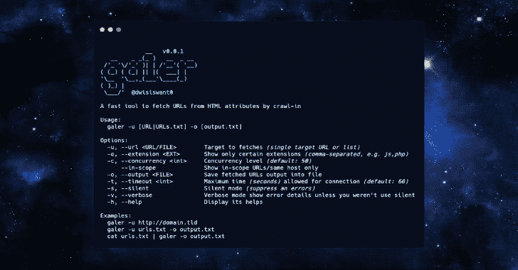

# Galer:一个通过爬入从 HTML 属性中获取 URL 的快速工具

> 原文：<https://kalilinuxtutorials.com/galer-a-fast-tool-to-fetch-urls-from-html-attributes-by-crawl-in/>

[](https://1.bp.blogspot.com/-NBNqD1uyh9A/YEZvlmoFxHI/AAAAAAAAIeY/LhhnxJ6_h-E389Yz9MyvDQ3L2WtjI6MGACLcBGAsYHQ/s728/galer.png)

**Galer** 是一个通过爬入从 HTML 属性获取 URL 的快速工具。受 [@omespino Tweet](https://twitter.com/omespino/status/1318605084989837312) 的启发，通过 Chrome DevTools 协议对 JavaScript 求值，可以提取`src`、`href`、`url`和`action`的值。

**安装**

*   **来自二进制**

安装很容易。您可以从 releases 页面下载一个预构建的二进制文件，解压并运行！或与

**(sudo)curl-ssfl https://git . io/galer | sh-s-─b/usr/local/bin**

*   **来源于**

如果您安装并配置了 go1.15+编译器:

**GO111MODULE=on go 获得 github.com/dwisiswant0/galer**

*   **来自 GitHub**

git 克隆 https://github.com/dwisiswant0/galer
CD galer
去建造。
(sudo)mv galer/usr/local/bin

**用途**

*   **基本用法**
    *   简单地说，galer 可以通过以下方式运行:

**galer-u " http://domain . TLD "**

*   **标志**

**galer -h**


这将显示该工具的帮助。这里是它支持的所有开关。

| **【标志】t1㎡** | **描述** |
| --- | --- |
| -u，–URL | 要获取的目标*(单个目标 URL 或列表)* |
| -e，–扩展 | 仅显示某些扩展名*(逗号分隔，如 js、php)* |
| -c，–并发 | 并发级别*(默认值:50)* |
| –范围内 | 仅显示范围内的 URLs 同一主机 |
| -o，–输出 | 将提取的 URL 输出保存到文件中 |
| -t，–超时 | 连接*允许的最大时间*(秒)*(默认:60)* |
| -s-无声 | 静音模式*(抑制错误)* |
| -v，–详细 | 详细模式显示错误详细信息，除非您没有使用静默模式 |
| 救命啊 | 显示它的帮助 |

**例题**

*   **单一网址**

**galer-u " http://domain . TLD "**

*   **列表中的 URLs】**

**galer -u /path/to/urls.txt**

*   **来自标准输入**

**cat urls.txt | galer**

*   **如果你想用其他工具连锁:**

**sub finder-d domain . TLD-silent | httpx-silent | galer**

**图书馆**

你可以用 galer 作为库。

去找 github.com/dwisiswant0/galer/pkg/galer

例如:

```
package main

import (
	"fmt"

	"github.com/dwisiswant0/galer/pkg/galer"
)

func main() {
	cfg := &galer.Config{
		Timeout: 60,
	}
	cfg = galer.New(cfg)

	run, err := cfg.Crawl("https://twitter.com")
	if err != nil {
		panic(err)
	}

	for _, url := range run {
		fmt.Println(url)
	}
}
```

**TODOs**

*   启用以设置额外的 HTTP 头
*   随机提供用户代理
*   绕过无头浏览器
*   为特定扩展名添加例外

[**Download**](https://github.com/dwisiswant0/galer)