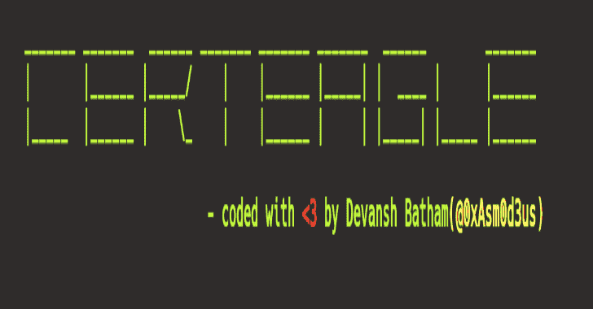
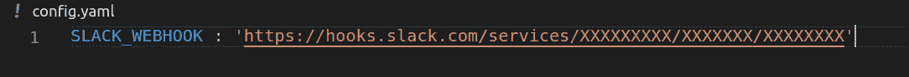
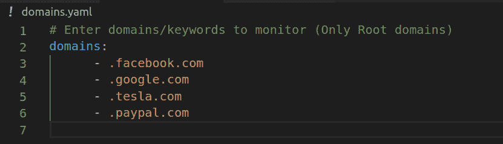
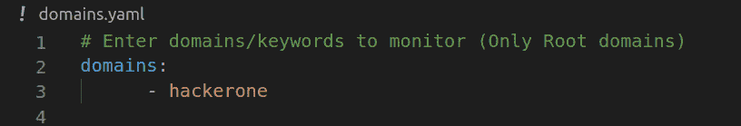
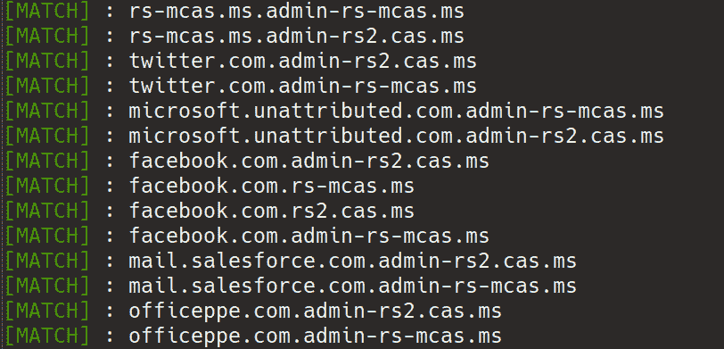
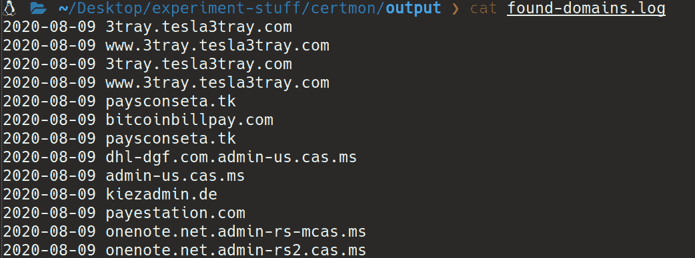

# CertEagle:资产监控工具

> 原文：<https://kalilinuxtutorials.com/certeagle/>

**CertEagle** 是一个使用实时 CT 日志馈送的资产监控实用程序。

在 bug bounds "**如果你不是第一名，那么你就是最后一名**"没有银牌或铜牌这样的东西，侦察起着非常重要的作用，如果你能比别人更早地发现/识别新增加的资产，那么你发现/报告该资产的安全漏洞并因此获得奖励的机会就比别人高。

就我个人而言，很长一段时间以来，我一直在监控域/子域的 CT 日志，它给了我很多成功的结果，这背后的灵感是“[sub lett:By yassineaboukir](https://github.com/yassineaboukir/sublert/)”，它检查 crt.sh 的子域，并可以定期执行，但是我使用的方法有些不同，我不是定期查看 crt.sh，而是从实时 CT 日志提要中提取域，因此我比其他人更早发现新资产的机会更高。

**工作流程**

*   监控实时 CT 日志馈送并从该馈送中提取域名
*   将提取的子域/域与要匹配的域/关键词进行匹配
*   如果域名匹配，则发送延迟通知

**要求**

*   VPS (UNIX 启动并运行)
*   Python 3x(使用 Python 3.6.9 测试)
*   宽松工作空间(可选)

**设置**

我假设您已经完成了 slack workspace 的设置。

现在创建一个名为“subdomain-monitor”的通道，并设置一个传入的 webhook

*   **启用时差通知**

编辑`config.yaml`文件并将你的 slack webhook URL 粘贴到那里，看起来应该像这样

*   **要匹配的关键字和域:**

您可以在`domains.yaml`文件中指定要匹配的关键字和域，您可以指定名称

*   **匹配子域:**

注意:注意前面点。]

以“. facebook.com”为例，从实时 CT 日志中提取的域将与单词“. facebook.com”进行匹配，如果匹配，它们将被记录在我们的输出文件(found-domains.log)中。这里要注意的是，它会给出一些误报，如“test.facebook.com.test.com”，“example.facebook.company”，但我们可以稍后使用 regex magic 过滤掉它们

*   **用于匹配带有特定关键字的域/子域:**

假设您想要监控和记录包含单词“hackerone”的域/子域，那么我们的 domains.yaml 文件将类似于下面这样

现在，所有包含单词“hackerone”的提取域/子域都将被匹配和记录(并且会发送一个 slack 通知给你)

好了，我们完成了初始设置，让我们安装所需的依赖项并运行我们的工具

【T2`$ pip3 install -r requirements.txt`
`$ python3 certeagle.py`

*   **匹配的域将如下所示:**

*   **时差通知将如下所示:**

*   **输出文件:**

程序将继续运行，所有匹配的域名将保存在输出目录下的 found-domains.log 文件中

**严格警告:**未经事先同意，不得监控任何组织的资产

[**Download**](https://github.com/devanshbatham/CertEagle)