# uEmu:基于 Unicorn 的 IDA 小可爱模拟器插件

> 原文：<https://kalilinuxtutorials.com/uemu/>

[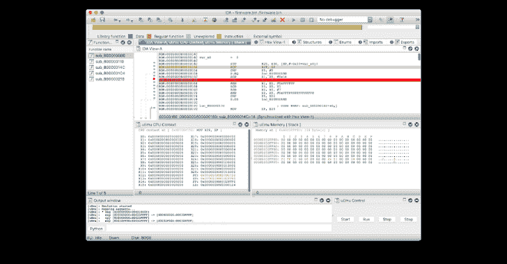](https://1.bp.blogspot.com/-mXLoNADubPk/YE7-KGPo5CI/AAAAAAAAIh8/RBwq_xzIvmg7mVPSmPTBSriQ0wmZP4XvACLcBGAsYHQ/s728/uEmu.png)

uEmu 是一个基于 unicorn engine 的 IDA 小可爱模拟器插件。开箱即用支持以下架构: **x86** 、 **x64** 、 **ARM** 、 **ARM64** 、 **MIPS** 、 **MIPS64** 。

有什么好处？

*   模拟裸机代码(引导加载程序、嵌入式固件等)
*   模拟独立功能

对什么不好？

*   模拟复杂的操作系统代码(动态库、进程等)
*   用许多系统调用模拟代码

**有哪些可以改进的地方？**

*   找到一种方法来模拟供应商特定的寄存器访问(如 ARM64 的`MSR S3_x, X0`)
*   添加更多寄存器进行跟踪

**安装**

*   **`brew install unicorn`** 安装独角兽二进制文件
*   `**pip install unicorn**`安装 Unicorn python 绑定
*   使用 IDA 中的`**File / Script file...**`或`ALT+F7`加载 **uEmu.py**

可选的 **uEmu** 可以作为 IDA 插件自动加载。在这种情况下，将它放入[IDA]/Plugins 文件夹，并将 **uEmu.py** 中的 **`USE_AS_SCRIPT`更改为`False`**

**注意:**在 Windows 上，您可能需要添加 IDA Pro Qt5 路径

**导入
sys sys . path . append(' D:\ \ Soft \ \ IDA Pro 7 . x \ \ python \ \ 3 \ \ pyqt 5 ')**

**特性**

**Popup Menu**

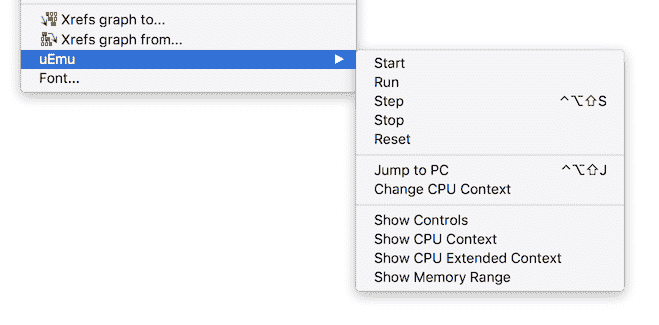

*   Start 命令通过映射所有段和设置 Unicorn 来初始化仿真器
*   运行命令模拟指令，直到到达断点或发生错误
*   Step 仿真一个或 N 个指令(按住`ALT` / `OPTION`指定一个数字)
*   停止中断仿真
*   重置重置仿真引擎并取消所有内存区域的映射
*   跳转到电脑只是跳转到当前电脑
*   可以手动或通过 JSON 文件更新 CPU 上下文(见下文)
*   显示控件显示带有开始/运行/步进/停止按钮的窗口
*   显示 CPU 上下文显示带有可用寄存器的窗口
*   显示带有扩展寄存器的 CPU 扩展上下文显示窗口(浮点/SIMD)
*   显示堆栈显示带有当前堆栈的窗口
*   显示内存范围允许显示特定的内存区域

**开始**

从光标处开始模拟。必须首先提供初始 CPU 上下文(见*更新 CPU 上下文*)，然后 IDA 数据库中的所有数据段将被映射到仿真器(初始化数据也将被复制)。

**运行**

执行代码，直到到达代码或内存断点，或者出现需要用户操作的事件。

**步骤**

执行单步执行。按住`ALT` / `OPTION`指定要执行的步数。

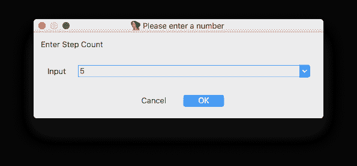

**停止**

当仿真正在进行时，该命令可用于中断执行。

**复位**

重置模拟器实例并取消所有内存区域的映射。

**断点**

您可以使用 IDA 断点来指示应该中断仿真的位置。这包括代码和内存断点。通常与**运行**命令一起使用。

**运行时动作**

**未映射内存**

当仿真器需要访问尚未映射的内存时，插件将显示以下对话框。

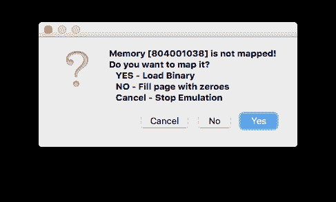

*   按 **YES** 提供要加载到内存的内存转储。

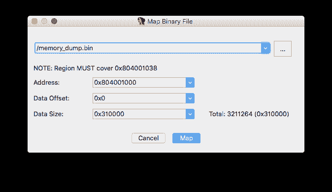

*   按**否**映射一个用零填充的空白页面(0x1000)
*   按**取消**停止仿真

**未知指令**

当仿真器运行到未知指令时，可以跳过它并手动恢复 CPU 上下文。

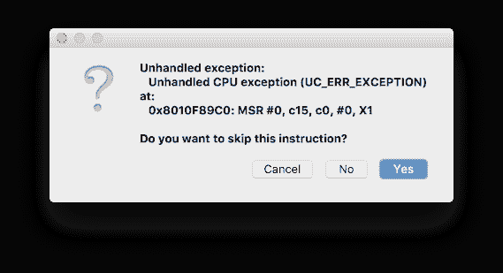

**视图**

**控件**

只是一个控制执行的面板。

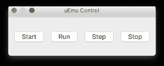

**CPU 上下文**

*   **当前 CPU 上下文**。

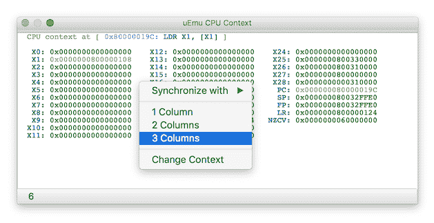

每次仿真停止时，已更改的寄存器将被突出显示。寄存器可以通过弹出菜单显示在 1、2 或 3 列中。

可以通过弹出菜单更新 CPU 上下文(见下文)。

**CPU 扩展上下文**

*   **当前 CPU 扩展上下文。**

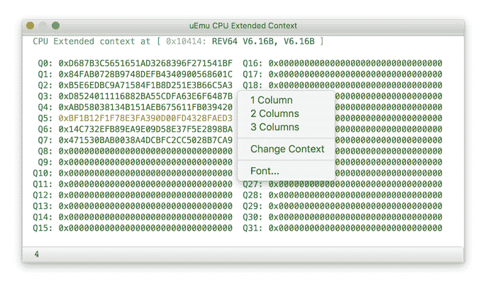

每次仿真停止时，已更改的寄存器将被突出显示。寄存器可以通过弹出菜单显示在 1、2 或 3 列中。

可以通过弹出菜单更新 CPU 上下文(见下文)。

**内存**

使用此视图观察指定地址和大小的内存区域。为方便起见，注释将显示在标题中。

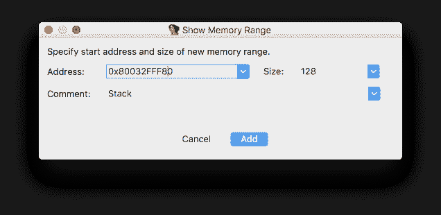

每次仿真停止时，更改的内存块将会突出显示。

**更新 CPU 上下文**

寄存器值可以通过弹出菜单用 JSON 文件单独或一次全部改变。当前上下文也可以保存在 JSON 文件中供将来使用。

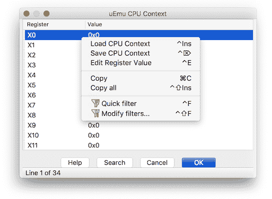

**主插件菜单**

除了弹出菜单中列出的所有功能外，还有几个新命令。

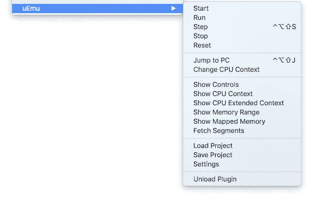

**显示映射内存**

显示所有映射的区域。使用弹出菜单显示特定区域的内存或将其转储到文件中。

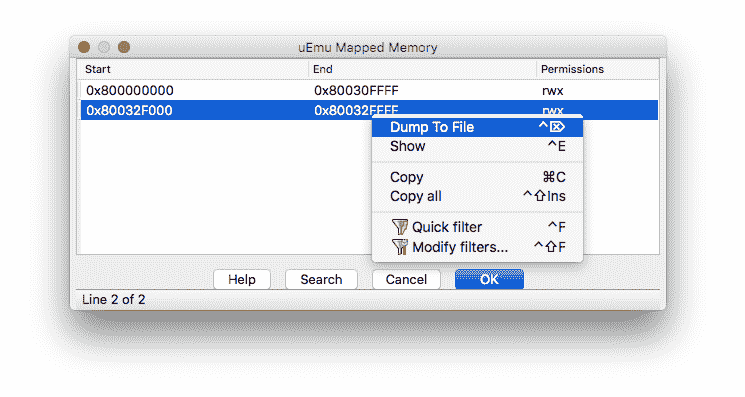

**获取段**

该命令试图通过创建新的映射或尽可能与现有的映射合并，将 IDA 段与映射内存同步。这有助于在运行时向仿真器添加新的 IDA 段，而无需重启仿真器。

**加载项目**

从文件加载 uEmu 状态。

**保存项目**

将 uEmu 状态保存到文件。请注意，只有在插件中定义的寄存器才会被保存。

**设置**

*   在仿真过程中，跟随 PC 将 IDA 视图滚动到当前 PC
*   自动转换为代码是 IDA 光标下的数据不是代码
*   跟踪指令打印仿真器正在执行的每个指令
*   惰性映射按需添加页面，而不是在开始时映射所有现有区域

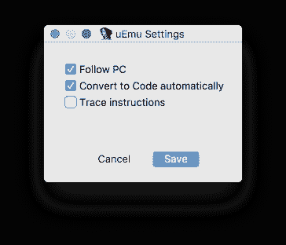

**扩展**

也可以使用扩展系统在 uEmu 之上添加新功能或构建您的项目。

请在此处找到带有示例[的描述](https://github.com/alexhude/uEmu/blob/master/Extensions/README.md)