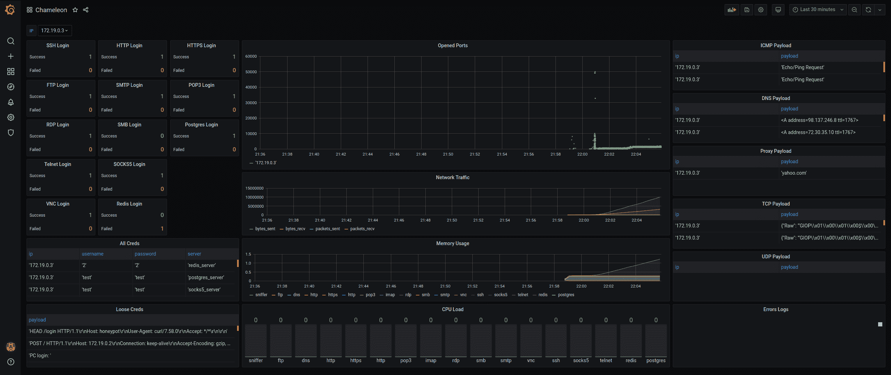
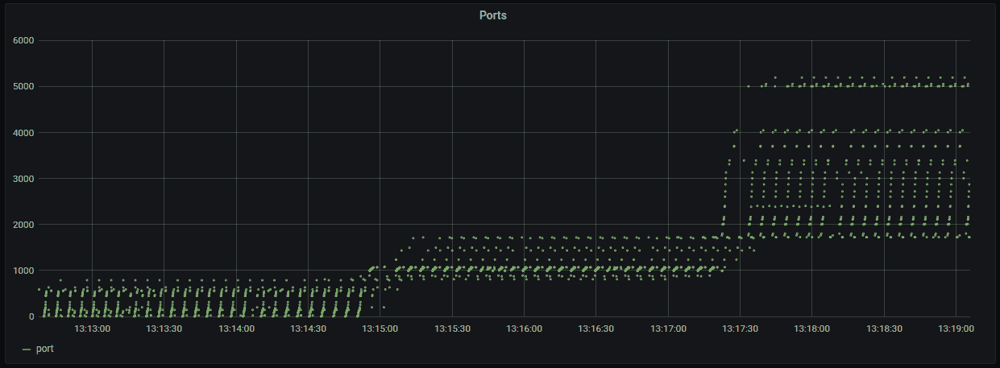
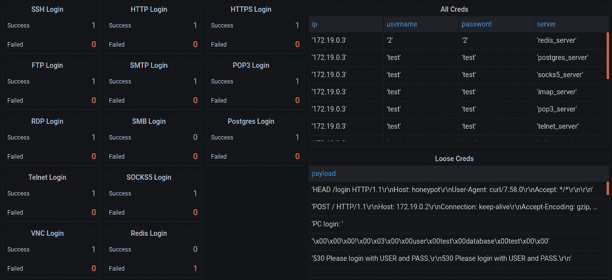
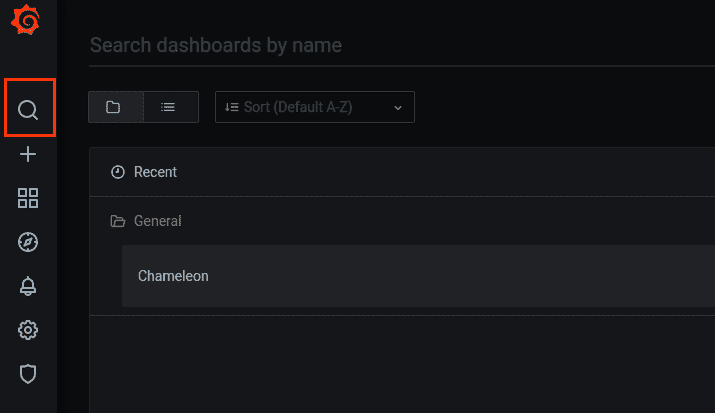

# 变色龙:用于监控网络流量的可定制蜜罐

> 原文：<https://kalilinuxtutorials.com/chameleon/>

[](https://1.bp.blogspot.com/-xJ8Lt3F_ON8/YE2p66ZM25I/AAAAAAAAIgU/zk9H5tWbjbEpaxYOA1L5KouaCo5CUqQJwCLcBGAsYHQ/s728/chameleon%25281%2529.png)

**变色龙**是一个可定制的蜜罐，用于监控网络流量、僵尸程序活动和用户名\密码凭证(DNS、HTTP 代理、HTTP、HTTPS、SSH、POP3、IMAP、STMP、RDP、VNC、SMB、SOCKS5、Redis、TELNET、Postgres 和 MySQL)。

**Grafana 接口**



**NMAP 扫描**



**凭证监控**



**一般特征**

*   模块化方法(蜜罐作为脚本运行或作为对象导入)
*   大多数蜜罐充当服务器(只有少数模拟应用层协议)
*   使用用户名、密码和标语设置服务器(默认用户名和密码为 test)
*   ICMP、DNS TCP 和 UDP 有效负载被解析并对照通用模式进行检查
*   用于监控结果的可视化 Grafana 界面(按 IP 过滤–默认为全部)
*   非结构化和结构化日志被解析并插入 Postgres
*   所有蜜罐都包含用于测试服务器的客户端
*   默认情况下，所有端口都被打开和监控
*   易于自动化，可以部署在 AWS ec2 上
*   探索更多功能

**安装&运行**

*   **在 ubuntu 18 或 19 系统上(自动配置)**

**git 克隆 https://github.com/qeeqbox/chameleon.git
CD 变色龙
chmod +x ./run.sh
。/run.sh 自动配置**

Grafana 界面 [http://localhost:3000](http://localhost:3000) 在完成初始化过程后会自动打开(用户名为 changeme457f6460cb287，密码为 changemed23b8cc6a20e0)。如果您没有看到变色龙仪表板，请单击左侧栏中的搜索图标并添加它。

等待几秒钟，直到蜜罐显示 IP 地址

**…
蜜罐 _1 |你的 IP: 172.19.0.3
蜜罐 _1 |你的 MAC: 09:45:aa:23:10:03
…**

您可以从本地系统与蜜罐进行交互

**ping 172.19.0.3
或对其运行任何网络工具** 

*   **在 ubuntu 18 或 19 系统上(自动配置测试)**

**git 克隆 https://github.com/qeeqbox/chameleon.git
CD 变色龙
chmod +x ./run.sh
。/run.sh 自动配置测试**

Grafana 界面 [http://localhost:3000](http://localhost:3000) 在完成初始化过程后会自动打开(用户名为 admin，密码为 admin)。如果您没有看到变色龙仪表板，请点击左侧栏中的搜索图标并添加它

*   **或者，导入您想要的非阻塞服务器作为对象(SSH 服务器)**

```
copy ssh_server.py to your folder
```

```
# ip= String E.g. 0.0.0.0
# port= Int E.g. 9999
# username= String E.g. Test
# password= String E.g. Test
# mocking= Boolean or String E.g OpenSSH 7.0
# logs= String E.g db, terminal or all
# --------------------------------------------------------------------
# always remember to add process=true to run_server() for non-blocking

from ssh_server import QSSHServer
qsshserver = QSSHServer(port=9999)
qsshserver.run_server(process=True)
qsshserver.test_server(port=9999)
qsshserver.kill_server()
```

**ssh 测试@127.0.0.1**

INFO:chameleonlogger:['servers '，{'status': 'success '，' username': 'test '，' ip': '127.0.0.1 '，' server': 'ssh_server '，' action': 'login '，' password': 'test '，' port': 38696}]

*   **或者，docker stanalone simple**

git 克隆 https://github.com/qeeqbox/chameleon.git
CD 变色龙
/蜜罐/。&&docker run-p 9999:9999-p 9998:9998-it 蜜罐-模式普通-服务器" ssh:9999 http:9998 "

*   如果您没有看到变色龙仪表板，请点击左侧栏中的搜索图标并添加它



*   **树莓派 3B+ [(首先设置 zram 以避免锁定)](https://github.com/qeeqbox/chameleon/pull/1)**

**要求(仅服务器)**

**# apt-get update-y&&apt-get install-y iptables-persistent tcpdump nmap iputils-ping python python-pip python-psycopg 2 lsof PS misc dnsutils
# pip install scapy = = 2 . 4 . 4 neti faces = = 0 . 10 . 9 pyftpdlib = = 1 . 5 . 6 sqlalchemy = = 1 . 3 . 23 pyyaml = = 5 . 4 . 1 paramiko = = 2 . 7 . 1 in packet = = 0**

**当前服务器/仿真器**

*   DNS(使用 Twisted 的服务器)
*   HTTP 代理(使用 Twisted 的服务器)
*   HTTP(服务器使用 Twisted)
*   HTTPS(使用扭曲的服务器)
*   SSH(使用套接字的服务器)
*   POP3(使用 Twisted 的服务器)
*   IMAP(使用 Twisted 的服务器)
*   STMP(使用 smtpd 的服务器)
*   RDP(使用扭曲的服务器)
*   SMB(使用 impacket 的服务器)
*   SOCK5(使用 socketserver 的服务器)
*   TELNET(使用 Twisted 的服务器)
*   VNC(使用扭曲的仿真器)
*   使用 Twisted 的仿真器
*   Redis(使用扭曲的仿真器)
*   Mysql(使用 Twisted 的模拟器)
*   Elasticsearch(即将推出..)
*   甲骨文(即将推出..)
*   ldap(可能)

**变化**

*   2020.V.01.05 增加了 mysql
*   2020.v . 1.04 增加的新内容
*   2020.V.01.03 将 ftp 服务器切换到 twisted
*   2020.V.01.02 将 http 和 https 服务器切换到 twisted
*   2020.V.01.02 修正了 grafana 接口中的 ip 变更

**路线图**

*   ~~重构日志~~
*   ~~固定记录器~~
*   代码清理
*   将一些服务器切换到 twisted
*   添加正常连接关闭(错误响应)
*   实现其余的服务器
*   向嗅探器添加一些检测逻辑
*   添加控制面板

[**Download**](https://github.com/qeeqbox/chameleon)