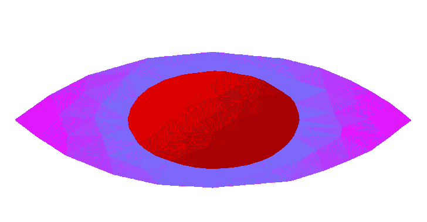

# HiddenEyeReborn : HiddenEye 拥有全新的代码库和更好的功能集

> 原文：<https://kalilinuxtutorials.com/hiddeneyereborn/>

**HiddenEyeReborn** 是我尝试为人类错误开发的多功能工具。目前，`HE: RE`主要具有网络钓鱼功能。但我们计划增加更多，你可以通过查看(*提醒我做路线图*)或 GitHub 上的项目标签来跟踪开发进度。

**安装**

`HE: RE`在 PyPI 上可用，可以使用 pip 安装:

**pip 安装 hiddeneye-重生**

这就够了！HE: RE 现在可以作为一个终端命令或项目的一个包使用。

**基本用法**

*待写*

**文档**

*待写*[https://hiddeneye-reborn . readthedocs . io](https://hiddeneye-reborn.readthedocs.io)

**常见问题解答**

*   **问:**为什么原来的`HiddenEye`不再保留了？
    *   **答:**由于代码中使用的低质量和不良做法。
*   **问:**这个工具有什么使用示例吗？
    *   **答:**这只是一个工具，怎么用就看你自己了。这就是为什么我们对你的行为不负任何责任。有许多合法使用该工具的例子，例如人们愿意通过测试/教育他们的员工或同事，并教育他们关于社会工程师可能使用的人类漏洞来改善他们的工作流程。
*   **问:**为什么开发者这么慢？为什么没人更新？
    *   **答:**如果你希望开源软件被开发出来，社区不会产生任何收入，开发者在开发这个软件的时候也吃不起饭——支持开发者。

**免责声明**

`HiddenEye: Reborn`和/或其资源的使用由**最终用户**的**完全负责**。开发人员假定**没有责任**并且**不对`HiddenEye: Reborn`造成的任何误用或损坏**负责。您的一些行为可能**非法**并且您**不能**未经个人或公司的**书面许可**使用该软件测试某人。

[**Download**](https://github.com/Open-Security-Group-OSG/HiddenEyeReborn)