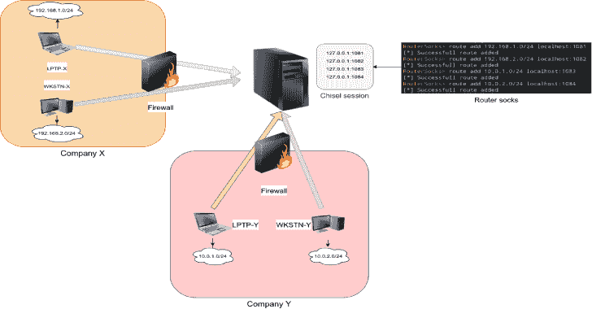

# 路由器袜子:路由器袜子。一个港口袜子为所有其他人

> 原文：<https://kalilinuxtutorials.com/go-routersocks/>

**Go-routers socks**是妥协一台机器后的下一步，是枚举背后的网络。有许多工具可以暴露攻击者机器上的 socks 端口，并通过隧道将所有流量发送到受损的机器。

当几个 socks 端口可用时，我们必须管理不同的 proxychains 配置来选择目标网络。该工具将暴露一个 socks 端口，并通过配置的路径路由流量。

这个想法是在使用了[凿子](https://github.com/jpillora/chisel)之后产生的。Chisel 确实很有帮助，但它很难管理许多客户端，因为它用反向模式为每个新客户端打开了一个新的 socks 端口。

**用途**

*   **启动 socks 服务器:**

**用法:**
rsocks【标志】
**标志:**
-h，–帮助 rsocks 的帮助
-i，–socks 5 服务器的 ip 字符串 IP(默认为“0 . 0 . 0 . 0”)
，–port int socks 5 端口(默认为 1080)

*   **定义路线:**

RouterSocks> help
route:管理到 Socks 服务器的路由
chisel: Liste chisel socks 服务器在本地主机上
help: help 命令
routers ocks>route add 192 . 168 . 1 . 0/24 10 . 0 . 0 . 1:1081
[*成功添加 routers ocks>chisel[0]127 . 0 . 0 . 1:1081 routers ocks>route add 192.161*

**特性**

*   通过远程或本地 socks 服务器路由网络
*   使用 chisel 会话 ID

[**Download**](https://github.com/nodauf/Go-RouterSocks)