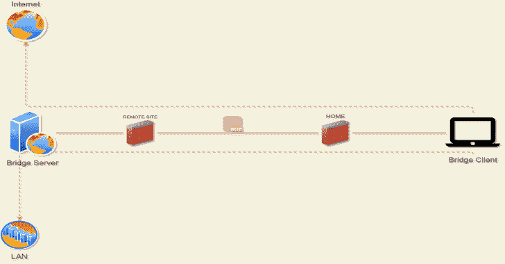

# HTTP_Bridge:通过简单的 HTTP 请求发送 TCP 流包

> 原文：<https://kalilinuxtutorials.com/http_bridge/>

[](https://1.bp.blogspot.com/-3mYb1dIij-E/YE4c31VJkEI/AAAAAAAAIhk/EGW-ftLoMNcrFTB6u_EHovKNZd_2QuAxwCLcBGAsYHQ/s728/Http%2BBridge%25281%2529.png)

HTTP_Bridge 是一个由服务器和客户端两部分组成的工具。

**服务器**

服务器只是一个带有一些逻辑的 php 文件，使用 tcp 套接字保持有状态连接，并处理传入的 http 请求；到目前为止，这个逻辑只适用于 linux 服务器。

我用 apache+mod_php、nginx+php-fpm 和内置的 php 服务器(php -S)测试过

**客户端**

客户端是一个 Socks5 服务器，它侦听传入的客户端连接，将字节串打包，并在收到客户端的响应回写后将 http 请求发送给服务器。

这个客户端是用 rust 编写的，我从这个项目中借用了 Socks5 的实现 [v2socks](https://github.com/ylxdzsw/v2socks) 所以感谢 [ylxdzsw](https://github.com/ylxdzsw)

**例题**

运行此示例需要 Proxychains。

上传服务器文件`hbserver/hbserver.php`到一个有 php 支持的正在运行的 web 服务器，或者如下运行一个本地服务器，这将产生一个 docker 容器监听 8080 端口。

**docker run–RM-it–net host–name Apache-web server-v " $ PWD/HB server:/app-v " $ PWD/tools/ports . conf:/etc/Apache 2/ports . conf " web devo PS/PHP-Apache:7.3**

到客户端需要编译，所以你需要安装一个 rust 编译器或者从这里得到一个 [rustup](https://rustup.rs/)

**cd 客户端&&
货舱&&
。/target/debug/hbsc**

将 proxychains 配置为指向本地 socks5 端口:

**echo " socks 5 127 . 0 . 0 . 1 1986 ">>$ HOME/。proxy chains/proxy chains . conf**

一切就绪后，进行一些测试:

*   **普通 http**

`**icanhazip.com**`

```
alejandro@0x2e ~ $ proxychains curl -v icanhazip.com
[proxychains] config file found: /home/alejandro/.proxychains/proxychains.conf
[proxychains] preloading /usr/lib64/libproxychains.so.4.14
*   Trying 224.0.0.1:80...
* Connected to icanhazip.com (127.0.0.1) port 80 (#0)
> GET / HTTP/1.1
> Host: icanhazip.com
> User-Agent: curl/7.72.0
> Accept: */*
> 
* Mark bundle as not supporting multiuse
< HTTP/1.1 200 OK
< Date: Thu, 25 Feb 2021 18:08:04 GMT
< Content-Type: text/plain
< Content-Length: 15
< Connection: close
< Set-Cookie: __cfduid=dd994605ef1b77d0aa6dc46b6fdbb4c8d1614276484; expires=Sat, 27-Mar-21 18:08:04 GMT; path=/; domain=.icanhazip.com; HttpOnly; SameSite=Lax
< Access-Control-Allow-Origin: *
< Access-Control-Allow-Methods: GET
< X-RTFM: Learn about this site at http://bit.ly/icanhazip-faq
< X-THANK-YOU: Many thanks to the fine people at Cloudflare for keeping this site afloat!
< cf-request-id: 087bf977730000e790d13c4000000001
< Server: cloudflare
< CF-RAY: 62735e9f1ec9e790-MDE
< alt-svc: h3-27=":443"; ma=86400, h3-28=":443"; ma=86400, h3-29=":443"; ma=86400
< 
XXX.33.235.XXX
* Closing connection 0 
```

*   **TLSV3**

[http://httpbin.org/headers](http://httpbin.org/headers)

```
alejandro@0x2e ~ $ proxychains curl -v http://httpbin.org/headers
[proxychains] config file found: /home/alejandro/.proxychains/proxychains.conf
[proxychains] preloading /usr/lib64/libproxychains.so.4.14
*   Trying 224.0.0.1:80...
* Connected to httpbin.org (127.0.0.1) port 80 (#0)
> GET /headers HTTP/1.1
> Host: httpbin.org
> User-Agent: curl/7.72.0
> Accept: */*
> 
* Mark bundle as not supporting multiuse
< HTTP/1.1 200 OK
< Date: Thu, 25 Feb 2021 18:05:51 GMT
< Content-Type: application/json
< Content-Length: 173
< Connection: keep-alive
< Server: gunicorn/19.9.0
< Access-Control-Allow-Origin: *
< Access-Control-Allow-Credentials: true
< 
{
  "headers": {
    "Accept": "*/*", 
    "Host": "httpbin.org", 
    "User-Agent": "curl/7.72.0", 
    "X-Amzn-Trace-Id": "Root=1-6037e6ff-06059b933c2d8c495ecee43a"
  }
}
* Connection #0 to host httpbin.org left intact 
```

*   **HTTP2**

[https://mozilla.org](https://mozilla.org)

```
alejandro@0x2e ~ $ proxychains curl -v https://mozilla.org
[proxychains] config file found: /home/alejandro/.proxychains/proxychains.conf
[proxychains] preloading /usr/lib64/libproxychains.so.4.14
*   Trying 224.0.0.1:443...
* Connected to mozilla.org (127.0.0.1) port 443 (#0)
* ALPN, offering h2
* ALPN, offering http/1.1
* successfully set certificate verify locations:
*   CAfile: /etc/ssl/certs/ca-certificates.crt
  CApath: /etc/ssl/certs
* TLSv1.3 (OUT), TLS handshake, Client hello (1):
* TLSv1.3 (IN), TLS handshake, Server hello (2):
* TLSv1.3 (IN), TLS handshake, Encrypted Extensions (8):
* TLSv1.3 (IN), TLS handshake, Certificate (11):
* TLSv1.3 (IN), TLS handshake, CERT verify (15):
* TLSv1.3 (IN), TLS handshake, Finished (20):
* TLSv1.3 (OUT), TLS change cipher, Change cipher spec (1):
* TLSv1.3 (OUT), TLS handshake, Finished (20):
* SSL connection using TLSv1.3 / TLS_AES_256_GCM_SHA384
* ALPN, server accepted to use h2
* Server certificate:
*  subject: CN=mozilla.org
*  start date: Jan  1 19:11:54 2021 GMT
*  expire date: Apr  1 19:11:54 2021 GMT
*  subjectAltName: host "mozilla.org" matched cert's "mozilla.org"
*  issuer: C=US; O=Let's Encrypt; CN=R3
*  SSL certificate verify ok.
* Using HTTP2, server supports multi-use
* Connection state changed (HTTP/2 confirmed)
* Copying HTTP/2 data in stream buffer to connection buffer after upgrade: len=0
* Using Stream ID: 1 (easy handle 0x562758dbab60)
> GET / HTTP/2
> Host: mozilla.org
> user-agent: curl/7.72.0
> accept: */*
> 
* TLSv1.3 (IN), TLS handshake, Newsession Ticket (4):
* TLSv1.3 (IN), TLS handshake, Newsession Ticket (4):
* old SSL session ID is stale, removing
* Connection state changed (MAX_CONCURRENT_STREAMS == 128)!
< HTTP/2 301 
< date: Thu, 25 Feb 2021 18:03:56 GMT
< content-type: text/html
< content-length: 162
< location: https://www.mozilla.org/
< strict-transport-security: max-age=60; includeSubDomains
< x-backend-server: TS
< cache-control: max-age=3600
< x-frame-options: SAMEORIGIN
< content-security-policy: frame-ancestors 'none'
< 
<html>
<head><title>301 Moved Permanently</title></head>
<body>
<center><h1>301 Moved Permanently</h1></center>
<hr><center>nginx</center>
</body>
</html>
* Connection #0 to host mozilla.org left intact 
```

*   **SMTP**

`[smtp.gmail.com](http://smtp.gmail.com)`

```
alejandro@0x2e ~ $ proxychains nc -v smtp.gmail.com 25
[proxychains] config file found: /home/alejandro/.proxychains/proxychains.conf
[proxychains] preloading /usr/lib64/libproxychains.so.4.14
Connection to smtp.gmail.com 25 port [tcp/smtp] succeeded!
220 smtp.gmail.com ESMTP z1sm4022921qtu.83 - gsmtp
EHLO smtp.gmail.com
250-smtp.gmail.com at your service, [XXX.33.235.XXX]
250-SIZE 35882577
250-8BITMIME
250-STARTTLS
250-ENHANCEDSTATUSCODES
250-PIPELINING
250-CHUNKING
250 SMTPUTF8
^C 
```

*   **宋承宪**

```
alejandro@0x2e ~ $ proxychains ssh  localhost 'ps axl --sort=-pcpu|tail -n 5'
[proxychains] config file found: /home/alejandro/.proxychains/proxychains.conf
[proxychains] preloading /usr/lib64/libproxychains.so.4.14
Password: 
4     0  65375   1242  20   0   9516  6988 -      Ss   ?          0:00 sshd: alejandro [priv]
5  1000  65420  65375  20   0   9516  4320 -      S    ?          0:00 sshd: alejandro@notty
0  1000  65421  65420  20   0 218168  3260 -      Ss   ?          0:00 bash -c ps axl --sort=-pcpu|tail -n 5
4  1000  65422  65421  20   0 220568  3484 -      R    ?          0:00 ps axl --sort=-pcpu
0  1000  65423  65421  20   0 216756   748 -      S    ?          0:00 tail -n 5
alejandro@0x2e ~ $ 
```

[**Download**](https://github.com/sombralibre/http_bridge)