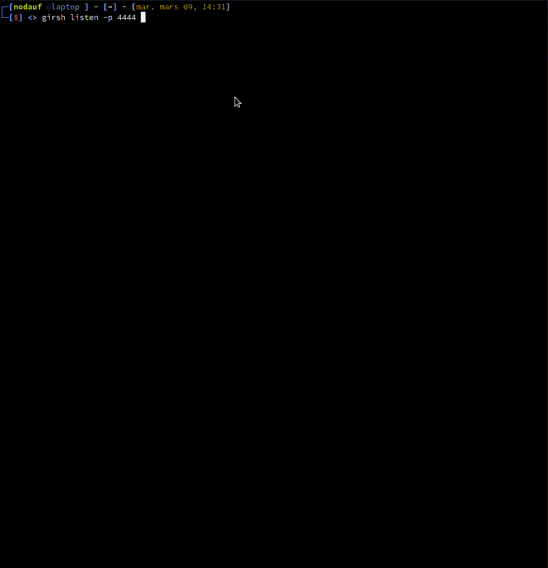

# Girsh:自动生成一个完全交互的反向外壳

> 原文：<https://kalilinuxtutorials.com/girsh/>

使用 **Girsh** ，只需运行它，它就会检测操作系统并执行正确的命令，将其升级为完全交互式的反向 shell。

**对于 Linux 来说**

*   获取终端的大小
*   使用 python2.7、python3 和 python 生成 tty
*   将终端更改为原始状态

**对于一个窗口**

*   将 [ConPTY](https://github.com/antonioCoco/ConPtyShell) 下载到与反向外壳服务器相同的机器和端口上
*   倾听是否得到了符合要求的反向外壳

**用途**

**有两种模式可供选择:**

*   **简单监听器**

**go run main.go listener -h
用法:**
girsh listen【标志】

**标志:**
-h，–help help for listen

**全局标志:**
-d，–Debug 调试输出
-p，–port int port to listen(默认为 1234)(默认为 1234)

*   **互动**

**go run main.go -h
生成一个 reverse shell oneliners(credits shell operator)。
和 listen 然后运行 stty raw -echo 并发送 python 命令来生成一个 tty shell 如果是 Linux
或者使用 ConPTY 如果是 windows**

**用法:**
girsh[Flags]
girsh[command]

**可用命令:**
help 关于任何命令
listen 监听并生成一个完全交互的 windows 和 Linux 客户端

**标志**

**演示**

**Linux**

[**Download**](https://github.com/nodauf/Girsh)