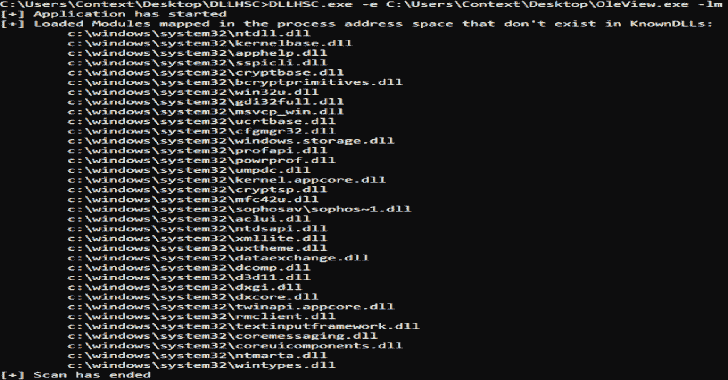
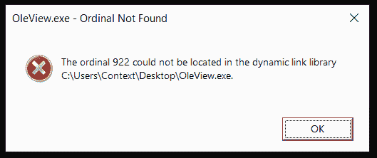
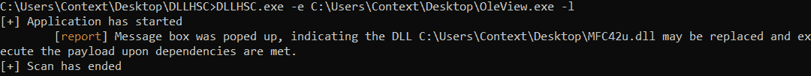
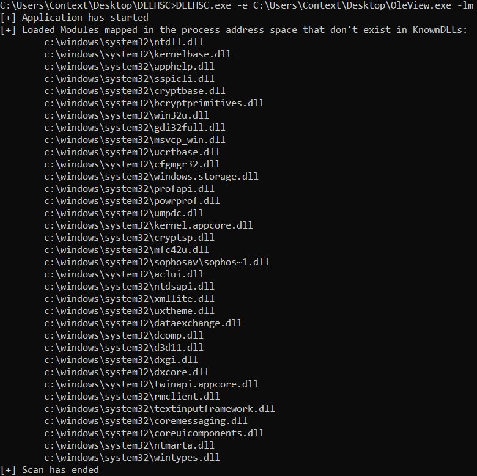
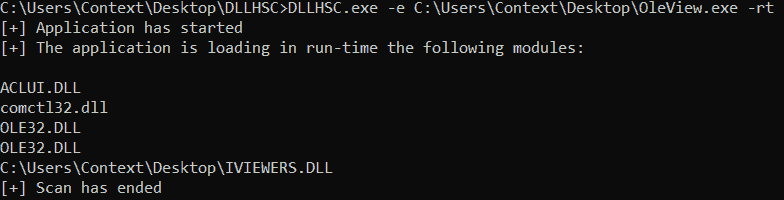

# DLLHSC : DLL 劫持扫描程序，一个帮助发现的工具

> 原文：<https://kalilinuxtutorials.com/dllhsc/>

[](https://1.bp.blogspot.com/---nwicU8Jkg/YE98OMN4ryI/AAAAAAAAIkM/tfcQ3QFbpccCHJe61VvA7xgGc2k27MJ1ACLcBGAsYHQ/s728/DLLHSC%25281%2529.png)

**DLLHSC(DLL 劫持扫描器)**是一个生成线索并自动发现 DLL 搜索顺序劫持候选对象的工具。

**该存储库的内容**

该存储库托管工具的 Visual Studio 项目文件(DLLHSC)、API 挂钩功能的项目文件(duround)、有效负载的项目文件以及最后但同样重要的 x86 和 x64 体系结构的已编译可执行文件(在本报告的发布部分)。代码是用 **Visual Studio 社区 2019** 编写编译的。

如果您选择从源代码编译工具，您将需要编译项目 DLLHSC、detour 和 payload。DLLHSC 实现了该工具的核心功能。绕道项目生成一个 DLL，用于挂钩 API。payload 项目生成 DLL，用作概念验证，以检查测试的可执行文件是否可以通过搜索顺序劫持来加载它。生成的有效负载必须与 DLLHSC 放在同一个目录中，对于 x86 架构名为*payload32.dll*，对于 x64 架构名为*payload64.dll*。

**操作模式**

该工具实现了 3 种操作模式，如下所述。

**轻量模式**

将可执行映像加载到内存中，解析导入表，然后用有效负载 DLL 替换导入表中引用的任何 DLL。

该工具仅在应用程序目录中放置一个不在应用程序目录中、不属于 WinSxS 且不属于 KnownDLLs 的模块(DLL)。

有效负载 DLL 在执行时，在下面的路径中创建一个文件:`**C:\Users\%USERNAME%\AppData\Local\Temp\DLLHSC.tmp**`作为执行的证明。该工具启动应用程序，并通过检查临时文件是否存在来报告有效负载 DLL 是否被执行。由于一些可执行文件从它们加载的 DLL 中导入函数，当提供的 DLL 无法导出这些函数从而满足提供的映像的依赖关系时，可能会显示错误消息框。但是，消息框表明，如果满足依赖关系，DLL 可能是有效负载执行的良好候选。在这种情况下，需要进行额外的分析。这些消息框的标题可能包含字符串:`Ordinal Not Found`或`Entry Point Not Found`。DLLHSC 查找包含这些字符串的窗口，一旦它们出现就关闭它们并报告结果。

**列表模块模式**

使用提供的可执行映像创建一个进程，枚举加载到该进程的地址空间中的模块，并在应用筛选器后报告结果。

该工具只报告从系统目录加载的模块，不属于 KnownDLLs。结果是需要额外分析的线索。然后，分析师可以将报告的模块放在应用程序目录中，并检查应用程序是否加载了提供的模块。

**运行时模式**

通过[微软弯路](https://github.com/microsoft/Detours)挂钩 LoadLibrary 和 LoadLibraryEx APIs，并报告运行时加载的模块。

每次被扫描的应用程序调用 LoadLibrary 和 LoadLibraryEx 时，该工具都会拦截调用，并将请求的模块写入文件`C:\Users\%USERNAME%\AppData\Local\Temp\DLLHSCRTLOG.tmp`。如果用标志 LOAD_LIBRARY_SEARCH_SYSTEM32 专门调用 LoadLibraryEx，则不会向文件中写入任何输出。所有拦截完成后，该工具读取文件并打印结果。需要进一步分析的是不存在于 KnownDLLs 注册表项中的模块、不存在于系统目录中的模块以及没有完整路径的模块(对于这些模块，loader 应用正常的搜索顺序)。

**编译&运行指南**

如果您选择从源代码编译该工具，建议在 Visual Code Studio 2019 上这样做。为了让工具正常工作，项目 *DLLHSC* 、*绕道*和*有效载荷*必须针对相同的架构进行编译，然后放在相同的目录中。请注意，从项目*有效负载*生成的 DLL 必须重命名为 32 位架构的*payload32.dll*或 64 位架构的*payload64.dll*。

**帮助菜单**

此应用程序的帮助菜单

```
NAME
        dllhsc - DLL Hijack SCanner

SYNOPSIS
        dllhsc.exe -h

        dllhsc.exe -e <executable image path> (-l|-lm|-rt) [-t seconds]

DESCRIPTION
        DLLHSC scans a given executable image for DLL Hijacking and reports the results

        It requires elevated privileges

OPTIONS
        -h, --help
                display this help menu and exit

        -e, --executable-image
                executable image to scan

        -l, --lightweight
                parse the import table, attempt to launch a payload and report the results

        -lm, --list-modules
                list loaded modules that do not exist in the application's directory

        -rt, --runtime-load
                display modules loaded in run-time by hooking LoadLibrary and LoadLibraryEx APIs

        -t, --timeout
                number of seconds to wait for checking any popup error windows - defaults to 10 seconds 
```

**示例运行**

本节提供了如何运行 DLLHSC 及其报告结果的示例。为此，使用了合法的微软实用程序*OleView.exe*(MD5:D1 e 6767900 c 85535 f 300 e 08d 76 AAC 9 ab)。为了获得更好的结果，建议在安装目录中扫描所提供的可执行映像。

标志`-l`解析所提供的可执行文件的导入表，应用过滤器，并试图通过在应用程序的当前目录中放置一个有效负载 DLL 来将导入的模块武器化。当不满足负载 DLL(导出函数)的依赖关系时，扫描的可执行文件可能会弹出一个错误框。在这种情况下，会弹出一个错误消息框。默认情况下，如果消息框被打开，DLLHSC 会检查 10 秒钟，或者用户使用标志`-t`指定的时间。一个错误消息框表明，如果满足依赖性，该模块可以武器化。

以下截图显示了`OleView.dll`加载有效负载 DLL 时生成的错误消息框:

[](https://github.com/ctxis/DLLHSC/blob/master/screenshots/dependency.PNG)

该工具等待的最长时间为 10 秒或`-t`秒，以确保流程初始化已经完成，并且任何消息框已经生成。然后它检测消息框，关闭它并报告结果:

[](https://github.com/ctxis/DLLHSC/blob/master/screenshots/dllhsc-l.PNG)

标志`-lm`启动提供的可执行文件并打印它加载的模块，这些模块不属于 KnownDLLs 列表，也不是 WinSxS 依赖项。这种模式旨在给出一个可以用作有效负载的 dll 的概念，它的存在只是为了给分析师生成线索。

[](https://github.com/ctxis/DLLHSC/blob/master/screenshots/dllhsc-lm.PNG)

当作为进程启动时，标志`-rt`打印所提供的可执行映像加载到其地址空间中的模块。这是通过微软绕路将 *LoadLibrary* 和*LoadLibrary ex*API 挂钩实现的。

[](https://github.com/ctxis/DLLHSC/blob/master/screenshots/dllhsc-rt.PNG)[**Download**](https://github.com/ctxis/DLLHSC)