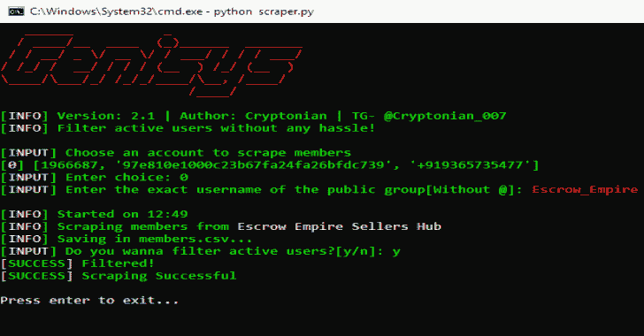
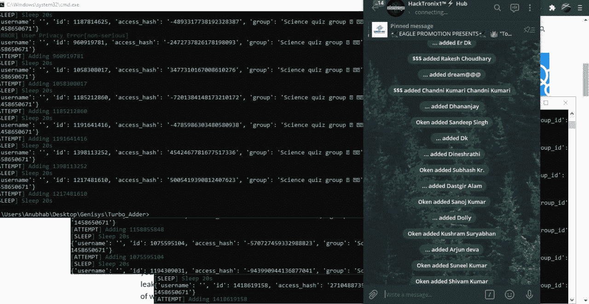

# Genisys:强大的电报成员抓取和添加工具包

> 原文：<https://kalilinuxtutorials.com/genisys/>

**Genisys** 是一个功能强大的电报成员抓取和添加工具包。

**特性**

*   批量添加[按用户 id，而不是用户名]
*   刮刀和添加到公共群组
*   在 Windows 系统中工作
*   您可以同时运行无限个帐户来添加成员
*   基于要使用的帐户数量的 CSV 文件自动分配器
*   强大的刮擦工具，可以从任何公共团体刮擦活跃成员
*   您可以通过用户名和用户 ID 添加成员
*   账户被禁的可能性最小
*   脚本自动加入所有帐户的公共组，以加快添加速度
*   过滤并删除被禁止的账户，让事情变得简单
*   genesys 还可以存储无限的帐户，用于添加目的
*   添加脚本会根据要使用的帐户数量自动启动

**如何使用？**

*   安装要求

`**pip install -r requirements.txt**`

*   阅读完整教程`**HOW_TO_USE.txt**`并使用它

*   添加您的帐户以添加和收集成员

`**python manager.py**`

*   刮成员

`**python scraper.py**`

*   添加成员

`**python tsadder.py**`

**支持|图库**

*   任何问题或帮助加入我们的[中心](https://telegram.me/HackTronix_Hub)

**警告**

*   这个工具是官方的，完全免费使用。如果有人试图通过复制脚本来销售，请不要购买

**新闻**

*   添加私人组功能将很快推出
*   将为 linux/android 推出单独的工具