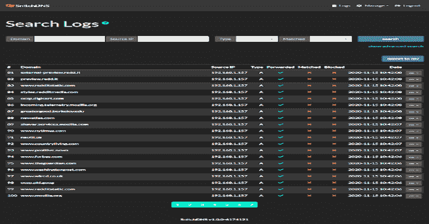

# SnitchDNS:带有 Web UI 的数据库驱动的 DNS 服务器

> 原文：<https://kalilinuxtutorials.com/snitchdns/>

**SnitchDNS** 是一个数据库驱动的 DNS 服务器，具有 Web UI，用 Python 和 [Twisted](https://github.com/twisted/twisted) 编写，使 DNS 管理更加容易，所有配置更改立即应用，无需重新启动任何系统服务。

它的主要特性之一是记录所有 DNS 查询，允许发现网络流量端点，它还可以用于实现金丝雀令牌，因为它支持通过电子邮件、web 推送、Slack 和团队进行通知。Red teamers 还可以使用 SnitchDNS 来监控网络钓鱼域的沙箱，与 SIEM 解决方案集成，限制对特定 IP 范围的响应，通过 DNS 隧道和无所不包的域输出数据，等等。

**依赖关系**

*   Python 3.6 以上版本

**安装**

请确保您使用`git`安装，而不是通过手动下载回购。

*   [手动方式](https://github.com/ctxis/SnitchDNS/blob/master/docs/setup/manual.md)
*   [可行的方法](https://github.com/ctxis/SnitchDNS/blob/master/docs/setup/ansible.md)
*   [码头工人的方式](https://github.com/ctxis/SnitchDNS/blob/master/docs/setup/docker.md)

**文档**

通用文档[见此处](https://github.com/ctxis/SnitchDNS/blob/master/docs/general/index.md)

**截图**

截图[见这里](https://github.com/ctxis/SnitchDNS/blob/master/docs/general/screenshots.md)

**基本特征**

*   **数据库驱动。**
    *   更改会立即反映在每个 DNS 请求上。
    *   支持的 DBMS:
        *   SQLite
        *   MySQL / MariaDB
        *   Postgres
*   **DNS 服务器**
    *   支持通用 DNS 记录。
        *   `A, AAAA, AFSDB, CNAME, DNAME, HINFO, MX, NAPTR, NS, PTR, RP, SOA, SPF, SRV, SSHFP, TSIG, TXT`。
    *   包罗万象的领域。
        *   能够将任何子域(无论深度)匹配到特定的父域，例如*.hello.example.com。
    *   无与伦比的记录转发。
        *   拦截特定查询(即只有`A`和`CNAME`)并将所有其他记录转发到第三方 DNS 服务器(即谷歌)的功能。
    *   标签和别名。
*   **IP 规则**
    *   为每个域配置允许/阻止规则。
*   **通知。当域被解析时，通过**接收通知
    *   电子邮件
    *   网页推送
    *   松弛的
    *   微软团队
*   **用户管理**
    *   多用户支持
        *   每个用户都有自己的子域可供使用。
    *   LDAP 支持
    *   双因素认证
    *   密码复杂性管理
*   **测井**
    *   记录所有 DNS 查询，无论它们是否匹配。
    *   SIEM 集成的 CSV 日志记录。
*   **Swagger 2.0 API**
*   **部署**
    *   适用于 Ubuntu 18.04 / 20.04 的可翻译脚本
    *   码头工人
    *   CLI 支持区域、记录、用户和设置管理。
    *   CSV 导出/导入

**用例**

*   **SnitchDNS 可用于:**
    *   DNS 转发服务器–允许您通过 Web GUI 监控所有请求。
    *   红队–实施 IP 限制以阻止沙盒、监控网络钓鱼域名解析和电子邮件，并限制对已知 IP 范围的访问。
    *   DNS 隧道–记录所有 DNS 请求和出口数据。
    *   让我们使用 API 或 CLI 界面加密 DNS 质询。
    *   广告拦截。
    *   金丝雀代币。
    *   与 SIEM 解决方案集成。

有关场景的更多详细信息，请参见[用例文档](https://github.com/ctxis/SnitchDNS/blob/master/docs/general/use_cases.md)

**限制**

*   缓存还没有实现，这意味着它不适合每个服务器有数百个 DNS 请求的环境
*   一分钟。

[**Download**](https://github.com/ctxis/SnitchDNS)