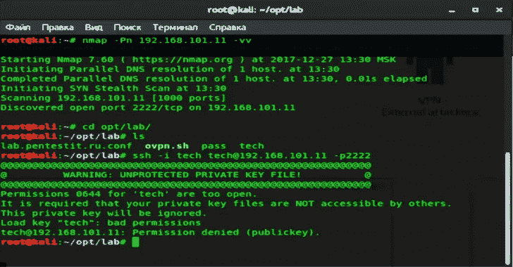

# 懒惰-RDP:用于自动冗余扫描和暴力破解的脚本

> 原文：<https://kalilinuxtutorials.com/lazy-rdp/>

**懒惰-RDP** 是一个脚本，用于自动[扫描地址列表的](https://www.kitploit.com/search/label/Scanning)是否存在开放的 3389 端口，然后选择方法并启动破坏对登录/密码。

该脚本针对 Kali linux 2.0、Kali Linux 2016.2иKali Linux 2017.1、2017.2 系统和更高版本进行了调整。

为了正确工作，脚本需要建立:masscan、curl 和 FreeRDP。

当前版本是 1.32。

*   **补充:**支持 XFCE，支持 Parrot 安全 OS，自动更新，[扫描器](https://www.kitploit.com/search/label/Scanner)从列表中选择(Nmap)，从 127.0.0.1/8 范围内扫描本地地址，指定扫描端口的能力。修正了误报的错误。修正了从列表中选择一些国家的脚本时的崩溃错误。修正了一个路径不正确的错误。增加了英语。~~修复了[蛮力](https://www.kitploit.com/search/label/Brute%20Force)菜单的一个 bug。~~完全把工具改成了[蛮](https://www.kitploit.com/search/label/Brute)力。增加了九头蛇 9.0。增加了自动检测操作系统语言的功能。优化的脚本代码。添加了自动安装和配置依赖项(freerdp-X11、freerdp2-x11、masscan ),以便在“SANA”和“ROLLING”中正常工作。增加了一个用 X11_OVER_SSH 创建脚本的特性。

**安装**

*   **设置**

**git 克隆 https://github.com/getdrive/Lazy-RDP
CD 懒人-RDP&&chmod+x hydra/configure hydra/hydra src/RDP _ brute . sh patator . py 开始安装**

*   **安装依赖关系**

**。/安装**

*   **运行脚本**

**。/start**

**演示视频**

[https://www.youtube.com/embed/Kpl8l6YQq48?feature=oembed&enablejsapi=1](https://www.youtube.com/embed/Kpl8l6YQq48?feature=oembed&enablejsapi=1)

**宋承宪的懒 RDP:**

[https://www.youtube.com/embed/VXScp23WbZw?feature=oembed&enablejsapi=1](https://www.youtube.com/embed/VXScp23WbZw?feature=oembed&enablejsapi=1)

**免责声明**

此脚本只能用于教育目的和测试。仅在您自己的网络上使用它。作者不对其使用负责。

[**Download**](https://github.com/getdrive/Lazy-RDP)