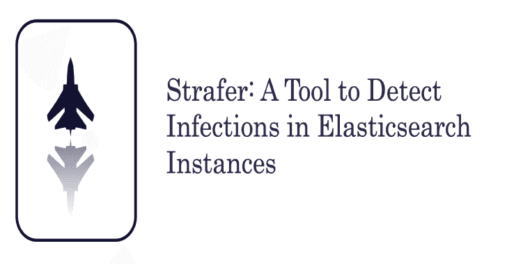

# Strafer:在弹性搜索实例中检测潜在感染的工具

> 原文：<https://kalilinuxtutorials.com/strafer/>

弹性搜索感染呈指数增长。对手正在利用开放和公开的弹性搜索接口来触发云和非云部署中的感染。在这次演讲中，我们将发布一款名为“ **STRAFER** 的工具，用于检测 Elasticsearch 实例中的潜在感染。该工具允许安全研究人员、渗透测试人员和威胁情报专家检测运行恶意代码的受损和受感染的 Elasticsearch 实例。该工具还使您能够在针对云数据库的恶意软件领域进行有效的研究。在此版本的工具中，支持以下模块:

*   弹性搜索实例信息收集和侦察
*   互联网上的弹性搜索实例曝光
*   在 Elasticsearch 实例中检测潜在的勒索病毒感染
*   检测潜在的僵尸网络感染，如喵僵尸网络
*   在弹性搜索实例中检测感染指数
*   检测弹性搜索蜜罐

**注意:**这是该工具的第一个版本，我们希望在不久的将来添加更多的模块。

研究和开发人员:Aditya K Sood 和 Rohit Bansal