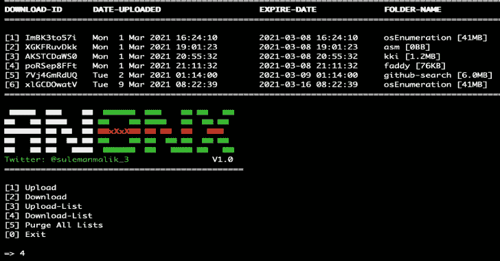

# AnonX:通过 AES-256-CBC 的加密文件传输

> 原文：<https://kalilinuxtutorials.com/anonx/>

**AnonX** 是一款加密文件上传器和下载器。上传的档案将持续一周，并将从服务器上删除。AnonX 在将目录上传到服务器之前会对其进行加密。下载功能需要下载 id 和 AES 密码才能成功下载和解密档案。

*   通过 AES-256-CBC 的加密文件传输
*   要上传的最大文件大小= 2GB

**用途**

**git 克隆 https://github . com/Sam haxr/anonx
chmod+x anonx . sh
。/Anonx.sh**

**Youtube 教程**

[https://www.youtube.com/embed/r2GrmcZxGV4?feature=oembed&enablejsapi=1](https://www.youtube.com/embed/r2GrmcZxGV4?feature=oembed&enablejsapi=1)

[**Download**](https://github.com/samhaxr/AnonX)