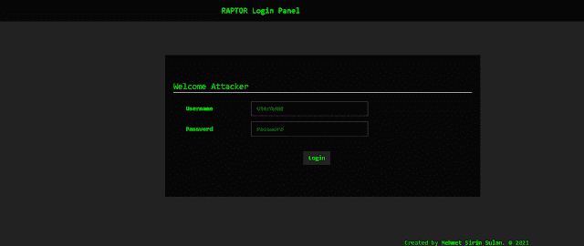
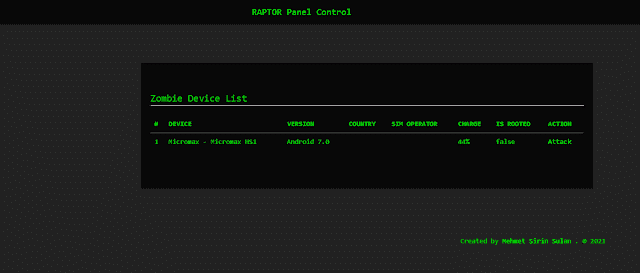
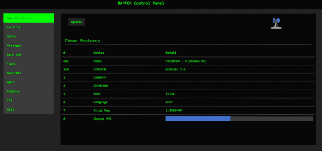
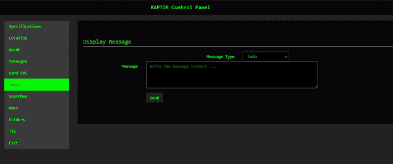
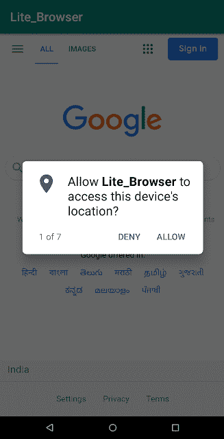
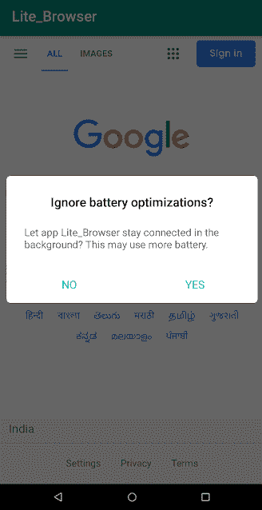

# 拉斐尔鼠:用 Java 写的安卓鼠

> 原文：<https://kalilinuxtutorials.com/rafel-rat/>

**拉斐尔**是**远程访问工具**，用于控制使用**网络面板**的受害者，具有更高级的功能。

**主要特点**

*   管理权限
*   将应用程序添加到白名单
*   看起来像浏览器
*   即使应用程序关闭也在后台运行(可能无法在某些设备上运行)
*   辅助功能
*   支持 Android V5–v10
*   不需要端口转发
*   获取唤醒锁
*   完全无法察觉

**先决条件**

*   安卓工作室

运筹学

*   [apkeeasytool](https://forum.xda-developers.com/android/software-hacking/tool-apk-easy-tool-v1-02-windows-gui-t3333960)

**用 Android Studio 构建 Apk**

1.  在 Android Studio 中打开项目 ***Lite_Browsercode***
2.  将服务器的`command.php`链接放到 InternalService.class 类中
3.  构建项目
4.  Zipalign 并签署 Apk…

**用 ApkEasyTool 构建 Apk:**

*   导航至***\ Lite _ Browser \ smali \ com \ velociraptor \ raptor***
*   打开 InternalService.smali
*   将此替换为您的面板 Url ***const-string v0，“[https://your-web Panel-Url/commands . PHP](https://your-webpanel-url/commands.php)”***

**构建服务器**

1.  将服务器文件夹中的文件上传到您的主机面板
2.  现在打开 login.php
3.  输入用户名 ***汉德**密码*Ercel**
4.  注意:确保你的虚拟主机站点使用 Https 并且应该有有效的连接…我推荐 000webhost.com
5.  您现在可以使用 panel 发送命令，并在发送命令后进行刷新

**截图**

