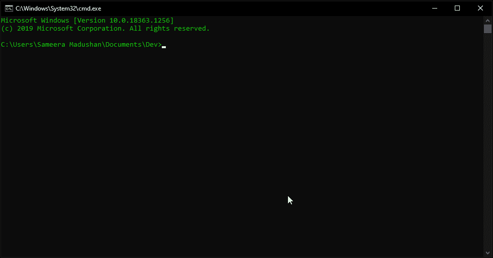

# Diceware 密码生成器:生成高熵密码

> 原文：<https://kalilinuxtutorials.com/diceware-password-generator/>

[**密码软件**](https://theworld.com/~reinhold/diceware.html) 是一种用于生成加密性强且容易记忆的密码的方法。这是 diceware 密码生成算法的 python 实现。看了[这个](https://youtu.be/Pe_3cFuSw1E)视频后受到启发。

**注意:**该程序不会以任何形式存储密码，所有密码都是在您的设备中本地生成的。

**DPG 如何生成密码？**

传统的骰子软件使用物理骰子，这个应用程序使用一个强大的随机数发生器来代替骰子。一个虚拟骰子被玩 5 次，5 位数的数字用于查找单词表。6 次掷骰子给你 6 个随机的单词，这些单词很容易被人记住，但是有很高的熵值，这使得它们很难被破解。

**警告** : [用电脑生成你的密码不如用纸质的密码列表来滚动实体骰子来得安全。](https://theworld.com/~reinhold/dicewarefaq.html#:~:text=Generating%20truly%20random%20numbers%20using%20a,better%20way%20to%20select%20passphrase%20words.)

更多详情请查看 diceware 密码短语[主页](https://theworld.com/~reinhold/diceware.html)。

**Git 安装**

**#克隆回购**
$ git 克隆 https://github . com/same era-madu shan/dice ware-Password-Generator . git

**#将工作目录改为 dice ware-Password-Generator**
$ CD dice ware-Password-Generator

**用途**

**用法:python dpg.py**

[**Download**](https://github.com/sameera-madushan/Diceware-Password-Generator)