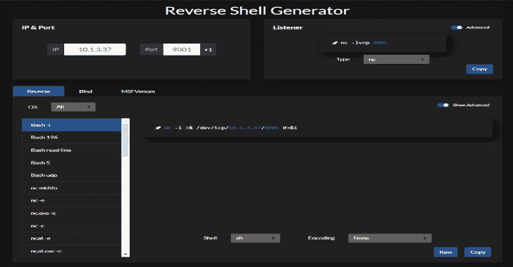

# 反向外壳生成器:托管的反向外壳生成器，具有大量功能

> 原文：<https://kalilinuxtutorials.com/reverse-shell-generator/>

托管的**反向外壳生成器**具有大量的功能。

**特性**

*   生成通用侦听器和反向 shells
*   原始模式，以卷曲壳到你的机器。
*   按钮将监听端口号增加 1
*   URI 和 Base64 编码
*   本地存储来保存您的配置
*   黑暗和光明模式

**开发**

如果您想要修改任何服务器功能，例如原始链接支持，建议使用 netlify dev 命令:

**npx 网络生命周期开发**

[**Download**](https://github.com/0dayCTF/reverse-shell-generator)