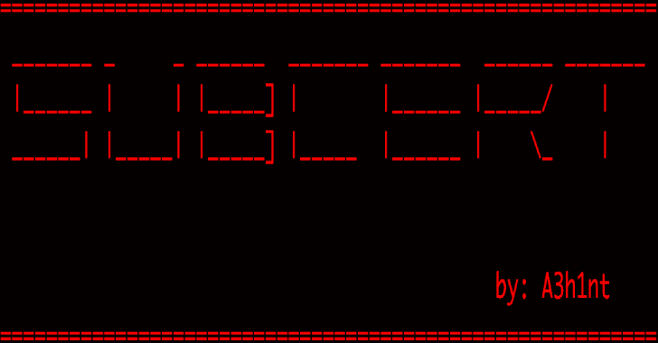

# Subcert:从证书透明度日志中查找所有子域

> 原文：<https://kalilinuxtutorials.com/subcert/>

Subcert 是一个子域枚举工具，从证书透明日志中找到所有有效的子域。

**设置**

*   **第一步:安装 Python 3**

**apt-get 安装 python3-pip**

*   **步骤 2:克隆存储库**

**git 克隆 https://github.com/A3h1nt/Subcert.git**

*   **步骤 3:安装依赖关系**

**pip 3 install-r requirements . txt**

*   **第四步:将目录移动到/opt**

**mv subcert /opt/**

*   步骤 5:在中添加一个别名。bashrc 从任何地方运行脚本

**别名 subcert = " python 3/opt/subcert/subcert . py "**

**演示**

[https://www.youtube.com/embed/xihYOaM6p8Y?feature=oembed&enablejsapi=1](https://www.youtube.com/embed/xihYOaM6p8Y?feature=oembed&enablejsapi=1)

[**Download**](https://github.com/A3h1nt/Subcert)