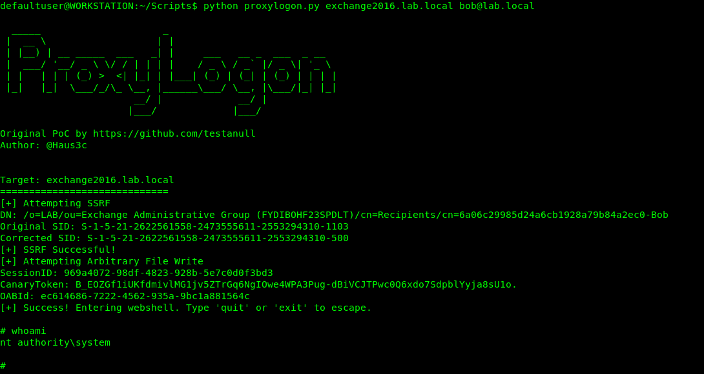

# 针对 microsoft exchange 的 proxylogon poco 漏洞利用

> 原文：<https://kalilinuxtutorials.com/proxylogon/>

**ProxyLogon** 是一款针对微软 exchange 的 PoC 漏洞利用工具。

**如何使用？**

`**python proxylogon.py <name or IP of server> <user@fqdn>**`

**例子**

`**python proxylogon.py primary administrator@lab.local**`

*   如果成功，你将进入一个网络外壳。`**exit**`或`**quit**`退出 webshell(或 ctrl+c)

*   默认情况下，它会创建一个文件`**test.aspx**`。这是可以改变的。

[**Download**](https://github.com/hausec/ProxyLogon)