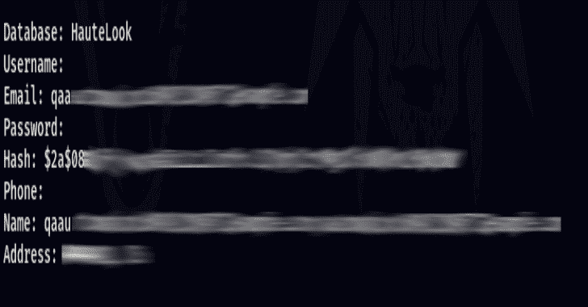

# Godehashed:使用 Dehashed.Com API 搜索受损资产的工具

> 原文：<https://kalilinuxtutorials.com/godehashed/>

Godehashed 是一个 golang 工具，它使用 dehashed.com API 来搜索受损的资产。然后可以将结果编译成 CSV 格式，以供进一步分析。

**去哈希 API**

您必须为该工具提供一个 api 密钥。例如，参见 apikey_template.txt。

**安装**

要在 CLI 中安装该工具，请运行以下命令。您的$GOPATH 必须已经设置。

`**go get https://github.com/an00byss/godehashed**`

**用途**

**。/gode hashed-s email-I API key . txt-e SOMEDOMAIN-o leaks . CSV**

Godehashed 用法():
-e 字符串
我们正在搜索的电子邮件
-i 字符串
要导入的 apikey 的名称。
-n 串
我们要找的名字。
-o 字符串
Outfile 文件名，将以 CSV 格式输出。
-p int
我们正在搜索的电话号码
-s string
指定我们正在搜索的内容:“姓名”、“电子邮件”、“电话”、“用户名”或“列表”。然后添加相应的开关。
-u string
我们正在搜索的用户名
-l list
搜索邮件列表。

| 搜索术语 | 例子 |
| --- | --- |
| 电子邮件 | `godehashed -s email -i apikey.txt -e SOMEDOMAIN.com -o leaks.csv` |
| 目录 | `godehashed -s list -e email -i apikey.txt -l list.txt -o leaks.csv` |
| 用户名 | `godehashed -s username -i apikey.txt -u USERNAME -o leaks.csv` |
| 名字 | `godehashed -s name -i apikey.txt -n "Name" -o leaks.csv` |
| 电话 | `godehashed -s phone -i apikey.txt -p "phonenumber" -o leaks.csv` |

**法律免责声明**

未经双方同意使用 godehashed 攻击目标是非法的。最终用户有责任遵守所有适用的地方、州和联邦法律。开发人员不承担任何责任，也不对任何误用或造成的损坏负责。

[**Download**](https://github.com/an00byss/godehashed)