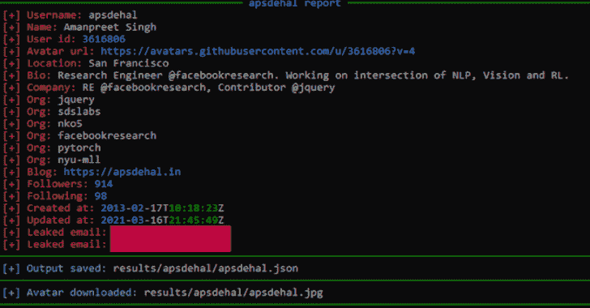

# Gitrecon:从 Github 配置文件中获取信息的工具

> 原文：<https://kalilinuxtutorials.com/gitrecon/>

Gitrecon 是一款 **OSINT** 工具，用于从 Github 或 Gitlab 档案中获取信息，并查找提交时泄露的用户电子邮件地址。

这是如何工作的？

GitHub 使用与 GitHub 帐户关联的电子邮件地址将提交和其他活动链接到 GitHub 配置文件。当用户提交公开回购时，他们的电子邮件地址通常会在提交中公布，并且可以公开访问，如果你知道去哪里找的话。

GitHub 提供了一些如何防止这种情况发生的[说明](https://help.github.com/articles/setting-your-email-in-git/)，但似乎大多数 GitHub 用户要么不知道，要么不在乎他们的电子邮件地址可能会被暴露。

找到 GitHub 用户的电子邮件地址通常就像通过 GitHub API 查看他们最近的事件一样简单。

**安装**

**git 克隆 https://github.com/GONZOsint/gitrecon.git
CD git recon/
python 3-m pip install-r requirements . txt**

*   通过编辑`**modules/github_recon.py**`文件的第 3 行，可以使用一个 [Github 访问令牌](https://github.com/settings/tokens)。这将防止可能的 API 禁令。
*   通过编辑`**modules/gitlab_recon.py**`文件的第 3 行，可以使用 [Gitlab 访问令牌](https://gitlab.com/-/profile/personal_access_tokens)。这将防止可能的 API 禁令。

**令牌= ' <访问令牌此处> <access token="" here="">'</access>**

**用途**

**用法:** gitrecon.py [-h] -s {github，gitlab} [-a] [-o]用户名

**位置参数:**
用户名

**可选参数:**
-h，–帮助显示此帮助信息并退出
-s {github，gitlab}站点选择
-a，–头像下载头像图片
-o，–输出保存输出

结果保存在结果//路径中。

**特性**

**Gitlab 和 Github 在提交时泄露邮件**

*   **Gitlab 和 Github SSH 密钥**

| Github SSH 密钥 | Gitlab SSH 密钥 |
| --- | --- |
| 身份证明 | -好的 |
| -好的 | 一点 |
| -好的 | 创建于 |
| -好的 | 过期时间 |
| 钥匙 | 钥匙 |

*   **Gitlab 和 Github 简介信息**

| Github 个人资料信息 | Gitlab 个人资料信息 |
| --- | --- |
| 用户名 | 用户名 |
| 名字 | 名字 |
| 用户标识 | 用户标识 |
| -好的 | 状态 |
| -好的 | 状态 |
| 头像 url | 头像 url |
| 电子邮件 | 电子邮件 |
| 位置 | 位置 |
| 个人简历 | 个人简历 |
| 公司 | 组织 |
| 组织 | -好的 |
| -好的 | 职称 |
| -好的 | 工作信息 |
| 博客 | 网 |
| Gravatar ID | -好的 |
| 推特 | 推特 |
| -好的 | 网络电话 |
| -好的 | 商务化人际关系网 |
| 追随者 | 追随者 |
| 跟随 | 跟随 |
| 创建于 | 创建于 |
| 更新时间 | -好的 |

[**Download**](https://github.com/GONZOsint/gitrecon)