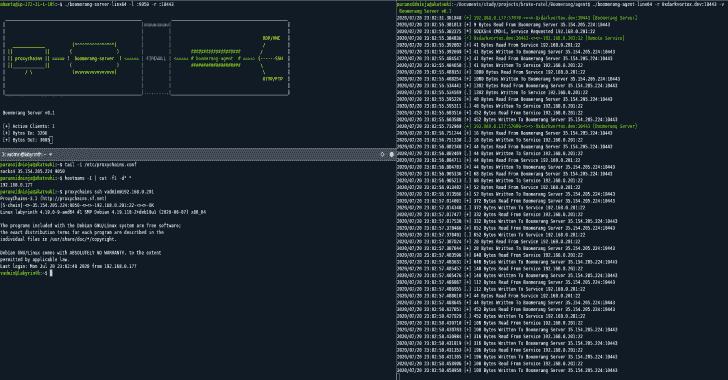

# Boomerang:一个将多个内部服务器暴露给 Web/Cloud 的工具

> 原文：<https://kalilinuxtutorials.com/boomerang/>

**Boomerang** 是一个使用 HTTP+TCP 隧道将多个内部服务器暴露给 web/cloud 的工具。服务器将在云上暴露 2 个端口。一个是像 proxychains 这样的工具可以通过 socks 连接的地方，另一个是代理可以连接的地方。

该代理可以在任何内部主机上执行。代理将连接到服务器，并监听任何可以转发到内部机器(如 socks 服务器)的连接。更详细的信息可以在下图中找到。

身份验证等功能正在开发中，很快就会添加进来。
代理&服务器相当稳定，可以在红队中使用，用于多层次的旋转和向外部/其他网络公开服务。

**注:**回旋镖代理&服务器支持 Windows、Linux 和 Arm 架构。正在开发的特性:代理认证(在此之前使用 C2s 的 IP 白名单)

[**Download**](https://github.com/paranoidninja/Boomerang)