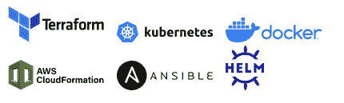

# Kics:发现安全漏洞和合规性问题

> 原文：<https://kalilinuxtutorials.com/kics/>

通过 Checkmarx 的 **KICS** ，在基础设施即代码开发周期的早期发现安全漏洞、合规性问题和基础设施错误配置。

KICS 主张保持基础设施代码安全，它是开源的，是任何云原生项目的必备工具。

**支持的平台**

对其他解决方案和其他云提供商的支持在[路线图](https://github.com/Checkmarx/kics/blob/master/docs/roadmap.md)中。

**入门**

设置和使用 KICS 超级简单。

*   首先，看看如何[安装并运行 First】。](https://github.com/Checkmarx/kics/blob/master/docs/getting-started.md)
*   然后探索 KICS [输出结果格式](https://github.com/Checkmarx/kics/blob/master/docs/results.md)并快速修复检测到的问题。

对更高级的东西感兴趣吗？

*   深入 KICS [查询](https://github.com/Checkmarx/kics/blob/master/docs/queries.md)。
*   了解如何将[KICS 整合到您最喜欢的 CI/CD 渠道中。](https://github.com/Checkmarx/kics/blob/master/docs/integrations.md)

它是如何工作的？

让 KICS 真正强大和受欢迎的是它内置的可扩展性。这种可扩展性是通过以下方式实现的:

*   完全可定制和可调整的启发式规则，称为[查询](https://github.com/Checkmarx/kics/blob/master/docs/queries.md)。这些可以很容易地编辑、扩展和添加。
*   强大而简单的[架构](https://github.com/Checkmarx/kics/blob/master/docs/architecture.md)，允许快速添加对新基础设施的支持作为代码解决方案。

**发布流程**

KICS 的释放过程相当简单。我们有每夜的构建，将打包和预发布所有合并到主版本中的更改。每夜发布将有一个“每夜”前缀，带有最后一个提交哈希代码。我们有适用于 Windows 和 Linux 的二进制文件，以及在 [DockerHub](https://hub.docker.com/r/checkmarx/kics) 中的 Docker 映像

[**Download**](https://github.com/Checkmarx/kics)