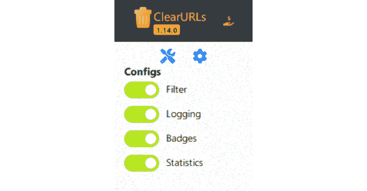
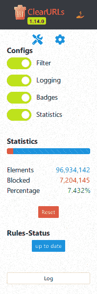

# ClearURLs:自动从 URL 中删除跟踪元素

> 原文：<https://kalilinuxtutorials.com/clearurls/>

ClearURLs 是基于新的 WebExtensions 技术的插件，针对基于 *Firefox* 和 *Chrome* 的浏览器进行了优化。

该扩展将自动删除 URL 中的跟踪元素，以帮助在浏览互联网时保护您的隐私，我们会定期更新该扩展，您可以在此处找到。

**应用**

许多网站在 URL 中使用跟踪元素(例如`**https://example.com?utm_source=newsletter1&utm_medium=email&utm_campaign=sale**`)来标记您的在线活动。所有这些跟踪代码对于网站的正常显示和运行都是不必要的，因此可以被删除——这正是 ClearURLs 所做的。

另一个常见的例子是亚马逊网址。如果你在亚马逊上搜索一个产品，你会看到一个很长的网址，比如:

https://www.amazon.com/dp/exampleProduct/ref=sxin_0_pb?__mk_de_DE=ÅMÅŽÕÑ&keywords=tea&pd_rd_i=exampleProduct&pd_rd_r=8d39e4cd-1e4f-43db-b6e7-72e969a84aa5&pd_rd_w=1pcKM&pd_rd_wg=hYrNl&pf_rd_p=50bbfd25-5ef7-41a2-68d6-74d854b30e30&pf_rd_r=0GMWD0YYKA7XFGX55ADP&qid=1517757263&rnid=2914120011

事实上，上面的大部分 URL 都是跟踪代码。一旦 ClearURLs 清理了地址，它将看起来像这样:`**https://www.amazon.com/dp/exampleProduct**`

**特性**

*   在后台自动删除对 URL 的跟踪
*   阻止一些常见的 ad 域(可选)
*   有一个内置的工具来清理多个网址一次
*   支持重定向到目的地，不需要作为中间人的跟踪服务
*   向上下文菜单中添加一个条目，以便可以快速、干净地复制链接
*   阻止超链接审计，也称为 *ping 跟踪*(参见[这篇文章](https://html.spec.whatwg.org/multipage/links.html#hyperlink-auditing))
*   防止 ETag 跟踪
*   防止跟踪历史 API 上的注入(参见:[replaceState()方法](https://developer.mozilla.org/en-US/docs/Web/API/History_API#The_replaceState()_method))
*   防止谷歌重写搜索结果(包括跟踪元素)
*   防止 Yandex 重写搜索结果(以包括跟踪元素)

**权限**

所需权限的推理可以在[下面的](https://gitlab.com/KevinRoebert/ClearUrls/issues/159)中找到。

**截图**

**CI/CD 工件下载(仅适用于 Firefox 和 Chrome 开发人员)**

在这里你可以下载 Firefox 和 Chrome 开发的打包文件:

**测试**

如果你想测试 ClearURLs 是否能在你的系统上正常工作，你可以去这个测试页面:[https://test.clearurls.xyz/](https://test.clearurls.xyz/)