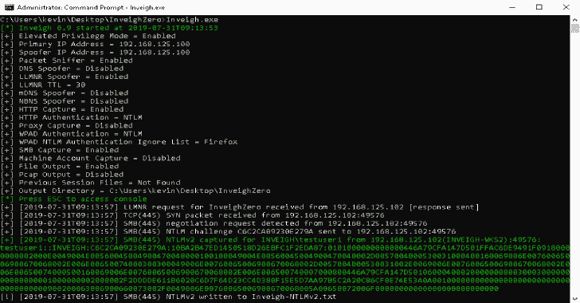
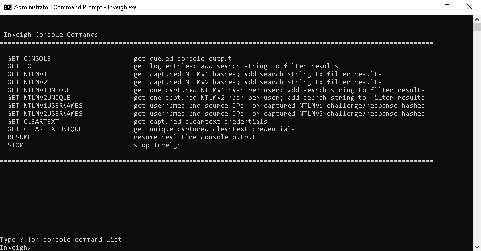

# InveighZero:Windows C # LLMNR/mDNS/NBNS/DNS/DHCP V6 欺骗器/中间人工具

> 原文：<https://kalilinuxtutorials.com/inveighzero/>

是一个 C# LLMNR/NBNS/mDNS/DNS/DHCPv6 欺骗器和中间人工具，旨在帮助发现自己受限于 Windows 系统的渗透测试人员/red teamers。这个版本与 PowerShell 版本的 [Inveigh](https://github.com/Kevin-Robertson/Inveigh) 有很多相同的特性。

**特权模式特性(需要提升管理员权限)**

*   SMB 捕获–基于数据包嗅探器
*   LLMNR 欺骗器-基于数据包嗅探器
*   NBNS 欺骗器-基于数据包嗅探器
*   mDNS 欺骗器-基于数据包嗅探器
*   DNS 欺骗器–基于数据包嗅探器
*   DHCPv6 欺骗器–基于数据包嗅探器
*   Pcap 输出–TCP 和 UDP 数据包
*   数据包嗅探器控制台输出–SYN 数据包、SMB kerberos 协商等

**非特权模式特征**

*   LLMNR 欺骗器-基于 UDP 监听器
*   NBNS 欺骗器-基于 UDP 监听器
*   mDNS 欺骗器-基于 UDP 监听器
*   DNS 欺骗器–基于 UDP 侦听器
*   DHCPv6 欺骗程序–基于 UDP 侦听器
*   注意:即使启用了 NBNS，NBNS 欺骗器也可以在所有系统上工作。LLMNR 和 mDNS 的欺骗者似乎可以在 Windows 10 和 Server 2016 上工作，这些服务已经启用。防火墙仍然可以阻挡一切。

**其他特征**

*   HTTP 捕获–基于 TCP 侦听器
*   代理授权捕获–基于 TCP 侦听器

**明显缺失的特征**

*   ADIDNS 攻击
*   HTTP 到 SMB 中继
*   HTTPS 听众
*   Kerberos kirbi 输出

**显著差异**

*   可以从以前的输出文件中导入捕获和日志数据。PowerShell 版本将数据存储在一个全局变量中，该变量保存在 PowerShell 实例中。
*   InveighZero 不在后台执行。相反，在 InveighZero 运行时，可以访问控制台。控制台中的命令具有与 in vigh 的 Get-in vigh、Watch-in vigh 和 Stop-in vigh 支持功能相似的功能。

**最小值。网络版**

*   **3.5**

**参数**

在大多数情况下，当存在时，InveighZero [参数](https://github.com/Kevin-Robertson/InveighZero/wiki/Parameters)镜像 Inveigh 的[参数](https://github.com/Kevin-Robertson/Inveigh/wiki/Parameters)。

**为什么名字中有零？**

在我转到 PowerShell 之前，Inveigh 是作为一个 C#概念验证开始的。“零”只是指 C#版本在 PowerShell 版本之前就已经存在的事实。不过，主要是我需要一个独特的回购名称。

**用途**

*   **以默认设置执行**

`**Inveigh.exe**`

*   **设置主 IP**

`**Inveigh.exe -IP 192.168.1.1**`

*   **向另一个系统发送欺骗流量**

`**Inveigh.exe -IP 192.168.1.1 -SpooferIP 192.168.1.2**`

*   【HTTP 和 SMB 的 Pcap 输出

`**Inveigh.exe -Pcap Y -PcapTCP 80,445**`

**截图**

[**Download**](https://github.com/Kevin-Robertson/InveighZero)