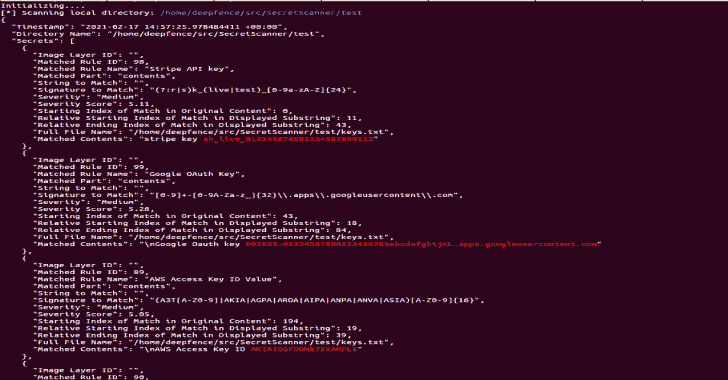

# SecretScanner:在容器映像和文件系统中查找秘密和密码

> 原文：<https://kalilinuxtutorials.com/secretscanner-find-secrets-passwords-in-container-images-and-file-systems/>

Deepfence **SecretScanner** 可以在容器映像或文件系统中找到任何潜在的秘密。

什么是秘密？

机密是任何类型的敏感或私有数据，它允许授权用户访问组织的关键 IT 基础架构(如帐户、设备、网络、基于云的服务)、应用程序、存储、数据库和其他类型的关键数据。例如，密码、AWS 访问 id、AWS 秘密访问密钥、Google OAuth 密钥等。都是秘密。秘密应该严格保密。然而，由于有缺陷的安全策略或开发人员的疏忽，有时攻击者可以很容易地访问机密。有时开发者使用默认的秘密或者留下硬编码的秘密，比如密码、API 密钥、加密密钥、SSH 密钥、令牌等等。在容器映像中，尤其是在 CI/CD 管道的快速开发和部署周期中。此外，有时用户以纯文本形式存储密码。向未经授权的实体泄漏机密会使您的组织和基础架构面临严重的安全风险。

Deepfence SecretScanner 帮助用户扫描他们的容器映像或主机上的本地目录，并输出一个 JSON 文件，其中包含所有发现的秘密的详细信息。

查看我们的[博客](https://medium.com/deepfence-cloud-native-security/detecting-secrets-to-reduce-attack-surface-3405ee6329b5)了解更多详情。

**命令行选项**

**$。/SecretScanner–help**

**的用法。/SecretScanner:**
-config-path string
从给定目录中搜索 config.yaml。如果未设置，则尝试从 SecretScanner 二进制文件和当前目录中找到它
-调试级别字符串
调试级别是致命、错误、重要、警告、信息、调试中的一种。仅显示高于调试级别的级别(默认“错误”)
-图像名称字符串
图像的名称以及用于扫描秘密的标记
-json-filename 字符串
输出 json 文件名。如果没有设置，它将自动创建一个基于图像或目录名的文件名
-本地字符串
指定要扫描的本地目录(绝对路径)。仅递归扫描给定的目录。
-max-multi-match uint
一个文件中相同模式的最大匹配数。这仅在启用多匹配选项时使用。(默认为 3)
-max-secrets uint
在一个容器映像或文件系统中可以找到的最大秘密数。(默认为 1000)
-最大文件大小 uint
以 KB 为单位处理的最大文件大小(默认为 256)
-多匹配
在一个文件中输出相同模式的多个匹配。默认情况下，一个文件只输出一个匹配的模式以获得更好的性能
-output-path string
输出存储 json 文件的目录。如果未设置，它将输出到当前目录
-temp-directory string
目录以处理和存储存储库/匹配(默认"/tmp")
-threads int
并发线程的数量(逻辑 CPU 的默认数量)

**快速尝试使用 Docker**

按照以下说明在容器映像上安装 docker 并运行 SecretScanner:

*   构建秘密扫描器:

`**docker build --rm=true --tag=deepfenceio/secretscanning:latest -f Dockerfile .**`

*   或者，通过以下方式从 docker hub 获取最新版本:

`**docker pull deepfenceio/secretscanning**`

*   提取容器图像进行扫描:

`**docker pull node:8.11**`

*   运行秘密扫描器:
    *   扫描集装箱图像:`**docker run -it --rm --name=deepfence-secretscanner -v $(pwd):/home/deepfence/output -v /var/run/docker.sock:/var/run/docker.sock -v /usr/bin/docker:/usr/bin/docker deepfenceio/secretscanning -image-name node:8.11**`
    *   扫描本地目录:`**docker run -it --rm --name=deepfence-secretscanner -v $(pwd):/home/deepfence/output -v /var/run/docker.sock:/var/run/docker.sock -v /usr/bin/docker:/usr/bin/docker deepfenceio/secretscanning -local /home/deepfence/src/SecretScanner/test**`

默认情况下，SecretScanner 还将创建 json 文件，其中包含在当前工作目录中找到的所有秘密的详细信息。您可以使用适当的选项显式指定输出目录和 json 文件名。

**构建指令**

*   安装 Docker
*   安装 Hyperscan
*   为您的平台安装 go(版本 1.14)
*   如果需要，安装 go 模块:**`gohs``yaml.v3`和`color`**
*   **`go get github.com/deepfence/SecretScanner`** 会在`**$GOPATH/bin**`或`**$HOME/go/bin**`目录下自动下载并建立 SecretScanner。或者，克隆这个存储库并运行`**go build -v -i**`在当前目录中构建可执行文件。
*   根据需要编辑 config.yaml 文件，并使用适当的配置文件目录运行 secret scanner。

作为参考，[安装文件](https://github.com/deepfence/SecretScanner/blob/master/Install.Ubuntu)包含在 ubuntu 系统上构建的命令。

**在本地主机上运行的指令**

**。/secret scanner–help

。/SecretScanner-config-path/path/to/config . YAML/dir-local test

。/SecretScanner-config-path/path/to/config . YAML/dir-image-name node:8.11**

**样本秘密扫描仪输出**

**免责声明**

这个工具不是用来黑客攻击的。请仅将它用于合法目的，如在您自己的基础架构上检测机密，而不是在他人的基础架构上。DEEPFENCE 对于因 SecretScanner 的任何用途或用途不充分或其中的任何缺陷或不足而直接或间接导致的利润损失、业务损失、其他财务损失或任何其他损失或损害概不负责。

[**Download**](https://github.com/deepfence/SecretScanner)