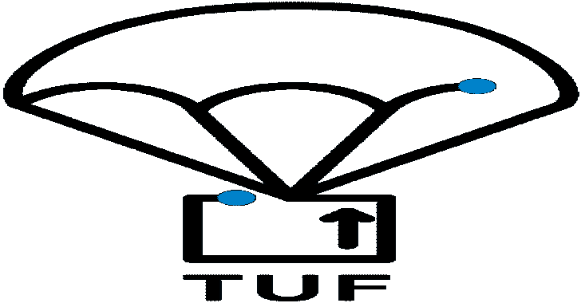

# TUF:保护软件更新系统的框架

> 原文：<https://kalilinuxtutorials.com/tuf-a-framework-for-securing-software-update-systems/>

**TUF** 是知识库**参考实现**更新框架[(TUF)](https://theupdateframework.github.io/)。它是用 Python 编写的，旨在符合 1.0 版本的 [TUF 规范](https://github.com/theupdateframework/specification/blob/master/tuf-spec.md)。该实现用于生产系统，但也旨在为那些在自己的语言、环境或更新系统中实现 TUF 的人员提供一个可读的指南和演示。

## 关于更新框架

更新框架(TUF)设计有助于开发人员维护软件更新系统的安全性，甚至可以抵御危及存储库或签名密钥的攻击者。TUF 提供了一个灵活的[规范](https://github.com/theupdateframework/specification/blob/master/tuf-spec.md),定义了开发者可以在任何软件更新系统中使用的功能，或者重新实现以满足他们的需求。

TUF 由 [Linux 基金会](https://www.linuxfoundation.org/)托管，作为[云本地计算基金会](https://www.cncf.io/) (CNCF)的一部分，它的设计被[各种科技公司和开源组织用于生产](https://theupdateframework.io/adoptions/)。一种叫做 [Uptane](https://uptane.github.io/) 的 TUF 被用来保护汽车的空中更新。

请查看 [TUF 介绍](https://github.com/theupdateframework/tuf/blob/develop/docs/OVERVIEW.rst)和 [TUF 网站](https://theupdateframework.com/)了解更多关于 TUF 的信息！

**文档**

*   [TUF 设计简介](https://github.com/theupdateframework/tuf/blob/develop/docs/OVERVIEW.rst)
*   [TUF 规范](https://github.com/theupdateframework/specification/blob/master/tuf-spec.md)
*   [TUF 参考实施入门](https://github.com/theupdateframework/tuf/blob/develop/docs/GETTING_STARTED.rst)
*   [治理](https://github.com/theupdateframework/tuf/blob/develop/docs/GOVERNANCE.md)和[维护者](https://github.com/theupdateframework/tuf/blob/develop/docs/MAINTAINERS.txt)为参照实施
*   [其他单据](https://github.com/theupdateframework/tuf/blob/develop/docs)

**联系人**

请通过我们的[邮件列表](https://groups.google.com/forum/?fromgroups#!forum/theupdateframework)联系我们。问题、反馈和建议都欢迎在这个小邮件列表中。

我们努力使规范易于实现，因此如果您遇到任何不一致或遇到任何困难，请通过发送电子邮件或在 GitHub [规范报告](https://github.com/theupdateframework/specification/issues)中报告问题来让我们知道。

**安全问题&bug**

安全问题可以通过给[jcappos@nyu.edu](mailto:jcappos@nyu.edu)发邮件来报告。

该报告至少必须包含以下内容:

*   漏洞的描述。
*   重现问题的步骤。

或者，可以使用 PGP 对通过电子邮件发送的报告进行加密。你要用 PGP 键指纹**e9c 0 59EC 0d 32 64FA B35F 94AD 465B f9f 6 F8EB 475 a**。

请不要使用 GitHub 问题跟踪器来提交漏洞报告。问题跟踪器用于错误报告和功能请求。主要的功能要求，比如对规范的设计变更，应该通过 [TUF 增强提案](https://github.com/theupdateframework/tuf/blob/develop/docs/TAP.rst) (TAP)提出。

**限制**

当使用相同的 TUF 客户端同时下载相同的目标文件时，参考实现可能会出现意外行为。

**执照**

本作品是[双许可](https://en.wikipedia.org/wiki/Multi-licensing)的，在(1) MIT 许可和(2) Apache 许可下发布，版本 2.0。请看[执照-麻省理工](https://github.com/theupdateframework/tuf/blob/develop/LICENSE-MIT)和[执照](https://github.com/theupdateframework/tuf/blob/develop/LICENSE)。

**致谢**

这个项目由云原生计算基金会下的 Linux 基金会托管。TUF 的早期开发是由纽约大学(T2)安全系统实验室(T3)的成员管理的。我们感谢康斯坦丁·安德里亚诺夫、格雷米·孔德拉、弗拉迪米尔·迪亚兹、郑玉玉、塞巴斯蒂安·阿瓦德、圣地亚哥·托雷斯·阿里亚斯、特里尚·库普萨米、赞·费舍尔、潘赫里·戈亚尔、、康斯坦丁·安德里亚诺夫和贾斯汀·萨缪尔等人的努力，他们为 TUF 参考实施工作提供了大量帮助。[贡献者](https://github.com/theupdateframework/tuf/blob/develop/docs/AUTHORS.txt)和[维护者](https://github.com/theupdateframework/tuf/blob/develop/docs/MAINTAINERS.txt)受 [CNCF 社区行为准则](https://github.com/cncf/foundation/blob/master/code-of-conduct.md)管辖。

这份材料是基于国家科学基金会资助的 CNS-1345049 和 CNS-0959138 的工作。本材料中表达的任何观点、发现、结论或建议都是作者的，不一定反映国家科学基金会的观点。

[**Download**](https://github.com/theupdateframework/tuf)