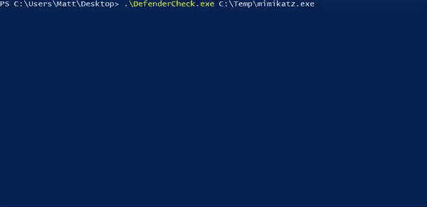

# DefenderCheck:标识 Microsoft Defender 标记的字节

> 原文：<https://kalilinuxtutorials.com/defendercheck/>

**防御者检查**快速工具，帮助规避工作变得更容易。将二进制作为输入，并对其进行分割，直到它精确定位到 Microsoft Defender 将标记的字节，然后将这些有问题的字节打印到屏幕上。当试图识别工具/有效负载中特定的坏代码时，这是很有帮助的。

**注意:**您的系统必须启用 Defender，但应禁用实时防护和自动提交样本功能。

[**Download**](https://github.com/matterpreter/DefenderCheck)