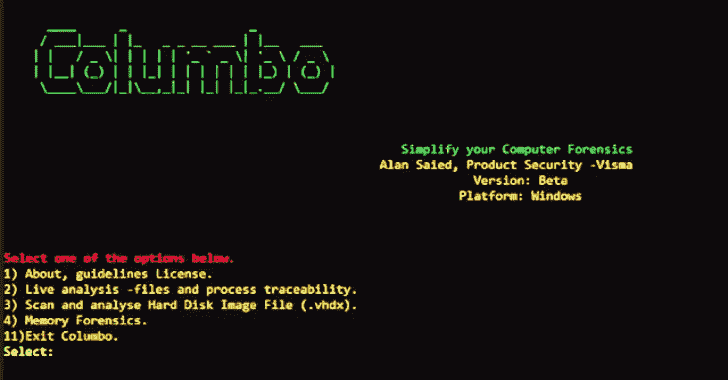

# Columbo:一种计算机取证分析工具，用于简化和识别受损数据集中的特定模式

> 原文：<https://kalilinuxtutorials.com/columbo/>

Columbo 是一种计算机取证分析工具，用于简化和识别受损数据集中的特定模式。它将数据分解为小部分，并使用模式识别和机器学习模型以建议的形式识别对手的行为及其在受损 Windows 平台中的可能位置。目前 Columbo 在 Windows 平台上运行。

**依赖关系&高层架构**

哥伦布依靠波动率 3，autorunsc.exe 和 sigcheck.exe 提取数据。因此，用户必须下载这些依赖工具，并将它们放在 **\Columbo\bin** 文件夹下。**在下载任何东西之前，请确保你已经阅读并理解了许可部分(或 License.txt 文件)。**这些工具生成的输出(数据)会自动传输到 Columbo 的主引擎。它将其分解为小部分，对其进行预处理，并应用机器学习模型来对被入侵系统的位置、可执行文件和其他行为进行分类。

**开始使用 Columbo**

**视频**

1.  在你开始 Columbo [之前，观看](https://www.youtube.com/watch?v=7rUCC1Wz4Gc)
2.  使用 Columbo 进行内存取证[内存取证](https://www.youtube.com/watch?v=fOa62iVemAQ)

**安装和配置**

**可执行二进制**

1.  下载并安装 python 3.7 或 3.8(未用 3.9 测试)。**确保在安装过程中把 python.exe 添加到路径中**。
2.  下载最新的二进制 Columbo 版本，在[版本下](https://github.com/visma-prodsec/columbo/releases)
3.  下载下面的每一个并把它们放在 **\Columbo\bin** 下。

*   挥发性 3 源代码。Columbo 不支持 volatile 2。请确保你也下载了[Symbol](https://github.com/volatilityfoundation/volatility3#symbol-tables)table pack for windows，解压后放在**\ Columbo \ bin \ volatility 3-master \ volatility \ symbols**下。
*   下载 autorunsc.exe 和 sigcheck.exe

**NB:** 为了避免错误，目录结构必须像**\ Columbo \ bin \ volatility 3-master**、**\ Columbo \ bin \ autorunsc . exe**和**\ Columbo \ bin \ SIG check . exe**

最后双击\Columbo 下的 **"main.exe"** 。

**源代码**

*   下载并安装 python 3.7 或 3.8(未用 3.9 测试)。**确保在安装过程中把 python.exe 添加到路径中**。
*   下载最新发布版本的 Columbo 源代码。
*   双击**install-prerequisites . bat**安装所有需要的包。
*   下载下面的每一个并把它们放在 **\Columbo\bin** 下。
    *   挥发性 3 源代码。Columbo 不支持 volatile 2。请确保你也下载了[Symbol](https://github.com/volatilityfoundation/volatility3#symbol-tables)table pack for windows，解压后放在**\ Columbo \ bin \ volatility 3-master \ volatility \ symbols**下
    *   下载 autorunsc.exe 和 sigcheck.exe。

**NB:** 为了避免错误，目录结构必须是这样的**\ Columbo \ bin \ volatility 3-master**、**\ Columbo \ bin \ autoruns . exe**和**\ Columbo \ bin \ SIG check . exe**

*   最后转到 cmd 并发出**python.exe \哥伦布\main.py**

**哥伦布&机器学习**

Columbo 使用数据预处理来组织数据和机器学习模型，以识别可疑行为。它的输出要么是 1(可疑的)，要么是 0(真实的)——以一种建议的形式，纯粹是为了帮助数字法医鉴定人员做决定。我们用不同的例子来训练模型，以最大限度地提高准确性，并使用不同的方法来最小化误报。然而，假阳性(错误检测)仍然存在，因此我们致力于定期更新模型。

**假阳性**

减少误报(误检)并不容易，尤其是在我们处理机器学习的时候。根据用于训练模型的数据的质量，机器学习模型生成的输出可能是假阳性。但是，为了帮助法医检查人员进行调查，Columbo 会为每个 1(可疑)和 0(真实)生成百分比分数。这种方法有助于审查员挑选路径、命令或过程，Columbo 将其归类为可疑。

**选项选择**

**选项 2**

**实时分析-文件和流程可追溯性。**此选项分析正在运行的 Windows 进程，以识别正在运行的恶意活动(如果有)。Columbo 使用 autorunsc.exe 从机器中提取数据，输出通过管道传输到机器学习模型和模式识别引擎，以对可疑活动进行分类。稍后，输出以 excel 文件的形式保存在\Columbo\ML\Step-2-results 下，以供进一步分析。此外，用户可以选择检查正在运行的流程。结果包含诸如流程可追溯性、与每个流程相关联的命令等信息——如果适用，以及流程是否负责执行新流程。

**选项 3**

**扫描并分析硬盘镜像文件(。vhdx):** 这个选项取 Windows 的挂载硬盘镜像的路径。它使用 sigcheck.exe 从文件系统中提取数据。然后将结果输入机器学习模型，对可疑活动进行分类。此外，输出以 excel 文件的形式保存在\Columbo\ML\Step-3-results 下。

**选项 4**

**记忆取证**。在该选项中，Columbo 采用内存映像的路径，并产生以下选项供用户选择。

1.  **内存信息:**volatile 3 用于提取图像的相关信息。
2.  **进程扫描:**volatile 3 用于提取每个进程的进程、dll 和句柄信息。然后，Columbo 使用分组和聚类机制根据母进程对每个进程进行分组。该选项稍后由异常检测选项下的流程可追溯性使用。
3.  **流程树:**volatile 3 用于提取流程的流程树。
4.  **异常检测和流程追溯:**volatile 3 用于提取异常检测流程列表。然而，Columbo 提供了一个名为过程可追溯性的选项来分别检查每个过程，并共同产生以下信息。

*   可执行文件和相关命令的路径。
*   使用机器学习模型来确定所识别的过程的合法性。
*   追踪每个流程，一直追溯到它们的根流程(完整路径)以及它们的执行日期和时间。
*   确定该流程是否负责执行其他流程，即它是否将成为新流程的母流程。
*   它提取、处理和 dll 每个进程的信息，并将其余信息呈现给它们。

放弃

本软件按“原样”提供，不含任何明示或暗示的担保，包括但不限于对适销性、特定用途适用性和不侵权的担保。在任何情况下，作者或版权所有者都不对任何索赔、损害或其他责任负责，无论是在合同诉讼、侵权诉讼或其他诉讼中，还是在与软件或软件的使用或其他交易相关的诉讼中。

**第三方工具**

*   下载和使用 Columbo 要求的第三方工具是用户的责任，与 Columbo 无关。
*   同意或不同意第三方工具提供的许可协议也是用户的责任，与 Columbo 无关。
*   与 MS SysInternal 工具相关。Columbo 在命令行上传递选项/参数-accepteula，以便进行非交互操作。同意或不同意 MS SysInternal tools 提供的许可协议也是用户的责任，与 Columbo 无关。

[**Download**](https://github.com/visma-prodsec/columbo)