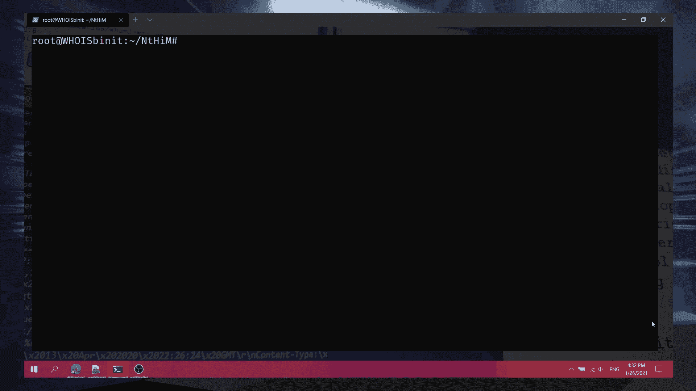
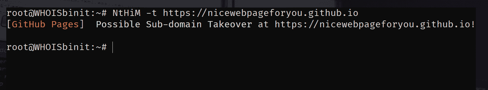
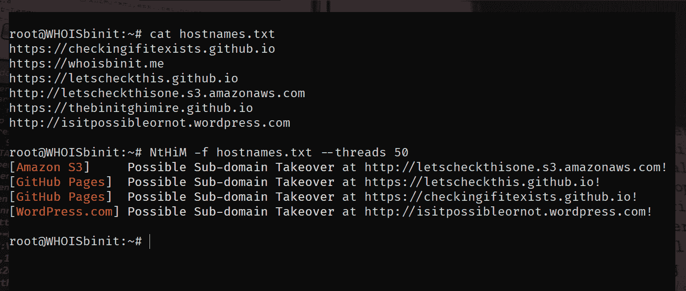

# NtHiM:超快速子域接管检测

> 原文：<https://kalilinuxtutorials.com/nthim/>

**NtHiM** 是一种超快速的子域接管检测。

**安装**

**方法 1:使用预编译的二进制文件**

不同系统的预编译二进制文件可以在 [**版本**](https://github.com/TheBinitGhimire/NtHiM/releases) 页面中找到。你可以下载一个适合你系统的，解压文件，开始使用 NtHiM。

**方法 2:使用板条箱。io**

**NtHiM** 在 **[板条箱. io](https://crates.io/crates/NtHiM)** 上有售。因此，如果您的系统上安装了 Rust，您可以使用以下命令简单地安装 **NtHiM** :

**货物安装 NtHiM**

**方法 3:手动构建**

您将需要 Cargo 来执行 NtHiM 的手动构建。如果您安装了货物，您可以简单地按照以下步骤:

*   克隆这个库，**，`git clone https://github.com/TheBinitGhimire/NtHiM`；**
*   转到文件夹里面，**，`cd NtHiM`；**
*   使用`**cargo build**`命令，
*   进入新建的**目标**文件夹，打开里面的**调试**文件夹，`cd target/debug`；
*   你会发现**NtHiM.exe**(在微软 Windows 上)或者 **NtHiM** 二进制(在 Linux 上)。

**NtHiM** 的安装演练已经上传到 YouTube，涵盖了这三种方法，你可以在这里观看视频: **[如何安装和使用 NtHiM(现在，主持人是我的！)?超快速子域接管检测！](https://youtu.be/CUTbqFhRjwY)**

**用途**

| 旗 | 描述 | 例子 |
| --- | --- | --- |
| -h | 显示与用法相关的帮助！ | NtHiM -h |
| 相当于-ED | 扫描单一目标！ | https://example.example.com |
| -f | 从文件中扫描目标列表！ | NtHiM -f 主机名. txt |
| -丙 | 并发线程数！ | NtHiM -c 100 -f 主机名. txt |
| -V | 显示版本信息！ | NtHiM -V |

**用例 1(单一目标):**

https://example.example.com 时间

**用例 2(多个目标):**

**NtHiM -f hostnames.txt**

**用法演示**

**例题**

**单一目标**

**使用并发线程的多个目标**

[**Download**](https://github.com/TheBinitGhimire/NtHiM)