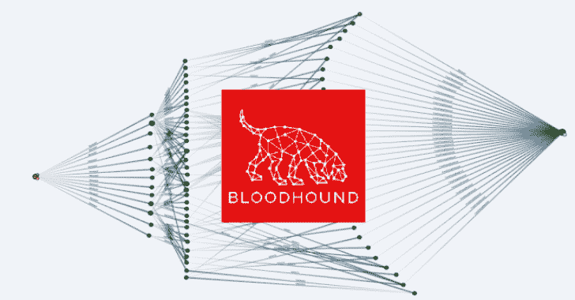

# 马克斯:用一套简单的工具最大化猎犬

> 原文：<https://kalilinuxtutorials.com/max/>

**描述**

*   **新发布:**
    *   [dpat](https://github.com/knavesec/Max/blob/master/wiki/dpat.md)–blood hound 域密码审计工具(dpat)
*   **一套简单的工具:**
    *   [获取信息](https://github.com/knavesec/Max/blob/master/wiki/get-info.md)–从 Neo4j 数据库中提取信息列表
    *   [标记拥有的](https://github.com/knavesec/Max/blob/master/wiki/mark-owned.md)–将对象列表标记为拥有
    *   [Mark-hvt](https://github.com/knavesec/Max/blob/master/wiki/mark-hvt.md)–将一系列对象标记为高价值目标
    *   [查询](https://github.com/knavesec/Max/blob/master/wiki/query.md)–运行原始密码查询并返回输出
    *   [导出](https://github.com/knavesec/Max/blob/master/wiki/export.md)–将域对象的所有出站控制权限导出到 CSV 文件
    *   [删除边](https://github.com/knavesec/Max/blob/master/wiki/del-edge.md)–从数据库中删除一条边
    *   [add-SPN](https://github.com/knavesec/Max/blob/master/wiki/add-spns.md)–创建 hasspn 配置的关系，新的攻击原语
    *   [add-SPW](https://github.com/knavesec/Max/blob/master/wiki/add-spw.md)–创建共享关系
    *   [dpat](https://github.com/knavesec/Max/blob/master/wiki/dpat.md)–blood hound 域密码审计工具(dpat)
    *   [pet-max](https://github.com/knavesec/Max/blob/master/wiki/pet-max.md)–狗说，有压力的约会的快乐

这是在以下博客上发布的截图和用例: [Max Release](https://whynotsecurity.com/blog/max/) ，[Updates&Primitives](https://whynotsecurity.com/blog/max2/)&[DPAT](https://whynotsecurity.com/blog/max3/)

在我的研究过程中，一个新的潜在攻击原语被添加到这个工具中，参见`add-spns`部分了解全部细节。

**用途**

**安装**

理想情况下，应该没有太多需要安装的东西，但是我已经包含了一个 requirements.txt 文件以防万一。在 Kali Linux 和 Windows 10 上测试，所有功能都适用于 Linux 和 Windows 操作系统。

`**pip3 install -r requirements.txt**`

**Neo4j Creds**

Neo4j 凭证可以硬编码在脚本*或*的开头，它们可以作为 CLI 提供。如果两个区域都留空，将提示您输入 uname/密码。

**python 3 max . py-u neo4j-p neo4j { module } { args }**

**python 3 max . py { module } { args }
Neo4j 用户名:neo4j
Neo4j 密码:**

**快速使用**

*   获取一般帮助和特定模块的帮助

**python 3 max . py-h
python 3 max . py { module }-h**

*   将拥有的对象导入 BH

**python 3 max . py mark-Owned-f Owned . txt
python 3 max . py mark-Owned-f Owned . txt–add-note“归重复的本地管理员所有”**

*   **获取用户列表**

**python 3 max . py get-info–users
python 3 max . py get-info–users–enabled
user 01 @ DOMAIN。本地
USER02@DOMAIN。局部

…**

*   获取目标组中的对象列表

**python 3 max . py get-info–group-members " domain controllers @ domain . local "**

*   获取用户拥有管理权限的计算机列表

**python 3 max . py get-info–admin to user 01 @ DOMAIN。本地**

*   获取所拥有对象的列表以及每个对象的注释

**python 3 max . py get-info-owned-get-note**

*   运行查询–返回包含 DA 路径的所有用户列表

**python 3 max . py query-q " MATCH(n:User)，(m:Group { name:' DOMAIN ADMINS @ DOMAIN。LOCAL'})匹配(n)-[*1..]->(m)RETURN DISTINCT(n . name)**

*   从数据库中删除边

**python 3 max . py del-edge can RDP**

*   使用 BloodHound 中存储的信息或 GetUserSPNs impacket 文件添加 HasSPNConfigured 关系

**python 3 max . py add-spns-b
python 3 max . py add-spns-I getuserspns-raw-output . txt**

*   DPAT

**python 3 max . py dpat-n ~/client/NTDs . dit-p ~/。hashcat/hashcat . potfile-o ouputdir–html-净化 t1]**

*   宠物麦克斯

**python3 max.py pet-max**

**目标文件&规格**

文件中的对象必须包含 FQDN，大小写无关紧要。这也适用于提供 CLI 用户名/计算机名的情况。

user 01 @ domain . localgroup 01 @ domain . local<-将被添加/更正 CLI 输入
computer 01 . domain . local<-将被添加/更正 CLI 输入
computer 01 . domain . local<-将被添加/更正 CLI 输入
user02 < -不会被添加/不正确的 CLI 输入
computer02 < -不会被添加/不正确的 CLI 输入

**进一步的工作**

我希望包含一个`analyze`函数来提供类似于 PlumHound/Cypheroth 的排序功能。最后，考虑为那些在 Windows 上运行 Neo4j 的人创建一个 Powershell 版本，但我在 Powershell so TBD 是垃圾。

任何其他功能和改进欢迎，在 BloodHoundGang Slack 频道和 Twitter 上找到我@流民。

[**Download**](https://github.com/knavesec/Max)