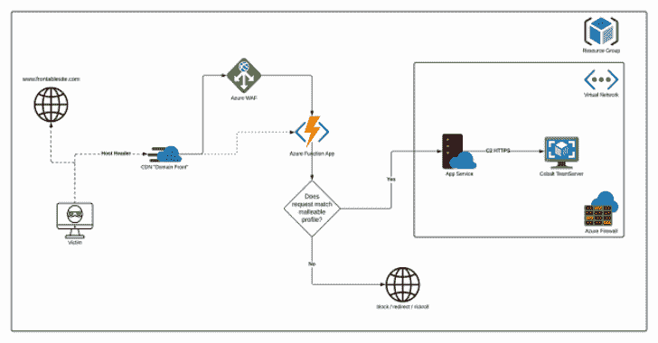

# AzureC2Relay:一个 Azure 函数，用于验证和中继钴击信标

> 原文：<https://kalilinuxtutorials.com/azurec2relay/>

**AzureC2Relay** 是一个 Azure 功能，它通过基于 Cobalt Strike 可延展 C2 配置文件验证传入请求来验证和中继 Cobalt Strike 信标流量。任何不共享配置文件用户代理、URI 路径、标头和查询参数的传入请求都将被重定向到可配置的诱饵网站。

经过验证的 C2 流量被中继到同一虚拟网络中的一个团队服务器，该虚拟网络受到网络安全组的进一步限制。允许虚拟机只暴露 SSH。

**展开**

*   AzureC2Relay 是通过 terraform azure 模块以及一些本地 az cli 命令部署的
*   确保您安装了 terraform、az cli 和 dotnet core 3.1 运行时
*   Windows (Powershell)

&([script block]::Create((Invoke-WebRequest-UseBasicParsing ' https://dot . net/v1/dot net-install . PS1 '))-runtime dot net-version 3 . 1 . 0
Invoke-WebRequest ' https://releases . hashi corp . com/terra form/0 . 14 . 6/terra form _ 0 . 14 . 6 _ windows _ amd64 . zip '-OutFile ' terra form . zip '
Expand-Archive-Path terra form . zip-destination Path " $(.$([环境]::get folderpath(' application data ')\ terra form \ "
Invoke-WebRequest-Uri https://aka.ms/installazurecliwindows-OutFile。\ AzureCLI.msistart-Process msiexec.exe-Wait-argument list“/I azure CLI . MSI/quiet”；rm。\AzureCLI.msi

*   苹果个人计算机

**curl-L https://dot.net/v1/dotnet-install.sh | bash-s—–runtime dot net–版本 3.1.0
brew 更新
brew 安装 hashicorp/tap
brew 安装 hashi corp/tap/terraform
brew 安装 azure-cli**

*   **Ubuntu，Debian**

curl-L https://dot.net/v1/dotnet-install.sh | bash-s—–runtime dot net–版本 3 . 1 . 0
wget https://releases . hashi corp . com/terra form/0 . 14 . 5/terra form _ 0 . 14 . 5 _ Linux _ amd64 . zip
unzip terra form _ 0 . 14 . 5 _ Linux _ amd64 . zip
sudo CP terra form/usr/local/bin/terra form
curl-sL https://aka.ms/InstallAzureCLIDeb | sudo bash

*   **卡利**

**curl-L https://dot.net/v1/dotnet-install.sh | bash-s—–runtime dot net–版本 3 . 1 . 0
wget https://releases . hashi corp . com/terra form/0 . 14 . 5/terra form _ 0 . 14 . 5 _ Linux _ amd64 . zip
unzip terra form _ 0 . 14 . 5 _ Linux _ amd64 . zip
sudo CP terra form/usr/local/bin/terra form
echo " deb[arch = amd64]https://packages.microsoft.com/repos/azure-cli/ stretch main " | sud**

*   修改`config.tf`中定义的第一个变量，以满足您的需求
*   用实际的 cobaltstrike 下载替换虚拟的“cobaltstrike-dist.tgz”
*   编辑/替换 Ressources 文件夹中的延展性概要文件(确保概要文件文件名与您在步骤 1 中设置的变量相匹配)
*   使用 azure 登录`az login`
*   运行`terraform init`
*   运行`terraform apply -auto-approve`来部署基础架构
*   等 CDN 活跃起来享受吧！

一旦 terraform 完成，它将为您提供所需的 ssh 命令，CobaltStrike teamserver 将在部署的 VM 上的 tmux 会话中运行

当你使用完红外线，你可以用`terraform destroy -auto-approve`删除它

[**Download**](https://github.com/Flangvik/AzureC2Relay)