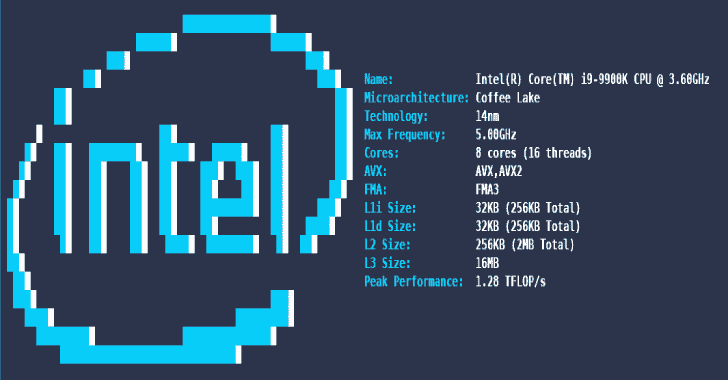
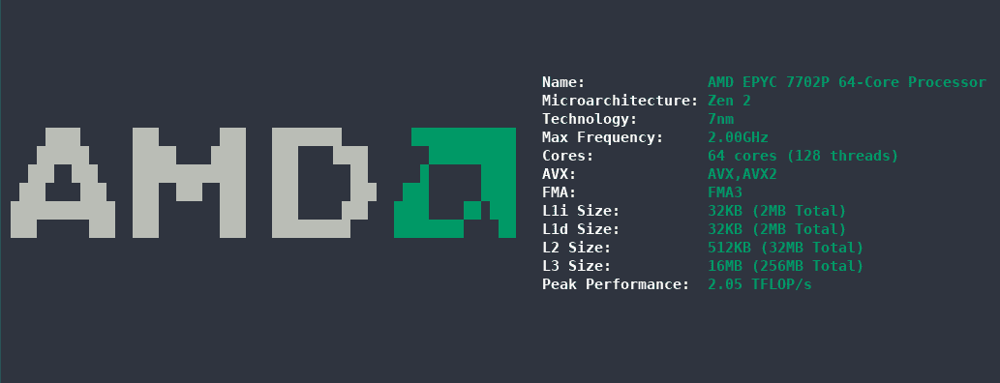
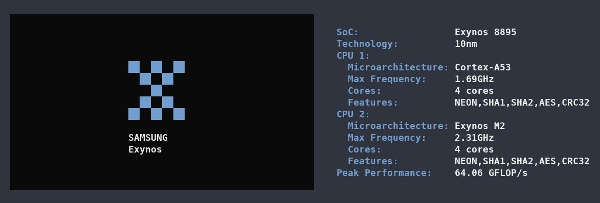

# CPUFetch:简单而奇特的 CPU 架构获取工具

> 原文：<https://kalilinuxtutorials.com/cpufetch/>

CPUFetch 是一个简单而有趣的 CPU 架构获取工具。

**支持**

cpufetch 支持 x86、x86_64 (Intel 和 AMD)和 ARM。

| 平台 | x86_64 | 手臂ˌ武器ˌ袖子ˌ装备 | 笔记 |
| --- | --- | --- | --- |
| GNU/Linux | ✔️ | ✔️ | 最佳支持 |
| Windows 操作系统 | ✔️ | -好的 | 一些信息可能会丢失。如果支持，将使用颜色 |
| 机器人 | -什么事？ | ✔️ | 一些信息可能会丢失。
未在 x86_64 下测试 |
| 马科斯 | ✔️ | -好的 | 一些信息可能会丢失。未来可能会增加苹果 M1 支持
(见 [#47](https://github.com/Dr-Noob/cpufetch/issues/47) ) |

**安装**

**从源构建**

只需克隆 repo 并使用`make`来编译它

**git 克隆 https://github.com/Dr-Noob/cpufetch
CD CPU etch
make
。/cpufetch**

Makefile 设计用于 Linux、Windows 和 macOS。

**Linux**

在 Arch Linux 中有一个可用的 cpufetch 包( [cpufetch-git](https://aur.archlinux.org/packages/cpufetch-git) )。如果您在另一个发行版中，您可以从源代码构建`cpufetch`。

**窗户**

在[版本](https://github.com/Dr-Noob/cpufetch/releases)部分，你会发现一些为 Windows 编译的 cpufetch 可执行文件。只需从 Windows CMD 下载并运行即可。您也可以从源代码构建`cpufetch`。

**苹果电脑**

您需要从源代码构建`cpufetch`。

**安卓**

1.  安装`termux` app(终端模拟器)
2.  在 termux 内部运行`pkg install -y git make clang`。
3.  通常从源代码构建:

**git 克隆[https://github.com/Dr-Noob/cpufetch](https://github.com/Dr-Noob/cpufetch)CD CPU fetch
make
。/cpufetch**

**例题**

这里有更多关于`cpufetch`在不同 CPU 上的表现的例子。

**x86 _ 64 CPU**

**ARM CPU**

**颜色&风格**

默认情况下，`cpufetch`将使用系统配色方案打印 CPU 图片。但是，您始终可以设置自定义配色方案，或者指定 Intel 或 AMD，或者指定 RGB 格式的颜色:

**。/cpufetch–彩色英特尔(英特尔的默认颜色)**
**。/cpufetch–color AMD(AMD 默认颜色)**
**。/cpufetch–color 239，90，45:210，200，200:100，200，45:0，200，200(示例)**

在使用 RGB 设置颜色的情况下，必须以格式:`[R,G,B:R,G,B:R,G,B:R,G,B]`给出 4 种颜色。这些颜色对应于 CPU 艺术颜色(2 种颜色)和文本颜色(2 种颜色之后)。因此，您可以自定义所有颜色。

**实施**

参见 [cpufetch 编程文档](https://github.com/Dr-Noob/cpufetch/blob/master/doc/README.md)。

**bug 或改进**

github 中有许多未解决的问题(参见[问题](https://github.com/Dr-Noob/cpufetch/issues))。在`cpufetch`中，您可以随意打开一个新页面，报告问题或提出任何改进建议

感谢 [Gonzalocl](https://github.com/Gonzalocl) 和 [OdnetninI](https://github.com/OdnetninI) 的帮助，在他们能接触到的很多不同的 CPU 中运行`cpufetch`，这样更容易调试和检查`cpufetch`的正确性。

[**Download**](https://github.com/Dr-Noob/cpufetch)