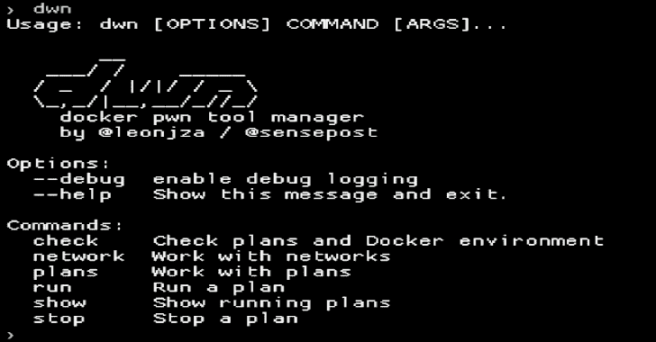

# DWN:码头工人 Pwn 工具经理

> 原文：<https://kalilinuxtutorials.com/dwn/>

[](https://1.bp.blogspot.com/-DJwX_J3wKmM/YHxyu6J4r_I/AAAAAAAAIw8/FyUBoS0TqiAHEHs8DWR2IWxftYMUHROGQCLcBGAsYHQ/s728/dwn%25281%2529.png)

**DWN** 是一个**“docker-compose for hackers”。使用类似于`**docker-compose**`的简单 YAML“计划”**格式，定义映像名称、版本和卷/端口映射，以设置要使用的工具。

**特性**

使用`dwn`,您可以:

*   配置在 docker 容器中使用的常见 pentest 工具
*   具有上下文感知卷装载
*   无需重启容器即可动态修改端口绑定
*   还有更多！

**安装**

*   简单地跑

`**pip3 install dwn**`

**用途**

`dwn`其实真的很简单。主要的概念是“计划”,其中定义了关于工具的信息(例如名称、版本、安装和绑定)。已经有一些[内置计划](https://github.com/sensepost/dwn/blob/master/plans)可用，但是你也可以滚动你自己的。如果没有参数，仅仅运行`dwn`就会像这样；

dwn
**用法:dwn【选项】命令【ARGS】……**

**选项:**
–调试启用调试日志记录
–帮助显示此消息并退出。

**命令:**
检查> >检查计划和码头环境
网络> >工作与网络
计划> >工作与计划
运行> >运行计划
显示> >显示运行计划
停止> >停止计划

要列出可用的计划，运行`dwn plans show`。

```
❯ dwn plans show
                                    dwn plans
┏━━━━━━━━━━━━━━━━━━┳━━━━━━━━━━━━━━━━━━━━━━━━━━━━━━━━━━━━━━━┓
┃ name             ┃ path                                  ┃
┡━━━━━━━━━━━━━━━━━━╇━━━━━━━━━━━━━━━━━━━━━━━━━━━━━━━━━━━━━━━┩
│ sqlmap           │ /tools/dwn/plans/sqlmap.yml           │
│ wpscan           │ /tools/dwn/plans/wpscan.yml           │
│ gowitness-report │ /tools/dwn/plans/gowitness-report.yml │
│ msfconsole       │ /tools/dwn/plans/msfconsole.yml       │
│ gowitness        │ /tools/dwn/plans/gowitness.yml        │
│ nginx            │ /tools/dwn/plans/nginx.yml            │
│ cme              │ /tools/dwn/plans/cme.yml              │
│ netcat-reverse   │ /tools/dwn/plans/netcat-reverse.yml   │
│ semgrep-sec      │ /tools/dwn/plans/semgrep-sec.yml      │
│ semgrep-ci       │ ~/.dwn/plans/semgrep-ci.yml           │
│ neo4j            │ ~/.dwn/plans/neo4j.yml                │
└──────────────────┴───────────────────────────────────────┘
                                     11 plans 
```

要运行一个计划，如`gowitness`截屏[https://google.com](https://google.com)，运行`dwn run gowitness --disable-db single https://www.google.com`。这个计划完成后就会退出，所以你不必`dwn stop gowitness`。

**>>dwn run gowitness–disable-db single https://www.google.com**
(I)发现 gowitness 的计划
(i)卷:~/scratch->/数据
(i)流式容器日志
08 Feb 2021 10:46:18 INF 预检结果 status code = 200 title = Google URL = https://www . Google . com

**>>ls 截图** 【T10

然而，像`netcat-reverse`这样的计划将继续存在。您可以在 TTY 计划开始与您可能收到的任何 shells 交互后连接到该计划。用法示例如下:

**> > dwn 运行 netcat-reverse**
(一)发现 netcat-reverse
(一)端口:4444 < -4444
(一)容器启动！attach & detach 命令有:
(I)attach:docker attach dwn _ wghz _ netcat-reverse
(I)detach:ctrl+p，ctrl + q

附加到计划(并在其他地方执行`nc -e`)

**>>docker attach dwn _ wghz _ netcat-reverse**
connect to[::ffff:172 . 19 . 0 . 2]:4444 from dwn _ wghz _ netcat-reverse _ net _ 4444 _ 4444 . dwn:46318([::ffff:172 . 19 . 0 . 3]:46318)

env | grep-I SHELL
SHELL =/bin/SHELL

你也可以得到一份运行计划报告

```
❯ dwn show
                                running plan report
┏━━━━━━━━━━━━━━━━┳━━━━━━━━━━━━━━━━━━━━━━━━━━━━━━━━━━━━━━━┳━━━━━━━━━━━━┳━━━━━━━━━━━┓
┃ plan           ┃ container(s)                          ┃ port(s)    ┃ volume(s) ┃
┡━━━━━━━━━━━━━━━━╇━━━━━━━━━━━━━━━━━━━━━━━━━━━━━━━━━━━━━━━╇━━━━━━━━━━━━╇━━━━━━━━━━━┩
│ netcat-reverse │ dwn_wghz_netcat-reverse_net_4444_4444 │ 4444<-4444 │           │
│                │ dwn_wghz_netcat-reverse               │            │           │
└────────────────┴───────────────────────────────────────┴────────────┴───────────┘ 
```

最后，停止一个计划。

**> > dwn 停止 netcat-reverse -y**

(i)停止计划 netcat-reverse 的 2 个集装箱

**联网**

`dwn`允许您动态地将端口映射到计划，而无需重新启动任何集装箱。网络命令位于`dwn network`子命令之下。以 [nginx](https://github.com/sensepost/dwn/blob/master/plans/nginx.yml) 计划为例，我们可以动态添加一个端口映射。首先，启动`nginx`计划。

**> > dwn 运行 nginx**

(一)为 nginx
找到计划(一)volume:~/scratch->/usr/share/nginx/html
(一)port: 80 < -8888
(一)为计划 nginx 启动容器 dwn_wghz_nginx，分离

接下来，用 cURL 测试通信

**>>curl localhost:8888/poo . txt**
哈哈，你摸到了！

**>>curl localhost:9000/poo . txt**
curl:(7)无法连接到 localhost 端口 9000:连接被拒绝

端口 9000 没有打开，所以让我们添加一个新的端口绑定并测试连通性

**> > dwn 网络添加 nginx -i 80 -o 9000**
(一)端口绑定为 9000- > nginx:80 创建了

**>>curl localhost:9000/poo . txt**
哈哈，你摸到了！

**更新计划**

`dwn plans pull`命令可用于更新计划中定义的`images`。要仅更新单个计划，在`pull`后添加计划名称。例:`dwn plans pull nginx`。

**写计划**

有一个`dwn plans new`命令可以快速搭建一个新计划。虽然启动并运行一个计划只需要几个选项，但是 Python Docker SDK 中用于 [run](https://docker-py.readthedocs.io/en/stable/containers.html#docker.models.containers.ContainerCollection.run) 调用的所有选项都是可以使用的有效标签。