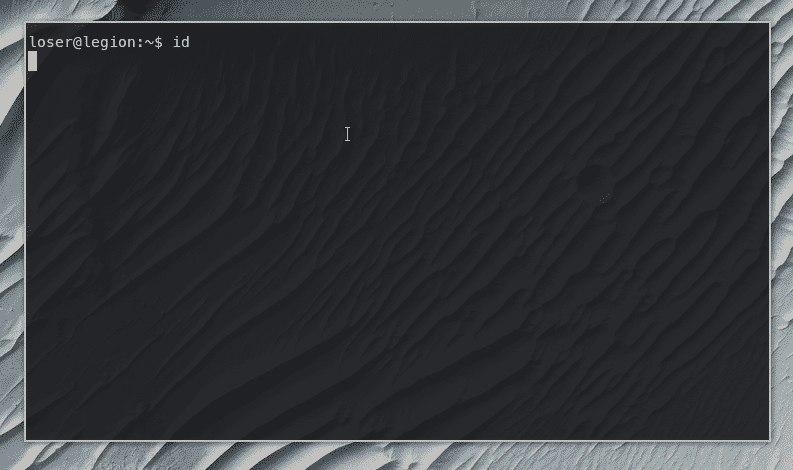

# 叛逆者:通过利用低挂果实(如 GTFOBin)自动获得 Linux 特权

> 原文：<https://kalilinuxtutorials.com/traitor/>

**叛徒**打包了一堆利用本地错误配置和漏洞(包括大部分 [GTFOBins](https://gtfobins.github.io/) )的方法，以便弹出根外壳。自动利用低挂水果弹出根壳。Linux 特权升级变得简单！

它将利用 GTFOBins 中列出的大多数 sudo 权限来弹出根 shell，并利用可写的`docker.sock`等问题。随着时间的推移，还会添加更多到 root 的路由。

**用途**

不带参数运行以查找可能允许权限提升的潜在漏洞/错误配置。如果当前用户密码已知，则添加`-p`标志。如果需要分析 sudo 权限等，将会要求输入密码。

**叛徒-p**

使用`-a` / `--any`标志运行以查找潜在的漏洞，尝试利用每个漏洞，如果获得根外壳，则停止运行。同样，如果当前用户密码已知，添加`-p`标志。

**叛徒-a -p**

使用`-e` / `--exploit`标志运行，尝试利用特定漏洞并获取根外壳。

叛徒 p -e docker:writable-socket

**支持的平台**

叛逆者将运行在所有 Unix 类系统上，尽管某些漏洞只会在某些系统上运行。

**变叛徒**

从[发布页面](https://github.com/liamg/traitor/releases)获取二进制文件，或者使用 go:

github.com/liamg/traitor/cmd/traitor

如果你试图获得特权的机器无法到达 GitHub 下载二进制文件，并且你无法通过 SCP/FTP 等方式将二进制文件上传到机器上。，那么您可以尝试在您的机器上对二进制文件进行 base64 编码，并将 base64 编码的字符串回显到目标机器上的`| base64 -d > /tmp/traitor`,记住一旦它到达就对其进行`chmod +x`。

[**Download**](https://github.com/liamg/traitor)