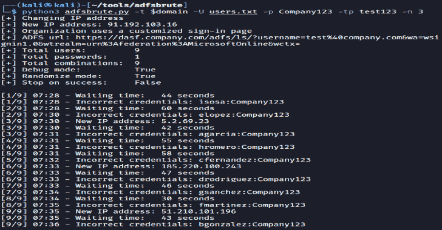
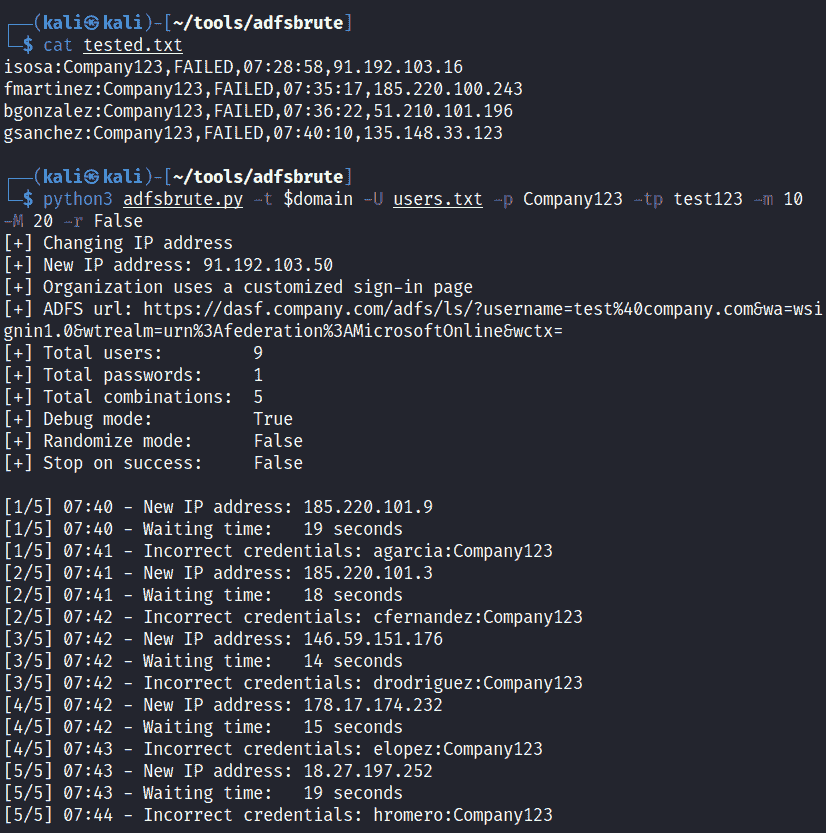
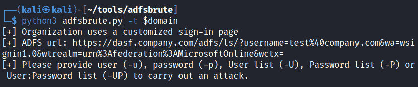

# ADFSBrute:针对 Active Directory 联合身份验证服务测试凭据的脚本

> 原文：<https://kalilinuxtutorials.com/adfsbrute/>

**ADFSBrute** 是一个针对活动目录联合服务(ADFS)测试凭据的脚本，计算组织的 ADFS url，并允许密码喷洒或暴力攻击。

主要思想是在每次测试之间进行随机和高延迟的密码喷射攻击，并使用代理列表或 [Tor](https://github.com/ricardojoserf/adfsbrute#using-tor) 使蓝队的检测更加困难。暴力攻击也是可能的，或者使用格式*用户名:密码*测试凭证(例如来自 [Pwndb](https://github.com/davidtavarez/pwndb) )。经过测试的登录将被存储在一个日志文件中，以避免测试两次。

**用途**

**。/adfs brute . py-t TARGET[-U USER][-U USER _ LIST][-P PASSWORD][-P PASSWORD _ LIST][-UL USER PASSWORD _ LIST]
[-M MIN _ TIME][-M MAX _ TIME][-TP TOR _ PASSWORD][-pl PROXY _ LIST][-n NUMBER _ OF _ REQUESTS _ PER _ IP]
[-s STOP _ ON _ SUCCESS][-r RANDOM _ COMBINATIONS][-d DEBUG][-l LOG _ FILE]**

攻击的参数是:

-t:目标域。例如:test.com
-u:单一用户名。例如:agarcia@domain.com
-U:带有用户名列表的文件。示例:users.txt
-p:单个密码:示例:Company123
-P:包含密码列表的文件。示例:passwords.txt
-UP:带有“用户名:密码”格式的凭证列表的文件。示例:userpass.txt
-m:每次测试之间等待的随机秒数的最小值。默认值:30
-M:每次测试之间等待的随机秒数的最大值。默认值:60
-tp: Tor 密码(使用 Tor 更改 IP 地址)
-pl:使用代理列表(使用代理 IP 列表更改 IP 地址)
-n:更改 IP 地址前的请求次数(与-tp 或-pl 一起使用)。Default: 1
-s:找到一个正确的凭证时，成功时停止。默认值:False
-r:随机化用户和密码的组合。默认:真
-d:显示调试信息。缺省值:True
-l:已测试凭证的日志文件位置。默认值:tested.txt

**例题**

使用密码“Company123”喷涂密码，tor 密码为“test123 ”,每 3 次请求更改一次 IP:

python 3 adfs brute . py-t company.com-U 用户. txt -p 公司 123 -tp 测试 123 -n 3

密码喷涂为密码“Company123”，tor 密码为“test123”，为每个请求更改 IP，随机延迟时间在 10 到 20 秒之间，不随机化用户顺序:

**python 3 adfs brute . py-t company.com-U users . txt-p company 123-TP test 123-M 10-M 20-r False**

查找 ADFS 网址:

**python 3 adfs brute . py-t company.com**

**使用 Tor**

要使用 Tor 更改每个请求的 IP，您必须散列一个密码:

**tor–哈希密码测试 123**

在文件/etc/tor/torrc 中，取消对变量 *ControlPort* 和变量 *HashedControlPassword* 的注释，并在最后一个中添加散列:

控制端口 9051
哈希控制密码 16:7 f 314 cab 402 a 81 f 860 B3 ee 449 b 743 AEC 0 ded 9 f 27 fa 41831737 e2f 08 f 87

重新启动 tor 服务，并使用该密码作为脚本的参数("-tp test123 "或"tor _ password 123 ")

重启服务

**注意:**此脚本用于在安全审计中进行测试，未经拥有 ADFS 的公司的适当授权，请勿使用，否则您将会冻结帐户。

[**Download**](https://github.com/ricardojoserf/adfsbrute)