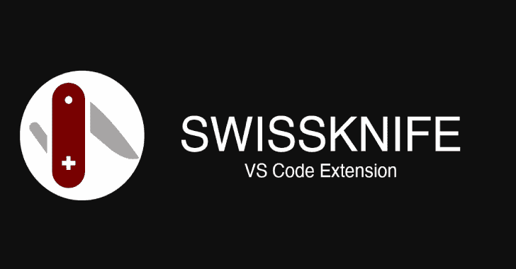

# SwissKnife:可脚本化的 VSCode 扩展，用于生成或操作数据

> 原文：<https://kalilinuxtutorials.com/swissknife/>

开发者 **SwissKnife** 。在 vs 代码之外进行转换和生成。可扩展的用户脚本。

**当前可用的脚本**

*   Base64 解码
*   Base64 编码
*   二进制到文本
*   Bip39 助记符
*   CSV 至降价
*   计算字符数
*   统计字数
*   加密货币值
*   时间戳日期
*   椭圆曲线密钥对
*   生成密码
*   HTML 编码(全部)
*   十六进制解码
*   十六进制编码
*   十六进制转换为 RGB
*   身份散列
*   JWT 解码
*   加入线条
*   Lorem Ipsum
*   降价到 HTML
*   Md5 哈希
*   新 Swissknife 脚本(JS)
*   新 Swissknife 脚本(TS)
*   密码强度
*   RGB 转十六进制
*   RSA 密钥对
*   随机字符串
*   请求获取
*   SHA1 杂碎
*   SHA256 哈希
*   SHA512 哈希
*   自签名证书
*   启动本地 HTTP 服务器
*   启动本地 HTTPS 服务器
*   停止 HTTP 服务器
*   文本到二进制
*   文本到字符串
*   迄今为止的时间戳
*   到骆驼箱
*   变为小写
*   到莫尔斯电码
*   到大写
*   UUIDv4
*   Unicode 解码
*   Unicode 编码(js 格式)
*   Unix/Linux 许可人类可读
*   urldecode
*   urlencode
*   Url 编码(所有字符)
*   Url 缩短
*   Url 取消缩短(url 扩展)

**用途**

对于 windows，您可以使用`ctrl+shift+9`调用专用命令 pallete 对于 mac，您可以使用`cmd+shift+9`调用专用命令 pallete(当聚焦编辑器时)

默认情况下，转换将仅使用选定的文本。如果没有选择文本，将使用编辑器的全部内容。它支持多重选择，并将为每个选择单独运行脚本

**Macbook Touchbar 支持**你也可以直接从 Macbook 的 Touchbar 调用 swissknife 扩展。

**脚本详情**

**加密货币值**

使用来自 [Cryptonator](https://github.com/luisfontes19/vscode-swissknife/blob/master/cryptonator.com) 的 API。您可以直接从文本中指定转换，如:

**1 英磅兑欧元**

查看支持的货币列表，请点击此处

**识别哈希**

操作的结果可能返回多个值，因为来自不同算法的散列具有相同的输出格式。我们仍然按照最相关的从上到下组织散列。

**HTTP(S)服务器**

服务器将收到的所有请求记录到 VSCode 的“输出”窗口中(您可以通过菜单中的 view -> Output 来显示它)。然后在窗口的右边(这里通常有值“任务”)，通过“Swissknife 服务器”过滤

**隐私说明**

这个扩展的主要目的之一是停止粘贴数据，或者信任随机网站生成的数据。出于隐私考虑，该扩展避免了外部 web 请求或记录数据。但是有些操作需要外部请求:

*   **加密货币值**–向 cryptonator api 请求获取可用的加密货币，并请求获取特定货币对的当前价格。**未发送正在转换的金额**，这是在本地机器上计算的。
*   **url un shorten**–这个确实需要对短 Url 做请求，所以它可以获得重定向(完整)Url。但是请记住，完整的 url 永远不会到达，扩展不会跟随重定向。
*   **网址缩短**–缩短功能使用 https://tinyurl.com 的[来注册一个新的短网址。](https://tinyurl.com)

**写剧本**

Swissknife 将自动加载其用户脚本文件夹中的所有脚本，您可以通过执行命令找到它。打开你的命令面板，输入“打开 swissknife 用户脚本文件夹”。或者只是开始键入它，因为它最终会被建议。这是您可以创建自定义脚本的文件夹。

要启动一个新的脚本，您也可以使用扩展提供的命令。打开 swissknife picker，输入“新 swissknife 脚本”。

**脚本重新加载**

脚本在初始化 VS 代码时被加载到扩展中，所以当你创建一个定制脚本时，你需要重新加载脚本。为了使开发更容易，该扩展有一个命令“Reload Swissknife Scripts ”,您可以从 VS 代码命令 pallette 调用它(不要与 Swissknife 的脚本启动器混淆)。

请记住，每次在用户脚本文件夹中更改脚本时，您都需要重新加载脚本。

**开始模板**

你可以根据你更喜欢的选择 TS 或 JS 版本。TS 会更复杂，因为你需要把它转换成 JS。我们会用 Javascript。这是脚本的基本结构:

Object.defineProperty(导出，“__esModule”，{ value:true })；
exports . do something = async(text，context)=>{
return new Promise((resolve，reject)=>{
resolve(text . replace(/a/g，" b)))；
})；
}
const scripts =[
{
title:“我的脚本”，
detail:“这个脚本做了什么”，
CB:(context)=>context . replace routine(exports . do something)
}，
]
exports . default = scripts；

这是创建脚本的基本模板。在这个文件中，我们创建了一个名为“我的脚本”的脚本。每个文件可以有任意多的脚本。这只是一种组织方式🙂正如您在最后看到的，脚本的结构由 3 个属性组成:标题、细节和 cb。前两个是不言自明的。cb 是脚本运行时将被调用的代码。默认情况下，swissknife 通过变量“context”为您提供了一些帮助入门的方法。这个方法只是用 b 代替 a

**语境**

在上下文中，你有一些好的方法来帮助你，你应该尽可能地使用它们。

*   insert routine(CB)–这个方法将解析的内容插入到编辑器的光标处。它将调用 cb 并将上下文作为参数发送。 **cb 应该是异步的**
*   information routine(CB)–该方法将创建一个包含已解析内容的通知。它将调用 cb，并将编辑器中的选定文本(如果没有选择，则为所有文本)和上下文作为参数发送。 **cb 应该是异步的**
*   replace routine(cb)–该方法将用 CB 中解析的内容替换编辑器中选择的文本(如果没有选择文本，则替换所有文本)。它将调用 cb，并将编辑器中的选定文本(如果没有选择，则为所有文本)和上下文作为参数发送。 **cb 应该是异步的**
*   vs code–该变量保存了 [vscode api](https://code.visualstudio.com/api) 。
*   modules——这个变量是在[脚本(和 lib)文件夹](https://github.com/luisfontes19/vscode-swissknife/tree/master/src/scripts)中的所有 JS 模块的数组。您可以使用它们从本机脚本中调用方法，以重用代码逻辑。例如:context . modules . passwords . generatesecurecharcode())

这种方法的使用是可选的。如果您觉得直接使用 vscode api 更容易，您也可以这样做:

Object.defineProperty(导出，“__esModule”，{ value:true })；
const scripts =[
{
title:"我的 Script2 "，
detail:"这个脚本做了点什么"，
CB:(context)=>{
console . log(context)
const editor = context . vs code . window . activetexteditor；
editor . edit((edit)=>{
edit . insert(editor . selection . my active，"做东西")
})；
}
}，
]
exports . default = scripts；

**更多例子**

Object.defineProperty(导出，“__esModule”，{ value:true })；
//使用 context.modules 重用现有代码。启动一个 http 服务器
exports . start server = async(context)=>{
context . modules . lib . server . start({ port:1234 })
}
//使用 context.userModules 调用另一个用户脚本
//context . user modules 中会有一个条目，其名称与加载了脚本的文件名称相同
//所有导出的方法都是可访问的……
//如果调用脚本，记得发送正确的参数，如 context
exports . another user script = async
}
//要求用户输入
exports . Ask input = async(context)=>{
return new Promise((resolve，reject)=>{
context . vs code . window . showinputbox({ prompt:“说点什么”})。然后(answer = > {
化解(答案)；
})；
})；
}
const scripts =[
{
title:“询问输入”，
detail:“询问用户输入并将其添加到编辑器中”，
CB:(context)=>context . insert routine(this . Ask Input)
}，
{
title:“在端口 1234 上启动服务器”，
detail:“在端口 1234 上启动服务器”，
CB:(context)=>this . startserver

[**Download**](https://github.com/luisfontes19/vscode-swissknife/)