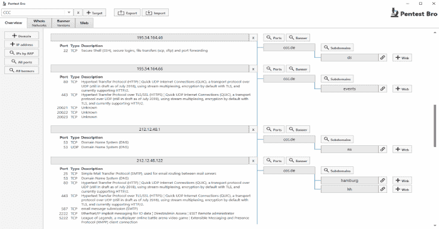
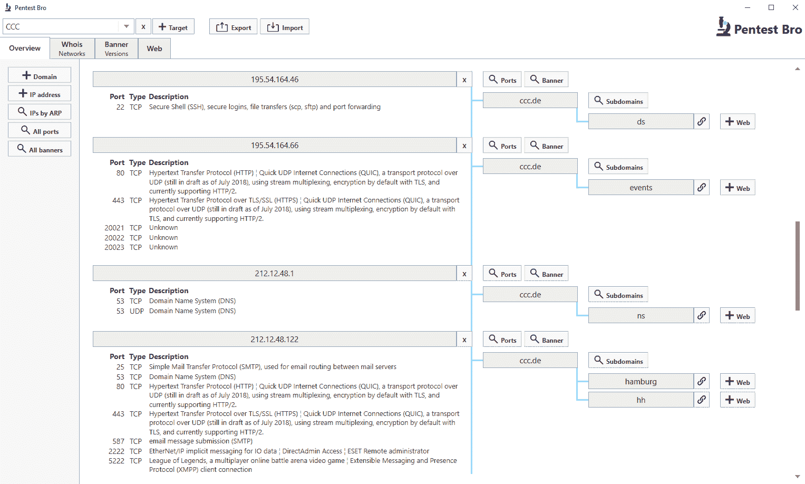
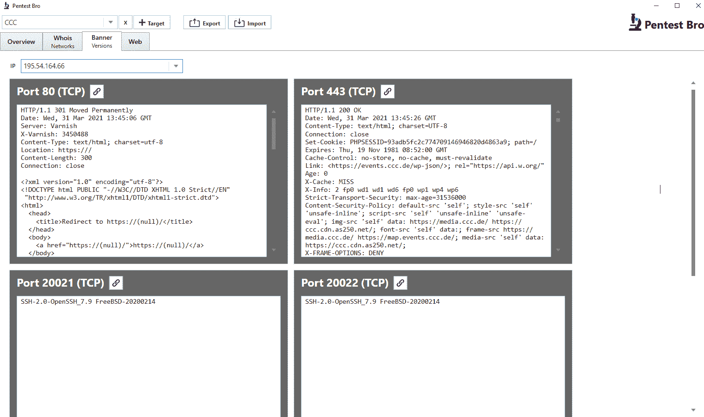
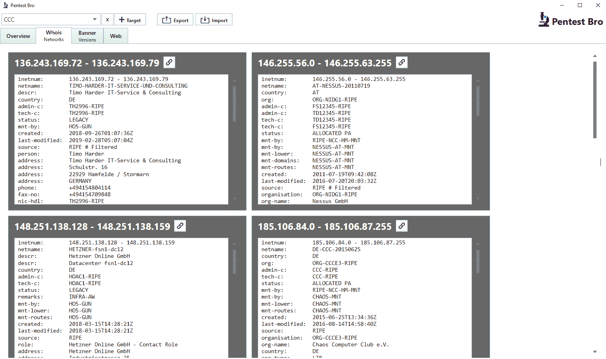

# PentestBro:将端口扫描、横幅抓取和 Web 枚举整合到一个工具中

> 原文：<https://kalilinuxtutorials.com/pentestbro/>

Windows 的实验工具。 **PentestBro** 将子域扫描、whois、端口扫描、横幅抓取和 web 枚举整合到一个工具中。使用 SecLists 的子域列表。使用 nmap 服务探测器抓取横幅。为 web 枚举使用路径列表。

**[www . CCC . de](http://www.ccc.de)**示例扫描

*   **扫描的子域、IP 和端口**

*   **抓取每个 IP 和端口的横幅**

*   **所有 IP 范围的谁是谁**

