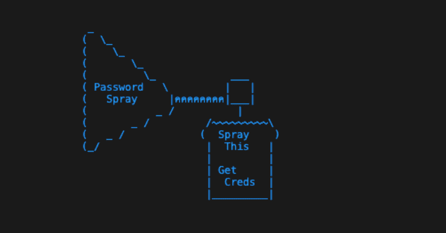

# Spraygen:用于密码喷射的密码列表生成器

> 原文：<https://kalilinuxtutorials.com/spraygen/>

Spraygen 是一个用于密码喷射的密码列表生成器——预烘有好东西。

**1.5 版本**

生成月、季、年、运动队(NFL、NBA、MLB、NHL)、运动分数、“密码”，甚至指定大小的可迭代密钥空间的排列。

所有的排列都附加了共同的属性(如“！”或“#”)，或自定义分隔符(如“.”或者“_”。

常见的字母替换选项(例如全部更改 A -> 4/@

用户可以使用逗号分隔的字符列表来扩展属性和分隔符。

Spraygen 还接受单个单词或外部单词列表，允许您在已经提供的内容之外生成调整的自定义单词列表。

你可以使用像 crunch 这样的工具，一个在 SecLists 上的花哨的 bash 循环，或者任何你有的工具，但是那需要时间…这个工具是为喷射而设计的，所以开始吧！

**python 3 Spray gen . py-h**

**用法:**Spray gen . py[-h][–YEAR _ START YEAR _ START][–YEAR _ END YEAR _ END][-s separators][-a attributes][-w word List][-n single word]
[–mode { all，nosep，noattr，years，plain，letter，custom }]
[–type { all，iterative，sports，nfl，nba，mlb，nhl，months

**可选参数:**
-h，–help 显示此帮助消息并退出
–YEAR _ START YEAR _ START
某个年份范围的开始年份
–YEAR _ END YEAR _ END 某个年份范围的结束年份
-s 分隔符一个或多个分隔符的逗号分隔列表
-a 属性一个或多个属性的逗号分隔列表
-w 单词列表自定义单词列表的路径
-n single 可以是 all，没有分隔符，没有属性，只有 years，plain，letter 或 custom(将只使用传入-s 或-a 的参数
)。
–键入{all，iterative，sports，nfl，nba，mlb，nhl，months，seasons，password，custom} [{all，iterative，sports，nfl，nba，mlb，nhl，months，seasons，password，custom} …]
要生成的列表类型。可以是所有，迭代，体育，nfl，nba，mlb，nhl，月份，赛季，密码，或自定义。选择“全部”
执行除“迭代”以外的所有选项，迭代必须手动运行。
–ITER { ascii，num，spec，asciinum，asciispec，numspec，full}
用于迭代列表生成的键空间模式。仅当–type 设置为“迭代”时有效。可以是 ascii、num、spec、asciinum、
asciispec、numspec 或 full。将生成所选密钥空间的所有排列，其长度由–size
参数设定。
–由设定的密钥空间生成的密码的大小长度。仅当–type 设置为“迭代”并且设置了–ITER 键空间模式时才有效。
–MIN _ LENGTH MIN _ LENGTH
包含在列表中的密码的最小长度。(默认值:1)
–MAX _ LENGTH MAX _ LENGTH
要包含在列表中的密码的最大长度(默认值:999)
-o 输出要创建的文件的文件名并将最终输出写入
-p 将输出逐行打印为明文
–Sort { no Sort，asc，desc，random}
排序最终输出。支持的排序方法有 nosort、asc、desc、random。
-v 打印 spraygen 的当前版本并退出

**基本用法**

1.  安装依赖关系`**pip3 install -r requirements.txt**`
2.  运行`**python3 spraygen.py -p**`–这将生成所有排列的默认内置单词列表，并将其打印到屏幕上

**使用建议**

*   [使用单据](https://github.com/3ndG4me/spraygen/blob/main/docs/usage.md)

**学分**

*   [@ markoh 17](https://github.com/MarkoH17)–用于布尔 python3.8 向后兼容性修复
*   [@ absolom](https://github.com/absolomb)–用于增强年份生成中的类型选择和属性逻辑

[**Download**](https://github.com/3ndG4me/spraygen)