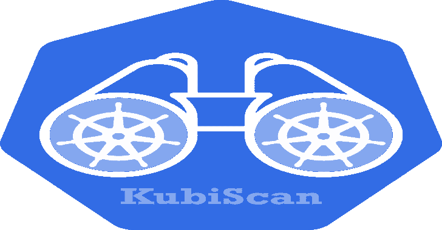

# KubiScan:一个扫描 Kubernetes 集群危险权限的工具

> 原文：<https://kalilinuxtutorials.com/kubiscan/>

在 Kubernetes 基于角色的访问控制(RBAC)授权模型中，用于扫描 Kubernetes 集群的风险权限的工具。该工具作为“通过消除有风险的权限来保护 Kubernetes 集群”研究的一部分发布[https://www . cyberark . com/threat-research-blog/Securing-Kubernetes-Clusters-by-eliming-Risky-Permissions/](https://www.cyberark.com/threat-research-blog/securing-kubernetes-clusters-by-eliminating-risky-permissions/)。

**概述**

KubiScan 帮助集群管理员识别攻击者可能利用来危害集群的权限。这在大型环境中尤其有用，在这种环境中，跟踪大量权限可能会很困难。KubiScan 收集有关风险角色\集群角色、角色绑定\集群角色绑定、用户和 pod 的信息，自动执行传统的手动流程，并为管理员提供降低风险所需的可见性。

它能做什么？

*   识别有风险的角色\集群角色
*   识别有风险的 role bindings \ ClusterRoleBindings
*   识别有风险的主体(用户、组和服务帐户)
*   识别有风险的容器\集装箱
*   从 pod 转储令牌(全部或按命名空间)
*   获取与角色、集群角色或主题(用户、组或服务帐户)关联的 Role bindings \ ClusterRoleBindings
*   列出特定种类的主题(“用户”、“组”或“服务帐户”)
*   列出 RoleBinding 或 ClusterRoleBinding 的规则
*   显示可以通过卷或环境变量访问机密数据的窗格
*   获取集群的引导令牌

**用途**

**集装箱**

用`**~/.kube/config**`文件

这应该在配置文件所在的**主**节点中执行:

docker run-it–RM-e CONF _ PATH = ~/。kube/config-v/:/tmp cyberark/kubiscan

*   `**CONF_PATH**`–集群配置文件的路径

在容器内部，命令`kubiscan`相当于`python3 /KubiScan/KubiScan.py`。
注意，在这种情况下，**整个文件系统将被挂载**。这是因为配置文件包含文件系统中其他位置的路径，这些路径在其他环境中会有所不同。

**【用服务账号令牌(从远程好)**

某些功能需要具有以下权限的**特权**服务帐户:

*   **资源**:`**["roles", "clusterroles", "rolebindings", "clusterrolebindings", "pods", "secrets"]**`
    动词 : `**["get", "list"]**`
*   **资源**:`**["pods/exec"]**`
    动词 : `**["create", "get"]**`

但是大部分功能都没有，所以您可以对有限的服务帐户使用此设置:
它可以通过运行以下命令来创建:

kubectl apply-f-<< EOF
API version:v1
kind:service account
元数据:
名称:kubiscan-sa
名称空间:默认
——
kind:ClusterRoleBinding
API version:rbac.authorization.k8s.io/v1beta1
元数据:
名称:kubiscan-ClusterRoleBinding
主题:
kind:service account
名称:kubiscan-sa
名称空间:默认
API group:“
角色

将服务帐户的令牌保存到文件中:

**忽必烈得到秘密$(忽必烈得到他的忽必烈-sa -o json | jq -r)。秘密[0]。名称')-JSON | jq-r .。data . token ' | base 64-d>令牌**

从任意位置运行容器:

`**docker run -it --rm -v $PWD/token:/token cyberark/kubiscan**`

在 shell 中，您将能够像这样使用 kubiscan:

`**kubiscan -ho <master_ip:master_port> -t /token <command>**`

例如:

`**kubiscan -ho 192.168.21.129:8443 -t /token -rs**`

请注意，您还可以使用证书颁发机构(ca.crt)来验证 SSL 连接:

`**docker run -it --rm -v $PWD/token:/token -v <ca_path>/ca.crt:/ca.crt cyberark/kubiscan**`

容器内部:

`**kubiscan -ho <master_ip:master_port> -t /token -c /ca.crt <command>**`

要删除特权服务帐户，请运行以下命令:

**`kubectl delete clusterroles kubiscan-clusterrole`
`kubectl delete clusterrolebindings kubiscan-clusterrolebinding`
`kubectl delete sa kubiscan-sa`**

**直接用 Python3**

**先决条件:**

*   **Python 3.5+**
*   **Pip3**
*   [**Kubernetes Python 客户端**](https://github.com/kubernetes-client/python)
*   
*   ****OpenSSL**(Ubuntu 内置)——仅用于加入令牌**

 ****安装在 Ubuntu 上的例子:**

【T4`apt-get update`
`apt-get install -y python3 python3-pip`
`pip3 install kubernetes`
`pip3 install PTable`

运行`**alias kubiscan='python3 /<KubiScan_folder/KubiScan.py'**`使用`kubiscan`。

安装完上述所有要求后，您可以用两种不同的方式运行它:

**从主节点:**

在 **`~/.kube/config`所在的主节点以及所有相关证书上，只需运行:
`kubiscan <command>`**
例如:`**kubiscan -rs**`会显示所有的风险主体(用户、服务账户、组)。

**来自远程主机:**

要从远程主机使用这个工具，您需要一个**特权**服务帐户，就像我们在容器部分解释的那样。
将令牌放入文件后，您可以运行:

`**kubiscan -ho <master_ip:master_port> -t /token <command>**`

**例子**

要查看所有示例，请运行`python3 KubiScan.py -e`或从容器`kubiscan -e`中运行。

**危险角色 YAML**

有一个名为`risky_roles.yaml`的文件。该文件包含具有优先级的危险角色的模板。
虽然每个角色中的种类是`Role`，但是这些模板将与集群中的任何角色\集群角色进行比较。
当对照集群中的角色检查这些角色中的每一个时，它检查集群中的角色是否包含来自危险角色的规则。如果是，它将被标记为有风险。
我们添加了我们发现有风险的所有角色，但是因为每个角色可以用不同的方式定义“有风险”一词，所以您可以通过添加\删除您认为风险更大\更小的角色来修改文件。

[**Download**](https://github.com/cyberark/KubiScan)**