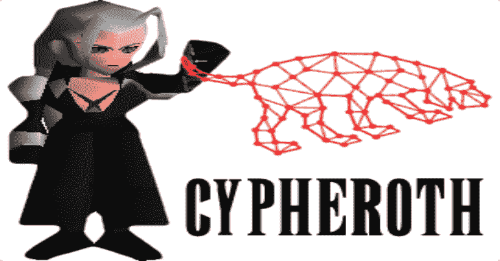

# Cypheroth:运行密码查询的自动化可扩展工具集

> 原文：<https://kalilinuxtutorials.com/cypheroth/>

Cypheroth 是一个自动化、可扩展的工具集，针对 Bloodhound 的 Neo4j 后端运行 cypher 查询，并将输出保存到电子表格中。

这是一个 bash 脚本，可以针对存储在 Neo4j 数据库中的 Bloodhound 数据自动运行 cypher 查询。

我发现自己通过 Neo4j web 界面在多个评估上重复运行相同的查询，并认为一定有更简单的方法。

要运行的 cypher 查询列表是完全可扩展的。下面的格式示例显示了如何添加您自己的。

请分享任何其他有用的查询，以便我可以将它们添加到这个项目中！

**演示**

**先决条件**

*   Neo4j 附带了`cypher-shell`命令，这是该脚本运行所必需的
    *   *如果安装了 Neo4j，但找不到`cypher-shell`，您可能拥有过时版本的 Neo4j*
    *   *最新版本总是可以在[这个位置](https://neo4j.com/download-center/)T3 找到*
    *   *在 Kali 上，使用 [Neo4j 的 Debian 资源库](https://debian.neo4j.org)T3 升级至最新版本*
*   可选:如果存在`ssconvert`命令，脚本将组合所有。csv 输出到. xls 文件中的工作表
    *   *使用 apt 或 brew 安装 gnumeric 工具集，以访问 ssconvert*

在 Windows 上，我们建议使用 WSL 来运行这个脚本，而 neo4j 数据库在 Windows 上运行。您只需要在 WSL (Linux)中安装`cypher-shell`包。

**用途**

**标志:**

-u Neo4J 用户名(必需)
-p Neo4J 密码(必需)
-d 全限定域名(必需)(区分大小写)
-a Bolt 地址(可选)(默认:localhost:7687)
-t 查询超时(可选)(默认:30s)
-v 详细模式(可选)(默认:FALSE)
-h 帮助文本和用法示例(可选)

默认值示例:

`**./cypheroth.sh -u neo4j -p BloodHound -d TESTLAB.LOCAL**`

所有选项的示例:

`**./cypheroth.sh -u neo4j -p hunter2 -d BigTech.corp -a 10.0.0.1:7687 -t 5m -v true**`

文件被添加到以 FQDN 命名的子目录中。

**密码查询**

脚本中目前有近 60 个查询。这是您将收到的信息示例:

*   完整的用户属性列表
*   完整的计算机属性列表
*   完整的域属性列表
*   完整的 OU 属性列表
*   完整的 GPO 属性列表
*   完整的组属性列表
*   有管理员的计算机
*   没有管理员的计算机
*   Kerberos 表用户和他们是管理员的计算机

要添加其他查询，请编辑 cypheroth.sh 中的`queries`数组，并使用以下格式添加一行:

`**Description;Cypher Query;Output File**`

*如果添加需要设置域值的查询，将其保存为$DOMAIN。*

*   **例 1:**

**所有用户名；MATCH (u:User)返回 u . name；用户名. csv**

*   **例 2:**

所有域管理员；MATCH(u:User)MATCH(g:Group { name:' DOMAIN ADMINS @ $ DOMAIN ' })返回 u.displaynamedomainAdmins.csv

**分析几个域**

如果您需要分析几个域，您可以并行运行多个 Cypheroth 实例，每个实例在其域上工作。例如，您可以使用下面的脚本(10 个并行)。

**#！/usr/bin/env bash
DOMAINS =(DOMA . example . net domB.example.net[…])
parallel-j10–lb。/cypheroth . sh-d { }::::" $ { DOMAINS[@]} "**

**故障排除**

如果您运行的是过时版本的`cypher-shell`，您可能会收到以下错误:

**在 Bolt 协议版本**
1 中，DateTime 不支持作为返回类型。请确保驱动程序至少支持协议版本
2。很可能需要升级驱动程序。

要解决此问题，[将 Neo4j](https://neo4j.com/download-center/) 更新至最新版本。

**鸣谢:**克里斯·法雷尔( [@seajay](https://twitter.com/seajay) )

**致谢**

*   没有 BloodHound 就不会有这个工具——由 [@_wald0](https://twitter.com/_wald0) 、 [@CptJesus](https://twitter.com/CptJesus) 和 [@harmj0y](https://twitter.com/harmj0y) 开发。
*   大喊到[警犬懈](https://bloodhoundgang.herokuapp.com)频道`#cypher_queries`寻求援助
*   这个项目的核心是直接从他的 [procdump 脚本](https://github.com/tinkersec/scratchpad/blob/master/BashScripts/grabDump.sh)复制/粘贴而来的🙃
*   非常感谢[@ AWS hacks](https://twitter.com/awsmhacks)、 [@haus3c](https://twitter.com/haus3c) 和 [@ScoubiMtl](https://twitter.com/ScoubiMtl) 收集有用的密码查询(这里、这里和这里)
*   非常感谢 [@chryzsh](https://twitter.com/chryzsh) 和 [@mubix](https://twitter.com/mubix) 的贡献！！
*   所有来自 [@cnotin](https://twitter.com/cnotin) 的惊人贡献

[**Download**](https://github.com/seajaysec/cypheroth)