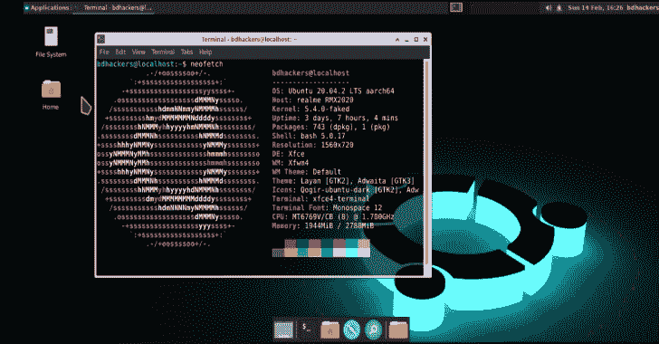
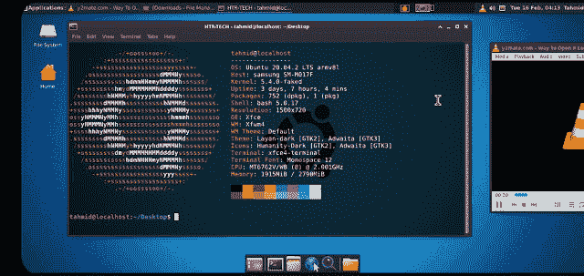

# 在你的 Termux 上运行 Ubuntu GUI，有很多特性

> 原文：<https://kalilinuxtutorials.com/modded-ubuntu-run-ubuntu-gui-on-your-termux-with-much-features/>

是一个用来在你的 termux 上运行 ubuntu GUI 的工具，有很多功能。

**特性**

*   固定音频输出
*   轻量级{需要至少 4GB 存储空间}
*   用于安装 kali 工具的 Katoolin3 工具
*   两种浏览器(Chromium 和 Mozilla Firefox)
*   支持孟加拉字体
*   VLC 媒体播放器
*   Visual Studio 代码
*   对初学者来说很容易

**安装**

*   首先克隆存储库并运行安装文件

**pkg 更新-y & & pkg 升级-y
pkg 安装 git wget -y
git 克隆 git://github . com/modded-Ubuntu/modded-Ubuntu . git
CD modded-Ubuntu
bash setup . sh**

*   然后重启 Termux &输入以下命令

**ubuntu
bash user.sh**

*   键入您的 ubuntu root 用户名。必须小写&不包括空格。
*   然后再次重启 Termux &键入以下命令

**ubuntu
bash gui.sh**

*   你必须记下你的 VNC 密码！！
*   Ubuntu 映像现在已成功安装。

键入 vncstart 运行 Vncserver
键入 vncstop 停止 Vncserver

*   在您的设备上安装 VNC 浏览器 Apk。谷歌 Play 商店
*   打开 VNC 浏览器&点击+按钮&输入地址 localhost:1 &随便起个名字
*   为了获得更好的质量，请将图像质量设置为高
*   点击连接并输入密码。

**注**

*   键入 ubuntu 运行 Ubuntu CLI。
*   键入 vncstart 运行 Vncserver
*   键入 vncstop 停止 Vncserver
*   键入 bash remove.sh 来删除 Ubuntu 模式的操作系统

**视频教程**

**学分**

*   这个工具使用 termux 包`proot-distro`提供的 ubuntu 镜像
*   Ubuntu 的形象完全归功于他们。
*   https://github.com/termux/proot-distro termux Proot 区

**维护人员**

*   **mustafakim Ahmed**([https://github . com/bdhackers 009](https://github.com/BDhackers009)
*   **tahmid rayat**([https://github . com/HTR-tech](https://github.com/htr-tech)

[**Download**](https://github.com/modded-ubuntu/modded-ubuntu)