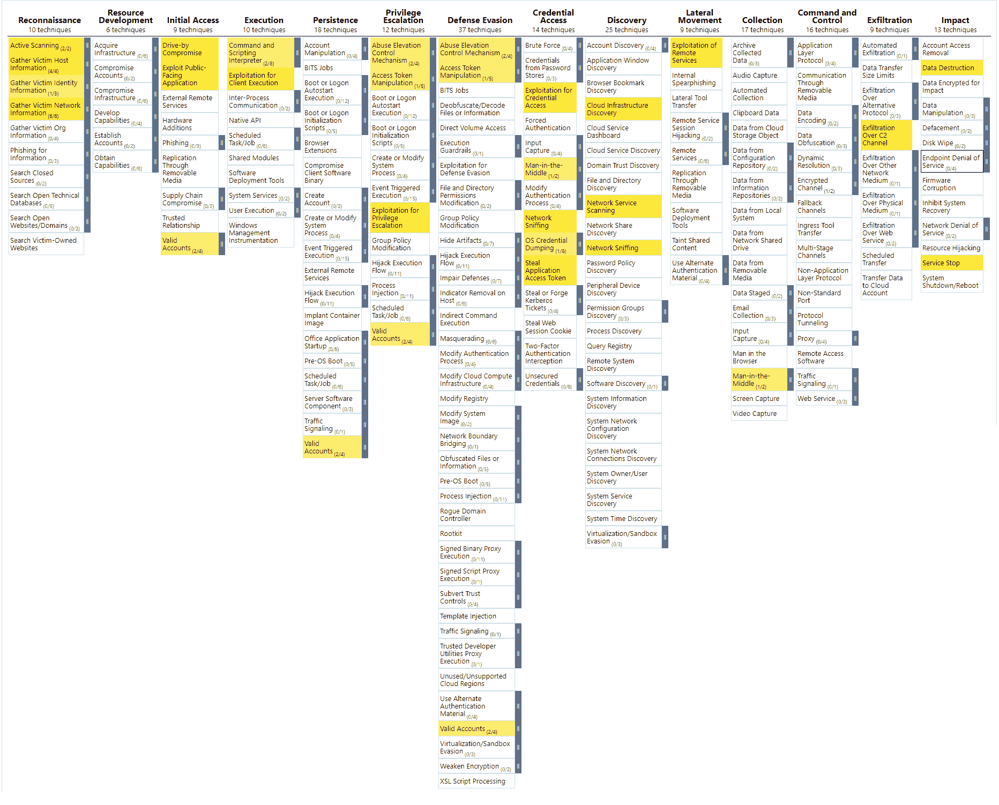

# Kubesploit:一个跨平台的开发后 HTTP/2 命令

> 原文：<https://kalilinuxtutorials.com/kubesploit/>

**Kubesploit** 是一个跨平台的后开发 HTTP/2 命令&控制服务器和代理，专用于容器化环境，用 Golang 编写，由 [Russel Van Tuyl (@Ne0nd0g)](https://github.com/Ne0nd0g) 在 [Merlin](https://github.com/Ne0nd0g/merlin) 项目的基础上构建。

**我们的动力**

在研究 Docker 和 Kubernetes 时，我们注意到目前可用的大多数工具都是针对集群中的漏洞进行被动扫描，缺乏更复杂的攻击载体覆盖。他们可能会让你看到问题，但不会利用它。重要的是运行利用来模拟真实世界的攻击，这将用于确定整个网络的企业弹性。
在运行漏洞利用时，它将实施组织的网络事件管理，这在扫描集群问题时不会发生。
它可以帮助组织学习当真正的攻击发生时如何操作，看看它的其他检测系统是否如预期那样工作，以及应该做出哪些改变。
我们希望创造一种能够满足这些需求的进攻性工具。

但是我们有另一个理由去创造这样一个工具。我们已经有了两个与 Kubernetes 相关的开源工具( [KubiScan](https://github.com/cyberark/KubiScan) 和 [kubeletctl](https://github.com/cyberark/kubeletctl) ，并且我们有了更多的想法。我们认为，与其为每一个工具创建一个项目，不如制作一个新工具，将这些新工具集中起来，这就是 Kubesploit 的创建时间。

我们寻找了一个为跨平台系统提供强大功能开源软件，我们发现由 [Russel Van Tuyl (@Ne0nd0g)](https://github.com/Ne0nd0g) 编写的 [Merlin](https://github.com/Ne0nd0g/merlin) 对我们来说很合适。

我们的主要目标是提高对集装箱化环境安全性的认识，并改善各种网络中实施的缓解措施。所有这些都是通过一个框架捕获的，该框架为 PT 团队和 Red Teamers 在这些环境中的活动提供了适当的工具。使用这些工具将帮助您评估这些环境的优势，并做出必要的更改来保护它们。

有什么新消息？

由于 C&C 和代理基础设施已经由 [Merlin](https://github.com/Ne0nd0g/merlin) 完成，我们集成了 [Go interpreter ("Yaegi")](https://github.com/traefik/yaegi) 以便能够从服务器到代理运行 Golang 代码。
它允许我们用 Golang 编写模块，在模块上提供更多的灵活性，并动态加载新模块。这是一个正在进行的项目，我们计划在未来添加更多与 Docker 和 Kubernetes 相关的模块。

当前可用的模块有:

*   使用安装的容器突破
*   使用 docker.sock 的容器突破
*   利用 CVE-2019-5736 漏洞的容器突破
*   扫描 Kubernetes 集群已知 CVE
*   侧重于 Kubernetes 服务的端口扫描
*   Kubernetes 服务从容器内扫描
*   灯 [kubeletctl](https://github.com/cyberark/kubeletctl) 包含以下选项:
    *   扫描带有 RCE 的容器
    *   扫描容器和集装箱
    *   从所有可用容器中扫描令牌
    *   使用多个选项运行命令

**快速启动**

我们在 Katacoda 创建了一个专门的 [Kubernetes 环境，供您使用 Kubesploit 进行实验。
这是一个完整的模拟，有一整套关于如何使用 Kubesploit 的自动化说明。我们鼓励你去探索它。](https://www.katacoda.com/cyberarkcommons/scenarios/kubesploit)

**建造**

要构建这个项目，从根文件夹运行`make`命令。

**快速构建**

要运行 Linux 快速构建，可以运行以下命令:

**导出路径=$PATH:/usr/local/go/bin
go 构建-o 代理 cmd/merlinagent/main.go
go 构建-o 服务器 cmd/merlinserver/main.go**

**缓解措施**

**YARA 规则**

我们创建了 YARA 规则来帮助捕捉 Kubesploit 二进制文件。规则写在文件`kubesploit.yara`里。

**代理录音**

加载到代理的每个 Go 模块都被记录在受害者机器中。

**斜切面图**

我们创建了 Kubesploit 使用的矢量攻击的 MITRE 地图。

[**Download**](https://github.com/cyberark/kubesploit)