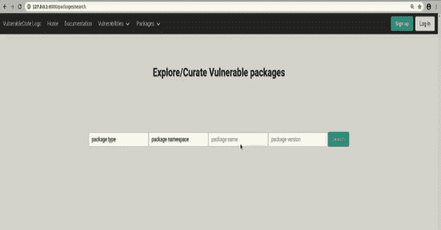

# Vulnerablecode:一个免费开放的漏洞数据库

> 原文：<https://kalilinuxtutorials.com/vulnerablecode/>

VulnerableCode 是一个自由开放的 FOSS 软件包漏洞数据库，以及创建和更新数据的工具。它是由 FOSS 社区制定的，旨在改善和保护开源软件生态系统。

**为什么？**

现有的解决方案是商业专有的漏洞数据库，这本身没有意义，因为数据是关于 FOSS(自由开源软件)的。

国家漏洞数据库是已知漏洞的主要集中数据源，但并不特别适合解决自由/开源软件的安全问题，因为:

1.  它早于自由和开放源码软件使用的爆炸
2.  它的数据格式反映了以商业供应商为中心的观点，部分原因是使用了 [CPE](https://nvd.nist.gov/products/cpe) 来将漏洞映射到现有的软件包。
3.  由于以供应商产品为中心的语义，CPE 并没有被设计成将自由/开源软件映射到漏洞。这使得回答“软件包 foo 易受攻击吗”和“软件包 foo 易受漏洞吧攻击吗？”

**如何**？

**VulnerableCode** 独立聚合多个软件漏洞数据源，并以分散的方式支持数据重建。这些数据源(见完整列表[此处](https://github.com/nexB/vulnerablecode/blob/main/SOURCES.rst))包括由 Linux 和 BSD 发行版发布的安全建议、应用软件包管理器和软件包仓库、自由/开源软件项目、GitHub 等等。由于这种方法，数据集中在特定的生态系统上，但聚集在单个数据库中，这使得能够查询一个包的多个实例之间的关系的更丰富的图表。具体增加了数据的准确性和有效性，因为跨不同生态系统的上游包的相同版本可能易受相同漏洞的攻击，也可能不受相同漏洞的攻击。

使用包 URL [PURL](https://github.com/package-url/purl-spec) 而不是 CPE 作为主要标识符来识别包。这使得对诸如“包 foo 容易受到漏洞吧？”更加准确和易于解释。

对数据的主要访问是通过 REST API 进行的。

此外，一个新兴的 web 界面目标是支持漏洞数据浏览和搜索，并通过添加新的包和漏洞以及检查和更新它们之间的关系，逐步实现社区对数据的监管。

我们还计划挖掘由于各种原因没有暴露的漏洞，例如但不限于接收 CVE ID 的复杂程序或无法将错误归类为安全危害。

最近的演示:

*   [**2020 年开源峰会**](https://github.com/nexB/vulnerablecode/blob/main/docs/Why-Is-There-No-Free-Software-Vulnerability-Database-v1.0.pdf)

**设置漏洞代码**

首先克隆源代码:

**git 克隆 https://github.com/nexB/vulnerablecode.git
CD 漏洞代码**

**使用 Docker 撰写**

设置 VulnerableCode 的一种简单方法是使用 docker 容器和 docker compose。为此，您需要安装以下软件。

*   码头引擎。在这里找到安装说明
*   码头工人作曲。在这里找到安装说明

使用 sudo docker-compose up 启动易受攻击的代码。然后访问 http://localhost:8000/或 http://127.0.0.1:8000/上的漏洞代码

重要提示:不要忘记运行 sudo docker-compose up-d–no-deps–build web 来在每次 git 拉取后同步您的实例。

使用 sudo docker-compose exec web bash 访问漏洞代码容器。从这里，您可以访问 manage.py 并运行管理命令来导入数据，如下所述。

**无 Docker 撰写**

**系统要求**

*   Python 3.8 以上版本
*   PostgreSQL 9+版本
*   Python 和 PostgreSQL 的编译器工具链和开发文件

在基于 Debian 的发行版上，这些可以和:

**sudo apt-get 安装 python 3-venv python 3-dev PostgreSQL libpq-dev build-essential**

**数据库配置**

*   创建一个名为`vulnerablecode`的用户。出现提示时使用`vulnerablecode`作为密码:

**sudo-u postgres create user–no-create role–no-super user–log in \
–inherit–createdb–pw prompt vulnerablecode "**

*   创建名为的数据库

**createdb–encoding = utf-8–owner = vulnerablecode–user = vulnerablecode \
–password–host = localhost–port = 5432 vulnerablecode**

**应用依赖关系**

*   创建虚拟环境，安装依赖项，生成静态文件并运行数据库迁移:

**python 3-m venv venv
source venv/bin/activate
pip install-r requirements . txt
DJANGO _ DEV = 1 python manage . py collect static
DJANGO _ DEV = 1 python manage . py migrate**

环境变量`DJANGO_DEV`用于加载适合开发的设置，在`vulnerablecode/dev.py`中定义。如果你不想每次都输入，用`export DJANGO_DEV=1`代替。不要在生产环境中使用 DJANGO_DEV。

对于生产模式，需要设置一个名为`SECRET_KEY`的环境变量。生成这个密钥的推荐方法是使用 Django 为此目的包含的代码:

**SECRET _ KEY = $(python-c " from django . core . management 导入 utilsprint(utils . get _ random _ secret _ key())"**

您还需要设置 VC_ALLOWED_HOSTS 环境变量，以匹配部署应用程序的主机名:

**VC _ ALLOWED _ HOSTS = vulnerablecode . your . domain . example . com**

您可以指定多个主机，用冒号分隔它们:

**使用 Nix**

可以用 [Nix](https://nixos.org/download.html) 安装漏洞代码(需要 [Flake](https://nixos.wiki/wiki/Flakes) 支持):

**CD etc/nix
nix-shell-p nix flakes–run“nix–print-build-logs flake check”# build&run tests**

使用 Nix 版本有几个选项:

**#进入一个所有依赖项都已设置好的交互环境。**
CD etc/nix
nix develop
../../manage.py … #调用本地 check out
>vulnerablecode-manage . py…#调用安装在 nix store 中的 manage . py

**】#使用 nix 版本测试导入程序。**
etc/nix/Test-import-using-nix . sh–all # import everything
**#使用本地签出测试导入。**
安装目录=。etc/nix/test-import-using-nix . sh ruby #仅导入 ruby

**保持 Nix 设置同步**

nix 安装使用 mach-nix 来处理 Python 依赖关系，因为一些依赖关系目前还不能作为 Nix 包使用。所有 Python 依赖项都是从**自动获取的。/requirements.txt.** 如果基于 mach-nix 的安装失败，您可能需要更新 mach-nix 本身和正在使用的 pypi-deps-db 版本(参见**etc/nix/flake . nix:inputs . mach nix**和 **machnixFor.pypiDataRev** )。

非 Python 依赖关系管理在:

**etc/nix/flake . nix:vulnerablecode . propagatedbuildinputs**

**运行测试**

使用这些命令运行代码样式检查和测试套件:

黑色-l 100–检查。
DJANGO _ DEV = 1 python-m pytest

**数据导入**

一些数据导入器使用 GitHub APIs。为此，使用以下命令导出`GH_TOKEN`环境变量:

**导出 GH_TOKEN=yourgithubtoken**

参见 [GitHub 文档](https://docs.github.com/en/free-pro-team@latest/github/authenticating-to-github/creating-a-personal-access-token)了解如何获得您的 GitHub 令牌。

要运行所有数据导入程序，请使用:

**DJANGO _ DEV = 1 python manage . py import–all**

要列出可用的导入程序，请使用:

DJANGO_DEV=1 python manage.py 导入–列表

要运行特定的导入程序:

DJANGO_DEV=1 python manage.py 导入 rust npm

**REST API 访问**

启动 web 服务器:

**DJANGO _ DEV = 1 python manage . py runserver**

有关 API 端点的完整文档，请使用以下 URL:

**http://127 . 0 . 0 . 1:8000/API/docs**

**连续周期性数据导入**

如果希望定期运行导入，可以使用 systemd 计时器:

**$猫~/。config/systemd/user/vulnerablecode . Service**

**【单元】
Description =更新漏洞数据库**

**【服务】
Type = one shot
Environment = " DJANGO _ DEV = 1"
ExecStart =/path/to/venv/bin/python/path/to/vulnerablecode/manage . py import–all**

**$ cat ~/。config/systemd/user/vulnerablecode . Timer**

**【单位】
Description =定期更新漏洞数据库**

**【Timer】
OnCalendar = daily**

**【Install】
wanted by = multi-user . target**

用以下方式启动该“计时器”:

**system CTL–用户守护进程–重新加载
system CTL–用户启动漏洞代码.定时器**

[**Download**](https://github.com/nexB/vulnerablecode)