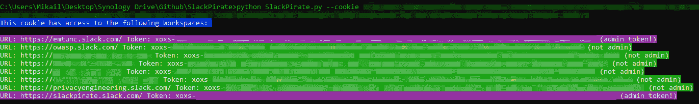
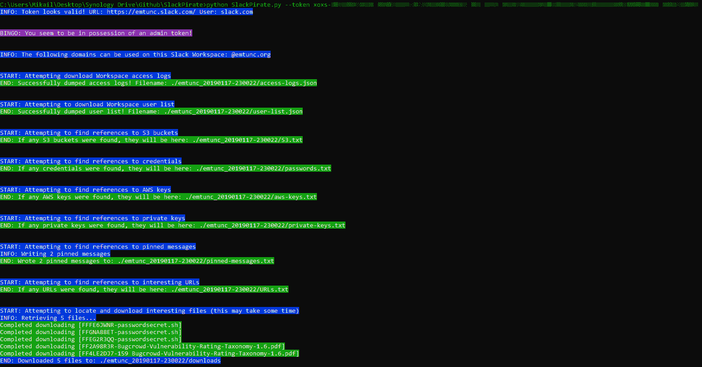

# SlackPirate : Slack 枚举和提取工具

> 原文：<https://kalilinuxtutorials.com/slackpirate/>

[](https://1.bp.blogspot.com/-ayhkzSeEXrY/YIq_s2Hdv-I/AAAAAAAAI6Q/YxVACmshTrw_5Pa9dbTfKS1tUifNC-U3ACLcBGAsYHQ/s728/Screenshots-1%25281%2529.png)

**SlackPirate** 是一个用 Python 开发的工具，它使用本地 Slack APIs 从给定访问令牌的 Slack 工作空间中提取“有趣”的信息。

截至 2018 年 5 月，Slack 拥有超过 800 万名客户，并且这一数字还在快速上升——集成和“ChatOps”的可能性是无限的，并且允许团队(不仅仅是开发人员！)来创建一些真正强大的工作流和 Slack bot/应用程序交互。

正如大大小小的公司一样，Slack 等工具在信息安全治理/政策雷达下飞行并不罕见，最终导致敏感和机密信息出现在它们不应该出现的地方。

**这个工具有双重目的:**

*   红队队员可以利用这一点从 Slack 中识别和提取敏感信息、文档、凭证等，给定组织工作区的低特权帐户。这可能会让攻击者转向其他系统和/或获得更多关于公司系统/应用程序的内部工作方式的信息
*   蓝队队员可以利用这一点来识别和检测工作区中的敏感信息，这些信息可能一开始就不应该存在于工作区中。蓝队队员可以通过展示工具的输出和可能被(内部和外部)攻击者使用和滥用的“东西”的类型，将这些信息用于内部培训和认知目的。

该工具允许您轻松收集敏感信息，以便在方便时脱机查看。

**注意:**我是 Python n00b，并且毫不怀疑该脚本可以被大规模优化和改进——请随时提出拉取请求；我会酌情审核合并！

**信息收集**

该工具使用本机 Slack APIs 来提取“感兴趣的”信息，并在今天寻找以下信息:

*   将允许注册工作区的域(如果有的话)打印到标准输出——我在这里看到过陈旧的、旧的和被遗忘的域，可以购买并用于注册工作区
*   链接到 S3 存储桶
*   密码
*   AWS 访问/密钥
*   私钥
*   所有通道中的固定消息
*   引用链接和网址，可以提供对敏感材料的进一步访问——想想:谷歌文档、Trello 邀请、内部系统的链接等
*   可能包含敏感信息的文件，如。键，。文件中嵌入的“密码”或“秘密”等字样

**松脆饼干**

Slack web 应用程序使用了许多 cookies 其中一个特别有趣的叫做，wait it…`d`。这个`d` cookie 在受害者可以访问的所有工作区中都是相同的。这实际上意味着一个被盗的`d` cookie 将允许攻击者访问受害者登录的所有工作区；我使用 Slack web 应用程序的经验是，一旦你登录，你将无限期地保持登录状态。

**松弛令牌**

Slack API 令牌是一个基于工作空间的令牌。一个令牌不能(据我所知)以上面的 **d** cookie 允许访问所有工作区的方式访问其他工作区。

对于搜索和提取信息的工具，您需要为它提供一个 API 令牌。有两种直接的方法可以做到这一点:

*   通过使用 **`--cookie`** 标志为工具提供一个`d` cookie。该工具将输出关联的工作空间和令牌
*   通过使用`**--token**`标志直接给工具提供一个令牌。您可以通过查看工作区 URL 的来源并搜索`**XOX**`来找到它

该令牌将类似于以下内容:

**API _ token:" xoxs-x-x-x "**

制作一个副本，并使用`**--token**`标志将其传递给脚本。

**大楼**

该脚本已经在 Python 3.5、3.6 和 3.7 上开发、测试和确认。Python 2 上的一个快速测试出现了一些兼容性问题。

**Linux with virtualenv**

*   **T2`git clone https://github.com/emtunc/SlackPirate`**
*   **T2`pip install virtualenv`**
*   **T2`virtualenv SlackPirate`**
*   **T2`source SlackPirate/bin/activate`**
*   **T2`pip install -r requirements.txt`**
*   **T2`./SlackPirate.py --help`**

**没有 virtualenv 的 Linux】**

*   `git clone https://github.com/emtunc/SlackPirate`
*   `chmod +x SlackPirate.py`
*   `pip install -r requirements.txt`
*   `./SlackPirate.py --help`

**Windows with virtualenv**

*   `git clone https://github.com/emtunc/SlackPirate`
*   `pip install virtualenv`
*   `virtualenv SlackPirate`
*   `SlackPirate\Scripts\activate.bat`
*   `pip install -r requirements.txt`
*   `python SlackPirate.py --help`

**用途**

**python 3 slack pirate . py–help**

```
Display the help menu - this includes information about all scan modules you can explicitly select or ignore
```

**python 3 slack pirate . py–互动**

```
Interactive mode instructs the tool to allow you to provide a token or cookie, and choose scans to run through a console UI rather than via command line arguments.
```

**python 3 slack pirate . py–cookie**

这将执行以下操作:

*   找到任何可以使用该 cookie 访问的相关工作区
*   连接到返回的任何工作区
*   在每个返回的工作空间中寻找 API 令牌
*   打印到标准输出，用于下一个命令

**python 3 slackpirate . py–token**

这将执行以下操作:

*   检查令牌有效性，只有当 Slack 返回 True 时才继续
*   如果提供的令牌具有 admin、owner 或 primary_owner 权限，则打印到标准输出
*   如果该工具找到任何可用于注册 Slack 工作空间的@domains，则打印到标准输出(您可能会对这里的发现感到惊讶，如果您幸运的话，您会在这里找到一个旧的、未使用的、可注册的域)
*   转储团队访问日志。如果提供的令牌是特权令牌，则为 json 格式
*   将用户列表转储到。json 格式
*   查找 S3 水桶的参考资料
*   查找对密码和其他凭证的引用
*   查找对 AWS 键的引用
*   查找对私钥的引用
*   在所有松弛通道中查找对固定消息的引用
*   找到有趣的网址和链接的参考
*   最后，该工具将尝试根据预定义的关键字下载文件

**python 3 slack pirate . py–token–S3-scan**

这将指示该工具仅运行 S3 扫描

**python 3 slack pirate . py–token–no-S3-scan**

这将指示该工具运行除 S3 扫描之外的所有扫描

**python 3 slack pirate . py–token–verbose**

详细模式将在中输出文件。CSV–将提供更多信息，如频道名称、用户名、永久链接等。

**截图**

[**Download**](https://github.com/emtunc/SlackPirate)